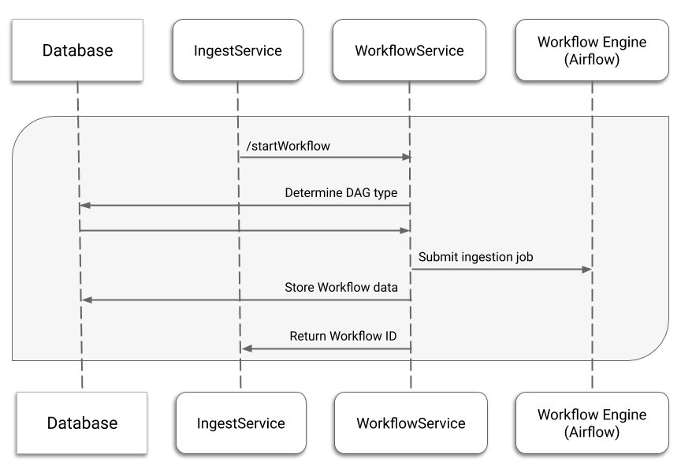

# OSDU Workflow Service

## Contents

* [Introduction](#introduction)
* [System interactions](#system-interactions)
* [Workflow API](#workflow-api)
  * [POST /v1/workflow](#post-v1workflow)
  * [GET /v1/workflow](#get-v1workflow)
  * [DELETE /v1/workflow/{workflow_name](#delete-v1workflowworkflow_name)
  * [GET /v1/workflow/{workflow_name](#get-v1workflowworkflow_name)
  * [POST /v1/workflow/{workflow_name}/workflowRun](#post-v1workflowworkflow_nameworkflowrun)
  * [GET /v1/workflow/{workflow_name}/workflowRun](#get-v1workflowworkflow_nameworkflowrun)
  * [GET /v1/workflow/{workflow_name}/workflowRun/{runId}](#get-v1workflowworkflow_nameworkflowrunrunid)
  * [PUT /v1/workflow/{workflow_name}/workflowRun/{runId}](#put-v1workflowworkflow_nameworkflowrunrunid)
* [Airflow 2.0 support](#airflow-2-support)
* [Service Provider Interfaces](#workflow-service-provider-interfaces)
* [Google Cloud implementation](#gc-implementation)
* [Firestore](#firestore-collections)

## Introduction

The OSDU R3 Workflow service is designed to start business processes in the system. In the OSDU R3
prototype phase, the service allows you to work with workflow metadata, supporting CRUD operations
and also trigger workflow in airflow, get, delete and change the status of process startup records.

The Workflow service provides a wrapper functionality around the Apache Airflow functions and is
designed to carry out preliminary work with files before running the Airflow Directed Acyclic Graphs
(DAGs) that will perform actual ingestion of OSDU data.

## System interactions

The Workflow service in the OSDU R3 Prototype defines the following workflows:

* Ingestion of new files
* Delivery of an ingestion workflow status
* Update of the workflow status
* Work with workflows definition
* Work with workflows run records

### Start ingestion

The ingestion workflow starts by a call to the `/v1/workflow/{workflow_name}/workflowRun` API endpoint.
The following diagram shows the workflow.



Upon a `/v1/workflow/{workflow_name}/workflowRun` request:

1. Validate the incoming request.
    * Verify the authorization token. Fail ingestion if the token is missing or invalid, and then
    respond with the `401 Unauthorized` status.
    * Verify the partition ID. Fail ingestion if the partition ID is missing, invalid or doesn't
    have assigned user groups, and then respond with the `400 Bad Request` status.
2. Submit a new ingestion job to the OSDU R3 Workflow Engine (Apache Airflow).
3. Create a workflow data record in the database with the **submitted** status.
4. Respond with the workflow run ID to the Ingestion service.

## Workflow API

The OSDU R3 Workflow API includes the following endpoints:

* `/v1/workflow`, external (Get, Post)
* `/v1/workflow/{workflow_name}`, external (Get, Delete)

* `/v1/workflow/{workflow_name}/workflowRun`, external (Get, Post)
* `/v1/workflow/{workflow_name}/workflowRun/{runId}`, external (Get, Put)

General considerations related to querying the Workflow API:

* Each endpoint must receive the authentication bearer token in the "Authorization" header. Example:
`"Authorization": "Bearer {token}"`
* Each endpoint must receive the partition ID in the "Partition-ID" header. Example:
`"Partition-Id: "default_partition"`
* The request and response Content Type is "application/json"

### POST /v1/workflow

Creates workflow definition with standard orchestrator operators.

#### Request body

| Property     | Type     | Description                                                     |
| ------------ | -------- | --------------------------------------------------------------- |
| workflowName | `String` | Workflow name          |
| registrationInstructions | `Object` | Data provided as list of key-value pairs |
| description | `String` | Description |

Request example:

```sh
curl --location --request POST 'https://{path}/v1/workflow' \
    --header 'Authorization: Bearer {token}' \
    --header 'Data-Partition-Id: {assigned partition ID}' \
    --header 'Content-Type: application/json' \
    --data-raw '{
        "workflowName": "string",
        "registrationInstructions": {
            "dagName": "osdu-default",
            "dagContent": null,
            "etc": "string"
        },
        "description": "string"
    }'
```

#### Response body

| Property   | Type     | Description                   |
| ---------- | -------- | ----------------------------- |
| workflowId | `String` | Workflow Id |
| workflowName | `String` | Workflow name |
| description | `String` | Workflow description |
| createdBy | `String` | User Id who started the workflow |
| creationTimestamp | `long` | Workflow creation date |
| version | `String` | Workflow definitions version |

### GET /v1/workflow

List all the workflows for the tenant.

Request example:

```sh
curl --location --request GET 'https://{path}/v1/workflow' \
    --header 'Authorization: Bearer {token}' \
    --header 'Data-Partition-Id: {assigned partition ID}' \
    --header 'Content-Type: application/json'
```

#### Parameters

| Name | Description                   |
| ---------- | ----------------------------- |
| prefix | Filter workflow names which start with the full prefix specified. |

#### Response body

| Property   | Type     | Description                   |
| ---------- | -------- | ----------------------------- |
| workflowId | `String` | Workflow Id |
| workflowName | `String` | Workflow name |
| description | `String` | Workflow description |
| createdBy | `String` | User Id who started the workflow |
| creationTimestamp | `long` | Workflow creation date |
| version | `String` | Workflow definitions version |

### DELETE /v1/workflow/{workflow_name}

Delete a workflow by it's name.

Request example:

```sh
curl --location --request DELETE 'https://{path}/v1/workflow/airflow_name' \
    --header 'Authorization: Bearer {token}' \
    --header 'Data-Partition-Id: {assigned partition ID}' \
    --header 'Content-Type: application/json'
```

#### Parameters

| Name | Description                   |
| ---------- | ----------------------------- |
| workflow_name | Unique name of the Workflow to be deleted. |

#### Response

Response with 204 code

### GET /v1/workflow/{workflow_name}

Get complete details for a workflow.

Request example:

```sh
curl --location --request GET 'https://{path}/v1/workflow/{workflow_name}' \
    --header 'Authorization: Bearer {token}' \
    --header 'Data-Partition-Id: {assigned partition ID}' \
    --header 'Content-Type: application/json'
```

#### Parameters

| Name | Description                   |
| ---------- | ----------------------------- |
| workflow_name | Name of the workflow. |

#### Response body

| Property   | Type     | Description                   |
| ---------- | -------- | ----------------------------- |
| workflowId | `String` | Workflow Id |
| workflowName | `String` | Workflow name |
| description | `String` | Workflow description |
| createdBy | `String` | User Id who started the workflow |
| creationTimestamp | `long` | Workflow creation date |
| version | `String` | Workflow definitions version |

### POST /v1/workflow/{workflow_name}/workflowRun

The `/v1/workflow/{workflow_name}/workflowRun` API endpoint starts a new workflow.

For OSDU R3 Prototype, the API doesn't reconfigure the workflows and only queries the database to
determine which DAG to run.

#### Request body

| Property     | Type     | Description                                                     |
| ------------ | -------- | --------------------------------------------------------------- |
| runId | `String` | Workflow start run Id          |
| executionContext | `Object` | Data required to run a DAG, provided as list of key-value pairs |

> The Context may include a file location, ACL and legal tags, and the Airflow run ID. The
> **/v1/workflow/{workflow_name}/workflowRun API** passes the Context to Airflow without modifying it.

Request example:

```sh
curl --location --request POST 'https://{path}/v1/workflow/{workflow_name}/workflowRun' \
    --header 'Authorization: Bearer {token}' \
    --header 'Data-Partition-Id: {assigned partition ID}' \
    --header 'Content-Type: application/json' \
    --data-raw '{
      "runId": "string",
      "executionContext": {
        "key1": "value1"
      }
  }'
```

#### Response body

| Property   | Type     | Description                   |
| ---------- | -------- | ----------------------------- |
| workflowId | `String` | Unique ID of the workflow job |
| runId | `String` | Unique ID of the workflow run |
| startTimestamp | `long` | Workflow run start date |
| endTimestamp | `long` | Workflow run end date |
| status | `String` | Workflow status |
| submittedBy | `String` | User Id who started the workflow |

### GET /v1/workflow/{workflow_name}/workflowRun

Get all run instances for a workflow.

Request example:

```sh
curl --location --request GET 'https://{path}/v1/workflow/{workflow_name}/workflowRun' \
    --header 'Authorization: Bearer {token}' \
    --header 'Data-Partition-Id: {assigned partition ID}' \
    --header 'Content-Type: application/json'
```

#### Parameters

| Name | Description                   |
| ---------- | ----------------------------- |
| workflow_name | Name of the workflow. |
| prefix | A prefix used when generating the runId of the workflow run. |
| startDate | The start date where this call should start creating workflow runs from (inclusive) |
| endDate | The end date where this call should stop creating workflow runs at (inclusive) |
| limit | The maximum number of workflow runs to create in a single request. |

#### Response body

| Property   | Type     | Description                   |
| ---------- | -------- | ----------------------------- |
| workflowId | `String` | Unique ID of the workflow job |
| runId | `String` | Unique ID of the workflow run |
| startTimestamp | `long` | Workflow run start date |
| endTimestamp | `long` | Workflow run end date |
| status | `String` | Workflow status |
| submittedBy | `String` | User Id who started the workflow |

### GET /v1/workflow/{workflow_name}/workflowRun/{runId}

Get details for a speciffic workflow run instance.

Request example:

```sh
curl --location --request GET 'https://{path}/v1/workflow/{workflow_name}/workflowRun/{runId}' \
    --header 'Authorization: Bearer {token}' \
    --header 'Data-Partition-Id: {assigned partition ID}' \
    --header 'Content-Type: application/json'
```

#### Parameters

| Name | Description                   |
| ---------- | ----------------------------- |
| workflow_name | Name of the workflow. |
| runId  | Run id for the workfkow. |

#### Response body

| Property   | Type     | Description                   |
| ---------- | -------- | ----------------------------- |
| workflowId | `String` | Unique ID of the workflow job |
| runId | `String` | Unique ID of the workflow run |
| startTimestamp | `long` | Workflow run start date |
| endTimestamp | `long` | Workflow run end date |
| status | `String` | Workflow status |
| submittedBy | `String` | User Id who started the workflow |

### PUT /v1/workflow/{workflow_name}/workflowRun/{runId}

Update the workflow run instance.

Request example:

```sh
curl --location --request PUT 'https://{path}/v1/workflow/{workflow_name}/workflowRun/{runId}' \
    --header 'Authorization: Bearer {token}' \
    --header 'Data-Partition-Id: {assigned partition ID}' \
    --header 'Content-Type: application/json'\
    --data-raw '{
        "status": "INPROGRESS"
    }'
```

#### Parameters

| Name | Description                   |
| ---------- | ----------------------------- |
| workflow_name | Name of the workflow. |
| runId  | Run id for the workfkow. |

#### Response body

| Property   | Type     | Description                   |
| ---------- | -------- | ----------------------------- |
| workflowId | `String` | Unique ID of the workflow job |
| runId | `String` | Unique ID of the workflow run |
| startTimestamp | `long` | Workflow run start date |
| endTimestamp | `long` | Workflow run end date |
| status | `String` | Workflow status |
| submittedBy | `String` | User Id who started the workflow |

## Airflow 2 support

as per airflow community, airflow experimnetal API will be discontinued. with help of MR 160 we added airflow 2.0 stable api support. for more details please check mentioned MR. 160

#### Procedure to switch airflow 2.0

* add following properties

| Key | Value | Decription |
| ------ | ------ | ------ |
| osdu.airflow.version2  | true | if this property is missing or false, airflow 1 experimental api will be called
| osdu.airflow.username| `<_airflow_username_>` | airflow username if basic auth is enabled
| osdu.airflow.password | `<_airflow-password_>` | airflow password if basic auth is enabled

* override and disable integration test case `org.opengroup.osdu.workflow.workflow.v3.WorkflowRunV3IntegrationTests.triggerWorkflowRun_should_returnBadRequest_when_givenDuplicateRunId()` in provider level.
* override and enable integration test case `org.opengroup.osdu.workflow.workflow.v3.WorkflowRunV3IntegrationTests.triggerWorkflowRun_should_returnConflict_when_givenDuplicateRunId_with_airflow2_stable_API()` in provider level

## Workflow Service Provider Interfaces

The Workflow service has several Service Provider Interfaces that the classes need to implement.

| Interface                   | Obligatory / Optional   | Path                                                                         |
| --------------------------- | ----------------------- | ---------------------------------------------------------------------------- |
| IAuthenticationService      | Obligatory to implement | `workflow-core/src/main/.../provider/interfaces/IAuthenticationService`       |
| IWorkflowEngineService      | Obligatory to implement | `workflow-core/src/main/.../provider/interfaces/IWorkflowEngineService`       |
| IWorkflowManagerService     | Obligatory to implement | `workflow-core/src/main/.../provider/interfaces/IWorkflowManagerService`       |
| IWorkflowMetadataRepository | Obligatory to implement | `workflow-core/src/main/.../provider/interfaces/IWorkflowMetadataRepository`       |
| IWorkflowRunRepository      | Obligatory to implement | `workflow-core/src/main/.../provider/interfaces/IWorkflowRunRepository`       |
| IWorkflowRunService         | Obligatory to implement | `workflow-core/src/main/.../provider/interfaces/IWorkflowRunService`       |


## Open API 3.0 - Swagger

- Swagger UI : https://host/context-path/swagger (will redirect to https://host/context-path/swagger-ui/index.html)
- api-docs (JSON) : https://host/context-path/api-docs
- api-docs (YAML) : https://host/context-path/api-docs.yaml

All the Swagger and OpenAPI related common properties are managed here [swagger.properties](workflow-core/src/main/resources/swagger.properties)

## Google Cloud implementation

The Google Cloud Identity and Access Management service account for the Workflow service must have the
**Composer User** and **Cloud Datastore User** roles.

Note that obtaining user credentials for Application Default Credentials isn't suitable for the
development purposes because signing a blob is only available with the service account credentials.
Remember to set the `GOOGLE_APPLICATION_CREDENTIALS` environment variable. Follow the [instructions
on the Google developer's portal][application-default-credentials].

* Documentation for the Google Cloud Datastore implementation is located in [here](./provider/workflow-gc/README.md)
