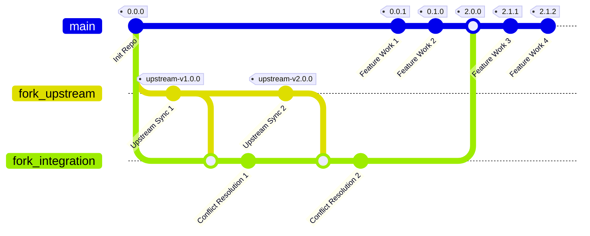

# Fork Management Template: Architecture Document

## 1. Introduction

### 1.1. Purpose
This document outlines the architecture for the Fork Management Template, a GitHub repository template that provides automated fork lifecycle management through GitHub Actions workflows. The architecture leverages proven DevOps patterns and GitHub's native features to provide zero-configuration deployment with intelligent upstream synchronization, automated conflict management, and semantic release management.

### 1.2. Architectural Philosophy
**Template-Driven Automation**: Zero setup, intelligent automation, continuous maintenance.

- **GitHub Native**: Leverage platform features without external dependencies
- **Self-Configuring**: Template repositories that adapt to specific upstream sources
- **Safety-First**: Multiple validation points prevent unstable code promotion
- **Event-Driven**: Automated response to repository changes and schedules
- **Scalable**: Supports unlimited repository deployments with consistent patterns

### 1.3. Scope
This document covers:
- Overall system architecture and design principles
- Workflow implementation patterns and integration strategies
- Phase-based evolution from foundation through advanced features
- Security, compliance, and operational considerations

## 2. Architectural Principles

### 2.1. Core Principles
- **Template-First Design**: Built specifically for GitHub template repository pattern
- **Automation-Optimized**: Workflows designed for minimal human intervention
- **Branch Safety**: Protected main branch with isolated conflict resolution
- **Security Integration**: Built-in vulnerability scanning and compliance checks
- **Developer Experience**: Clear visibility into sync status and conflict resolution

### 2.2. GitHub Actions Pattern Strategy
**Event-Driven Workflow Architecture:**
1. Leverage GitHub's native event system for automatic triggering
2. Implement modular workflows with clear separation of concerns
3. Use composite actions for reusable patterns across workflows
4. Apply consistent error handling and status reporting patterns

### 2.3. Template Context Considerations
**Critical Design Constraints:**
- **Zero External Dependencies**: Must work with GitHub features only
- **Self-Modification**: Workflows must update themselves during initialization (Bootstrap Pattern - ADR-007)
- **Multi-Repository**: Template must support unlimited deployments
- **Issue-Based Configuration**: User interaction through GitHub Issues
- **Security-First**: All automation must maintain security posture

## 3. System Architecture Overview

### 3.1. High-Level Architecture

```
┌─────────────────────────────────────────┐
│          GitHub Template                │
│         Repository Pattern              │
└─────────────┬───────────────────────────┘
              │ Template Creation
              │ (One-click deployment)
              ▼
┌─────────────────────────────────────────┐
│        Fork Repository Instance         │
│  ┌─────────────────────────────────┐    │
│  │         Workflow Suite          │    │
│  │  • init.yml                     │    │
│  │  • sync.yml                     │    │
│  │  • cascade.yml                  │    │
│  │  • validate.yml                 │    │
│  │  • build.yml                    │    │
│  │  • release.yml                  │    │
│  └─────────────────────────────────┘    │
│  ┌─────────────────────────────────┐    │
│  │      Three-Branch Strategy      │    │
│  │  • main (protected)             │    │
│  │  • fork_upstream (sync)         │    │
│  │  • fork_integration (resolve)   │    │
│  └─────────────────────────────────┘    │
│  ┌─────────────────────────────────┐    │
│  │    Shared Infrastructure        │    │
│  │  • Branch Protection            │    │
│  │  • Security Scanning            │    │
│  │  • Issue Management             │    │
│  │  • Release Automation           │    │
│  └─────────────────────────────────┘    │
└─────────────┬───────────────────────────┘
              │ Scheduled/Event Sync
              ▼
┌─────────────────────────────────────────┐
│          Upstream Repository            │
│  • GitHub/GitLab Repository             │
│  • Public/Private Repositories          │
│  • Any Git-based Source Control         │
└─────────────────────────────────────────┘
```

### 3.2. Phased Implementation Strategy

#### Phase 1: Template Foundation ✅ (Completed)
**Goal**: Self-configuring template with automated setup
**Scope**: Repository initialization + branch structure

#### Phase 2: Upstream Synchronization ✅ (Completed)
**Goal**: Automated upstream sync with conflict detection
**Scope**: Scheduled sync + conflict isolation

#### Phase 3: Validation and Build ✅ (Completed)
**Goal**: Comprehensive validation and build automation
**Scope**: Commit validation + Java build support

#### Phase 4: Release Management ✅ (Completed)
**Goal**: Automated semantic versioning and releases
**Scope**: Release Please + changelog generation

#### Phase 5: Advanced Features (Planned)
**Goal**: Enhanced capabilities and integrations
**Scope**: Multi-provider + analytics + optimizations

## 4. Workflow Architecture Implementation

### 4.1. Workflow Component Structure

**Template-Workflows Separation Pattern (ADR-015):**

```
.github/
├── workflows/                    # Template development workflows (NOT copied to forks)
│   ├── init.yml                  # Repository initialization (issue creation)
│   ├── init-complete.yml         # Repository setup completion
│   ├── dev-ci.yml               # Template testing and validation
│   ├── dev-test.yml             # Template workflow testing
│   └── dev-release.yml          # Template version releases
├── template-workflows/           # Fork production workflows (COPIED to forks)
│   ├── sync.yml                  # Upstream synchronization
│   ├── validate.yml              # PR validation
│   ├── build.yml                 # Build automation
│   ├── release.yml               # Release management
│   ├── cascade.yml               # Cascade integration through branches
│   ├── cascade-monitor.yml       # Cascade health monitoring
│   ├── sync-template.yml         # Template repository updates
│   └── dependabot-validation.yml # Dependabot PR automation
├── actions/                      # Composite actions (copied with workflows)
│   ├── pr-status/                # PR status reporting
│   ├── java-build/               # Java build automation
│   └── java-build-status/        # Build status reporting
└── ISSUE_TEMPLATE/               # Issue templates (copied during init)
    └── init-config.yml           # Initialization issue
```

**Fork Repository Structure (After Initialization):**
```
.github/
├── workflows/                    # Clean production workflows only
│   ├── sync.yml                  # Copied from template-workflows
│   ├── validate.yml              # Copied from template-workflows
│   ├── build.yml                 # Copied from template-workflows
│   ├── release.yml               # Copied from template-workflows
│   ├── cascade.yml               # Copied from template-workflows
│   ├── cascade-monitor.yml       # Copied from template-workflows
│   ├── sync-template.yml         # Copied from template-workflows
│   └── dependabot-validation.yml # Copied from template-workflows
├── actions/                      # Copied composite actions
└── .template-sync-commit         # Template version tracking
```
### 4.2 Initialize Architecture (init.yml & init-complete.yml)

**Design Principle**: Separated user interaction from repository setup for better UX and maintainability

**Specification**: [Initialization Workflow Specification](init-workflow.md)

The initialization process is split into two focused workflows:

#### **init.yml** - User Interface and Issue Management
```yaml
# Repository initialization trigger
name: Initialize Fork
on:
  push:
    branches: [main]

jobs:
  check_template:
    # Detect if this is template vs. instance repository
    
  check_initialization:
    # Check for existing initialization markers
    # Primary: .github/workflow.env file
    # Secondary: branch structure and issues
    
  create_initialization_issue:
    # Create user-friendly welcome issue with instructions
    # Support GitHub (owner/repo) and GitLab (URL) formats
    
```

#### **init-complete.yml** - Repository Setup and Configuration
```yaml
# User response handling
name: Initialize Complete
on:
  issue_comment:
    types: [created]

jobs:
  validate_and_setup:
    # Validate user input with friendly error messages
    # Support both GitHub and GitLab repository formats
    
  setup_repository:
    # Create branch structure from upstream
    # Copy production workflows from template-workflows/ to workflows/
    # Configure secrets, variables, and repository settings
    # Set up branch protection rules
    # Trigger validation workflow  
    # Self-cleanup initialization files and template-workflows directory
```

**Bootstrap Pattern (ADR-007):**

The initialization workflow implements a self-updating bootstrap pattern to ensure that bug fixes and improvements are immediately available to new repositories:

1. **Bootstrap Problem**: Template-created repositories run workflows from the initial commit, missing subsequent fixes
2. **Solution**: Workflows update themselves from the template repository before executing initialization
3. **Benefits**: All initialization improvements reach new repositories immediately
4. **Implementation**: Two-phase approach - update workflows, then execute with latest version

**Template-Workflows Separation Pattern (ADR-015):**

The architecture implements clean separation between template development and fork production workflows:

1. **Workflow Pollution Problem**: Template repositories mixing development and production workflows caused forks to inherit irrelevant template infrastructure
2. **Solution**: Store fork workflows in `.github/template-workflows/`, template workflows in `.github/workflows/`
3. **Copy Process**: During initialization, copy from `template-workflows/` to `workflows/` in fork
4. **Benefits**: Clean fork repositories, clear maintenance boundaries, security isolation
5. **Authentication**: Requires Personal Access Token (PAT) with `workflows` permission for GitHub App workflow limitations

### 4.3. Synchronization Architecture (sync.yml)

**Design Principle**: Scheduled upstream sync with intelligent conflict handling

**Specification**: [Upstream Synchronization Workflow Specification](sync-workflow.md)

```yaml
# Synchronization workflow pattern
name: Upstream Synchronization
on:
  schedule:
    - cron: '0 0 * * 0'  # Weekly Sunday midnight
  workflow_dispatch:     # Manual trigger
  
jobs:
  sync-upstream:
    runs-on: ubuntu-latest
    permissions:
      contents: write
      pull-requests: write
      issues: write
      
    steps:
      - name: Fetch Upstream

      - name: Create Pull Request

      - name: Handle Failure
```

**Key Features:**
- **Scheduled Execution**: Weekly automation with manual override
- **Conflict Detection**: Automatic identification of merge conflicts
- **Staging Integration**: Safe resolution in dedicated branch
- **AI-Enhanced PRs**: Optional LLM-generated descriptions with diff limits


### 4.4. Cascade Architecture (cascade.yml & cascade-monitor.yml)

**Design Principle**: Human-controlled propagation of upstream changes through branch hierarchy with safety gates and comprehensive issue tracking

**Specification**: [Cascade Integration Workflow Specification](cascade-workflow.md)

**Architecture Decision**: [ADR-019: Cascade Monitor Pattern](../src/adr/019-cascade-monitor-pattern.md) - Human-centric cascade approach

The cascade system implements a human-centric two-phase integration pipeline with issue lifecycle tracking:

```yaml
# Cascade workflow pattern
name: Cascade Integration
on:
  workflow_dispatch:  # Primary: Manual trigger by humans after reviewing sync
                      # Fallback: Monitor safety net triggers if missed

jobs:
  cascade-to-integration:
    # Phase 1: fork_upstream → fork_integration
    steps:
      # 1. Check for active cascades (concurrency control)
      - name: Check Cascade State
        run: |
          active=$(gh pr list --label "cascade-active")
          if [ -n "$active" ]; then exit 0; fi
      
      # 2. Update integration with main (pre-merge)
      - name: Sync Integration with Main
        run: |
          git checkout fork_integration
          git merge origin/main --no-edit
      
      # 3. Create integration PR
      - name: Create Integration PR
        run: |
          # Always requires manual review (safety gate)
          gh pr create --label "upstream-sync,cascade-active"
  
  cascade-to-main:
    # Phase 2: fork_integration → main
    steps:
      # Auto-merge eligible if all conditions met
      - name: Evaluate Auto-merge
        run: |
          if [[ "$DIFF_LINES" -lt 1000 ]] && 
             [[ "$BREAKING_CHANGES" == "false" ]]; then
            gh pr merge --auto --squash
          fi
```

**Key Architectural Decisions:**

1. **Asymmetric Review Strategy (ADR-009)**:
   - **Manual Review Required**: `fork_upstream` → `fork_integration` (first contact with external changes)
   - **Auto-merge Eligible**: `fork_integration` → `main` (pre-validated changes, with conditions)

2. **Pre-merge Main Integration**:
   - Updates `fork_integration` with latest `main` BEFORE merging upstream
   - Ensures upstream changes are tested against current feature development

3. **Concurrency Control**:
   - Single cascade pipeline active at any time
   - Prevents race conditions and conflicting updates

4. **SLA-based Monitoring** (cascade-monitor.yml):
   - 48-hour SLA for conflict resolution
   - Automated escalation for stale conflicts
   - Health reporting every 6 hours

**Safety Features:**
- **State Tracking**: Labels track cascade progress (`cascade-active`, `cascade-blocked`, `cascade-ready`)
- **Conflict Isolation**: Conflicts detected and isolated at integration level
- **Auto-merge Criteria**: Size limits, no breaking changes, all checks passing
- **Rollback Capability**: Clear identification of cascade commits for emergency rollback

### 4.5. Validation Architecture (validate.yml)

**Design Principle**: Comprehensive validation with clear feedback

**Specification**: [Pull Request Validation Workflow Specification](validate-workflow.md)

```yaml
# Validation workflow pattern
name: Pull Request Validation
on:
  pull_request:
    types: [opened, synchronize, reopened]
    
jobs:
  validate:
    runs-on: ubuntu-latest
    permissions:
      contents: read
      pull-requests: write
      statuses: write
      
    steps:
      # 1. Commit message validation
      - name: Validate Conventional Commits
        if: github.actor != 'dependabot[bot]'
        uses: wagoid/commitlint-github-action@v5
        with:
          configFile: .commitlintrc.json
      
      # 2. Conflict detection
      - name: Check for Conflicts
        run: |
          git merge-tree $(git merge-base HEAD main) HEAD main | \
          grep -q "<<<<<<< " && echo "CONFLICTS_FOUND=true" >> $GITHUB_ENV || \
          echo "CONFLICTS_FOUND=false" >> $GITHUB_ENV
      
      # 3. Build validation (Java projects)
      - name: Java Build
        if: hashFiles('pom.xml') != ''
        uses: ./.github/actions/java-build
        with:
          java-version: '17'
          cache: 'maven'
      
      # 4. Status reporting
      - name: Update PR Status
        if: always()
        uses: ./.github/actions/pr-status
        with:
          status: ${{ job.status }}
          commit-validation: ${{ env.COMMITS_VALID }}
          conflict-check: ${{ env.CONFLICTS_FOUND }}
          build-status: ${{ steps.build.outcome }}
```

**Key Features:**
- **Conventional Commits**: Automated commit message validation
- **Conflict Detection**: Scanning for unresolved merge conflicts
- **Build Integration**: Java/Maven support with coverage reporting
- **Status Reporting**: Comprehensive feedback on PR health

### 4.5. Release Architecture (release.yml)

**Design Principle**: Automated semantic versioning with upstream correlation

**Specification**: [Release Management Workflow Specification](release-workflow.md)

```yaml
# Release workflow pattern
name: Release Management
on:
  push:
    branches: [main]
  workflow_dispatch:
    
jobs:
  release:
    runs-on: ubuntu-latest
    permissions:
      contents: write
      pull-requests: write
      
    steps:
      # 1. Release Please automation
      - name: Create Release
        uses: googleapis/release-please-action@v4
        id: release
        with:
          release-type: simple
          package-name: fork-management-template
          changelog-types: |
            [
              {"type":"feat","section":"Features","hidden":false},
              {"type":"fix","section":"Bug Fixes","hidden":false},
              {"type":"upstream","section":"Upstream Integration","hidden":false},
              {"type":"chore","section":"Maintenance","hidden":false}
            ]
      
      # 2. Tag with upstream reference
      - name: Tag with Upstream Reference
        if: steps.release.outputs.release_created
        run: |
          # Get current upstream version
          git fetch upstream main
          UPSTREAM_VERSION=$(git describe --tags upstream/main 2>/dev/null || echo "unknown")
          
          # Create correlated tag
          RELEASE_TAG="${{ steps.release.outputs.tag_name }}"
          git tag "${RELEASE_TAG}-upstream-${UPSTREAM_VERSION}"
          git push origin "${RELEASE_TAG}-upstream-${UPSTREAM_VERSION}"
```

**Key Features:**
- **Semantic Versioning**: Automated version determination from conventional commits
- **Changelog Generation**: Categorized change documentation
- **Upstream Correlation**: Release tags include upstream version references
- **GitHub Releases**: Automated publication with comprehensive notes

## 5. Three-Branch Strategy Architecture

### 5.1. Branch Architecture Overview

```
┌─────────────────────────────────────────┐
│               Upstream                  │
│              Repository                 │
│            (main branch)                │
└─────────────┬───────────────────────────┘
              │ Weekly Sync
              ▼
┌─────────────────────────────────────────┐
│           fork_upstream                 │
│         (Pure Upstream)                 │
│      Tracks upstream exactly            │
└─────────────┬───────────────────────────┘
              │ Integration Attempt
              ▼
┌─────────────────────────────────────────┐
│         fork_integration                │
│       (Conflict Resolution)             │
│     Safe workspace for conflicts        │
└─────────────┬───────────────────────────┘
              │ Tested Integration
              ▼
┌─────────────────────────────────────────┐
│              main                       │
│         (Protected Stable)              │
│       Production-ready code             │
└─────────────────────────────────────────┘
```

### 5.2. Branch Protection Configuration

```json
{
  "required_status_checks": {
    "strict": true,
    "contexts": [
      "validate",
      "build (if applicable)"
    ]
  },
  "enforce_admins": true,
  "required_pull_request_reviews": {
    "required_approving_review_count": 1,
    "dismiss_stale_reviews": true,
    "require_code_owner_reviews": false
  },
  "restrictions": null,
  "allow_force_pushes": false,
  "allow_deletions": false,
  "required_linear_history": true,
  "required_conversation_resolution": true
}
```

### 5.3. Development and Integration Flow



### 5.4. Conflict Resolution Workflow

```
1. Upstream Sync → fork_upstream (automated)
2. Integration Test → fork_integration (automated)
3. Conflict Detection → Issue Creation (automated)
4. Manual Resolution → fork_integration (human)
5. PR Creation → main (automated)
6. Review & Merge → main (human)
```

## 6. Security and Compliance Architecture

### 6.1. Security Integration

**Built-in Security Features:**
- **Trivy Scanning**: Vulnerability detection in dependencies and images
- **Pattern Detection**: Automated removal of sensitive data patterns
- **Branch Protection**: Enforced code review and status checks
- **Access Control**: Minimal required permissions for workflows

```yaml
# Security scanning pattern
- name: Security Scan
  uses: aquasecurity/trivy-action@master
  with:
    scan-type: 'fs'
    scan-ref: '.'
    format: 'sarif'
    output: 'trivy-results.sarif'
    
- name: Upload Security Results
  uses: github/codeql-action/upload-sarif@v3
  with:
    sarif_file: 'trivy-results.sarif'
```

### 6.2. Compliance Framework

**Audit Trail Components:**
- **Issue History**: Complete record of configuration decisions
- **PR Documentation**: Detailed change attribution (local vs upstream)
- **Release Notes**: Comprehensive changelog with upstream correlation
- **Workflow Logs**: Complete automation execution history

## 7. Extension and Integration Patterns

### 7.1. Composite Action Pattern

```yaml
# .github/actions/pr-status/action.yml
name: 'PR Status Reporter'
description: 'Update PR with comprehensive validation status'
inputs:
  status:
    description: 'Overall job status'
    required: true
  commit-validation:
    description: 'Commit message validation result'
    required: false
  conflict-check:
    description: 'Conflict detection result'
    required: false
    
runs:
  using: 'composite'
  steps:
    - name: Update PR Status
      shell: bash
      run: |
        # Generate status report
        cat > status-report.md << EOF
        ## Validation Results
        
        - **Status**: ${{ inputs.status }}
        - **Commits**: ${{ inputs.commit-validation || 'N/A' }}
        - **Conflicts**: ${{ inputs.conflict-check || 'N/A' }}
        EOF
        
        # Update PR comment
        gh pr comment ${{ github.event.number }} \
          --body-file status-report.md
```

### 7.2. Configuration Template Pattern

```yaml
# Template workflow configuration
env:
  UPSTREAM_REPO: "UPSTREAM_REPO_PLACEHOLDER"
  SYNC_SCHEDULE: "0 0 * * 0"  # Weekly
  BUILD_ENABLED: "auto"       # auto, true, false
  AI_ENHANCED: "true"         # Enable AI features
  DIFF_SIZE_LIMIT: "20000"    # Lines for AI processing
```

### 7.3. Multi-Provider Support Architecture

```yaml
# Provider-agnostic sync pattern
- name: Detect Provider
  run: |
    if [[ "$UPSTREAM_REPO" == *"github.com"* ]]; then
      echo "PROVIDER=github" >> $GITHUB_ENV
    elif [[ "$UPSTREAM_REPO" == *"gitlab.com"* ]]; then
      echo "PROVIDER=gitlab" >> $GITHUB_ENV
    else
      echo "PROVIDER=generic" >> $GITHUB_ENV
    fi

- name: Sync with Provider
  run: |
    case $PROVIDER in
      github) ./scripts/sync-github.sh ;;
      gitlab) ./scripts/sync-gitlab.sh ;;
      *) ./scripts/sync-generic.sh ;;
    esac
```

## 8. Performance and Optimization

### 8.1. Workflow Optimization

**Performance Patterns:**
- **Conditional Execution**: Skip unnecessary steps based on context
- **Caching Strategy**: Maven dependencies, Node modules, build artifacts
- **Parallel Processing**: Independent validation steps run concurrently
- **Resource Management**: Appropriate runner selection and timeout configuration

```yaml
# Optimization patterns
- name: Cache Dependencies
  uses: actions/cache@v4
  with:
    path: ~/.m2/repository
    key: ${{ runner.os }}-maven-${{ hashFiles('**/pom.xml') }}
    restore-keys: |
      ${{ runner.os }}-maven-

- name: Conditional Build
  if: hashFiles('pom.xml') != '' && !contains(github.event.head_commit.message, '[skip-build]')
  run: mvn clean install
```

### 8.2. Resource Management

**Workflow Resource Strategy:**
- **Timeout Configuration**: Appropriate limits for each workflow type
- **Artifact Retention**: Automatic cleanup with configurable retention periods
- **Concurrent Limits**: Prevent resource exhaustion with job concurrency controls
- **Runner Selection**: Match runner capabilities to workflow requirements

## 9. Monitoring and Observability

### 9.1. Workflow Health Monitoring

**Built-in Monitoring:**
- **Workflow Status**: Success/failure tracking across all workflows
- **Issue Creation**: Automated problem reporting and tracking
- **Performance Metrics**: Execution time and resource usage tracking
- **Error Aggregation**: Centralized error reporting and analysis

### 9.2. Operational Dashboards

**Key Metrics:**
- **Sync Success Rate**: Percentage of successful upstream synchronizations
- **Conflict Resolution Time**: Average time from detection to resolution
- **Release Frequency**: Automated release cadence tracking
- **Security Scan Results**: Vulnerability detection and resolution trends

## 10. Development Guidelines

### 10.1. Adding New Workflows

1. **Create workflow file** following naming convention (verb-noun.yml)
2. **Implement standard patterns** with consistent permissions and error handling
3. **Add composite actions** for reusable functionality
4. **Include status reporting** for visibility and debugging
5. **Test across scenarios** (success, failure, edge cases)

### 10.2. Extending Template Features

1. **Follow template pattern** with placeholder replacement
2. **Maintain backward compatibility** with existing deployments
3. **Add configuration options** through environment variables
4. **Document new features** with usage examples and best practices
5. **Test template creation** end-to-end validation

### 10.3. Quality Gates

- **Workflow Validation**: YAML syntax and action compatibility
- **Integration Testing**: End-to-end template deployment testing
- **Security Review**: All workflows reviewed for security implications
- **Performance Testing**: Workflow execution time validation
- **Documentation**: All features documented with examples

## 11. Deployment and Operations

### 11.1. Template Repository Management

```yaml
# Template repository setup
settings:
  template: true
  visibility: public
  features:
    issues: true
    projects: false
    wiki: false
    actions: true
    
protection_rules:
  main:
    required_status_checks: ["validate"]
    enforce_admins: true
    required_pull_request_reviews:
      required_approving_review_count: 1
```

### 11.2. Instance Lifecycle Management

**Instance Creation Flow (Two-Workflow Pattern):**
1. **Template Selection**: User creates repository from template
2. **Issue Creation**: `init.yml` creates user-friendly initialization issue
3. **README Update**: Initialization status added to README for visibility
4. **User Response**: User provides upstream repository URL in issue comment
5. **Validation**: `init-complete.yml` validates input with clear error messages
6. **Automated Setup**: Branch structure, protection rules, and workflows configured
7. **Completion**: Issue closed with summary, README updated, repository ready

**State Management:**
- **Primary Indicator**: `.github/workflow.env` file marks completion
- **Secondary Checks**: Branch structure and issue existence
- **User Visibility**: README status banner until completion

### 11.3. Maintenance and Updates

**Template Evolution Strategy:**
- **Version Tags**: Template versions tracked with semantic versioning
- **Migration Guides**: Documentation for updating existing instances
- **Backward Compatibility**: Maintain compatibility with existing deployments
- **Feature Flags**: Gradual rollout of new capabilities

## 12. Known Challenges and Solutions

### 12.1. Initialization Challenges

**Bootstrap Problem (ADR-007):**
- **Challenge**: Template repositories run workflows from initial commit, missing fixes
- **Solution**: Self-updating workflow pattern fetches latest version before execution

**Merge Conflicts:**
- **Challenge**: Common files (README.md, .gitignore) conflict between template and upstream
- **Solution**: `-X theirs` merge strategy automatically resolves in favor of upstream

**Unrelated Histories:**
- **Challenge**: Template and upstream have completely different commit histories
- **Solution**: `--allow-unrelated-histories` flag enables merging disparate branches

**GitHub Token Permissions:**
- **Challenge**: Built-in GITHUB_TOKEN cannot create repository secrets
- **Solution**: Use Personal Access Token (GH_TOKEN) for secret operations
- **Fallback**: Skip secret creation with user warning if PAT not available

### 12.2. Operational Considerations

**Security Scanning:**
- **Challenge**: Upstream repositories may contain sensitive data
- **Solution**: git-filter-repo removes secrets during initialization (old workflow approach)

**Branch Protection:**
- **Challenge**: Need to balance security with automation capabilities
- **Solution**: Temporary protection removal during critical operations with immediate re-enabling

## 13. Validation Strategy

### 13.1. Architecture Validation

**Current Implementation Validation:**
- ✅ Template repository creation and deployment functional
- ✅ Three-branch strategy implemented with protection rules
- ✅ Upstream synchronization operational with conflict detection
- ✅ Validation workflows comprehensive with status reporting
- ✅ Release automation functional with semantic versioning

### 13.2. Integration Validation

**End-to-End Testing:**
- **Template Creation**: New repository creation from template
- **Configuration Process**: Issue-based upstream repository setup
- **Sync Operations**: Scheduled and manual upstream synchronization
- **Conflict Resolution**: Manual resolution workflow validation
- **Release Process**: Automated semantic version generation and publication

## 14. Future Architecture Evolution

### 14.1. Phase 5: Advanced Features

**Planned Enhancements:**
- **Multi-Provider Support**: GitLab, Bitbucket, and other upstream sources
- **Advanced Analytics**: Fork health metrics and synchronization insights
- **Performance Optimization**: Workflow caching and parallel processing
- **Enterprise Integration**: LDAP/SSO integration and compliance reporting

### 14.2. Scalability Considerations

**Enterprise Readiness:**
- **Multi-Tenant Support**: Organization-wide template management
- **Policy Enforcement**: Centralized governance and compliance rules
- **Resource Optimization**: Efficient workflow execution at scale
- **Monitoring Integration**: Enterprise observability and alerting systems

## 15. Conclusion

The Fork Management Template architecture provides a comprehensive, production-ready solution for automated fork lifecycle management through GitHub's native features. By leveraging template repository patterns with sophisticated workflow automation, the architecture eliminates manual DevOps overhead while maintaining security, stability, and compliance requirements.

**Key Architectural Strengths:**
- **Zero-Configuration Deployment**: Template repository with self-configuring workflows
- **GitHub-Native Implementation**: No external dependencies or infrastructure requirements
- **Safety-First Design**: Protected main branch with isolated conflict resolution
- **Scalable Pattern**: Supports unlimited repository deployments with consistent automation
- **Security Integration**: Built-in vulnerability scanning and compliance features
- **Enterprise Ready**: Comprehensive audit trails and operational monitoring

The phased implementation approach ensures that each component builds on validated foundations while providing clear evolution paths for advanced features. The result is a robust, maintainable system that transforms fork management from a manual, error-prone process into an automated, reliable capability that scales across organizations.

Most importantly, the architecture enables development teams to focus on delivering value rather than managing infrastructure, while maintaining the upstream relationships that keep their forks current, secure, and aligned with the broader open source community.

## References

### Product Documentation
- [Product Brief](brief.md)
- [Product PRD](prd.md)
- [Architecture Decision Records](../src/adr/index.md)

### Workflow Specifications
- [Initialization Workflow Specification](init-workflow-spec.md) - Two-workflow initialization pattern
- [Upstream Synchronization Workflow Specification](sync-workflow-spec.md) - Automated upstream sync with conflict management
- [Build and Test Workflow Specification](build-workflow-spec.md) - Feature branch build automation
- [Pull Request Validation Workflow Specification](validate-workflow-spec.md) - PR quality gates and validation
- [Release Management Workflow Specification](release-workflow-spec.md) - Automated semantic versioning and releases