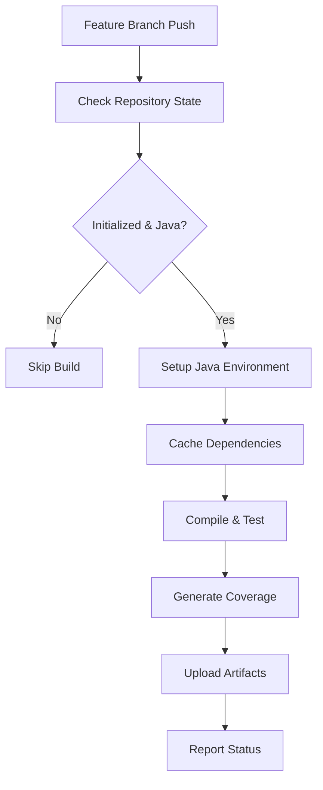
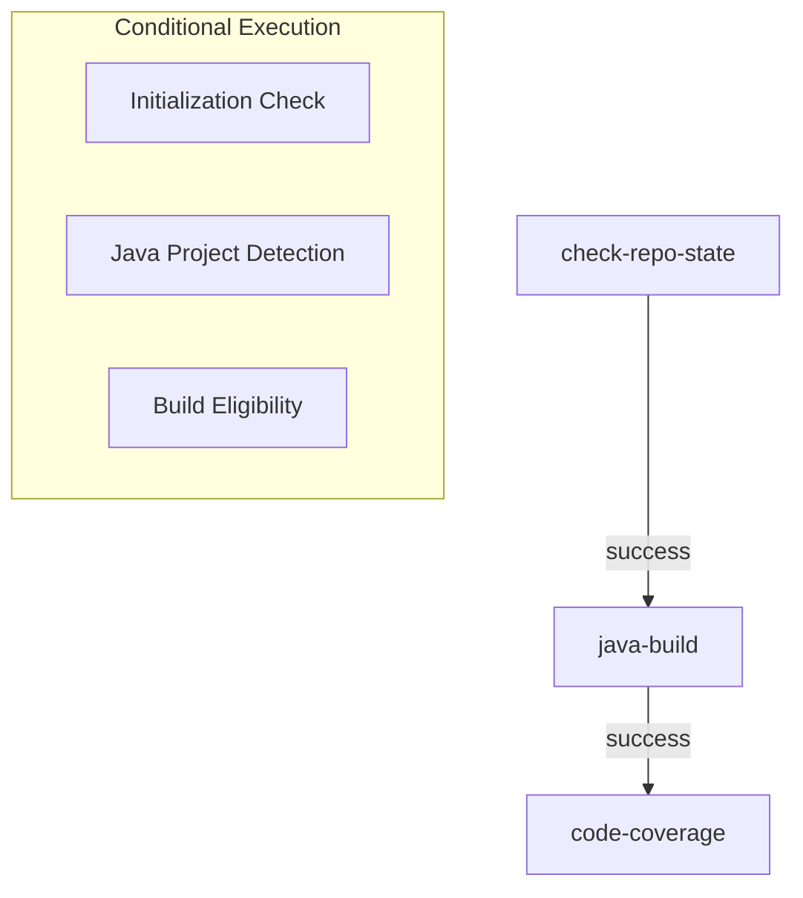

# Build and Test Workflow Specification

This document specifies the build and test workflow (`build.yml`) that provides automated build verification and code coverage analysis for feature branch development.

## Overview

The build workflow complements the validation workflow by focusing specifically on feature branch development. It provides rapid feedback for developers working on new features while ensuring code quality through comprehensive testing and coverage analysis.

## Architecture Integration

**Reference**: [ADR-002: GitHub Actions-Based Automation](../src/adr/002-github-actions-automation.md)

**Key Benefits**:
- **Early Feedback**: Rapid build validation for feature branches
- **Quality Assurance**: Comprehensive testing and coverage analysis
- **Performance Optimization**: Efficient caching and artifact management
- **Developer Experience**: Clear build status and detailed reports

## Workflow Configuration

### Triggers
```yaml
on:
  push:
    branches-ignore:
      - main
      - fork_integration
      - fork_upstream
      - 'dependabot/**'
```

**Rationale**: Feature branches only, protected branches handled by validation workflow

### Permissions
```yaml
permissions:
  contents: read
  actions: read
```

**Minimal Permissions**: Read-only access for build operations

## Workflow Architecture

### High-Level Flow


### Job Dependencies


## Phase 1: Repository State Validation

### Initialization Check
```yaml
# Verify repository is properly initialized
if [ ! -f ".github/workflow.env" ]; then
  echo "Repository not initialized - skipping build"
  exit 0
fi
```

### Java Project Detection
```yaml
# Multiple detection methods for Java projects
if [ -f "pom.xml" ] || [ -f "build.gradle" ] || [ -d "src/main/java" ]; then
  echo "is_java_project=true" >> $GITHUB_OUTPUT
else
  echo "is_java_project=false" >> $GITHUB_OUTPUT
  exit 0
fi
```

**Detection Criteria**:
- **Maven**: `pom.xml` file present
- **Gradle**: `build.gradle` file present  
- **Source Structure**: `src/main/java` directory exists

### Repository State Output
```yaml
outputs:
  is_java_project: ${{ steps.detect.outputs.is_java_project }}
  should_build: ${{ steps.detect.outputs.should_build }}
```

## Phase 2: Java Build Process

### Environment Setup
```yaml
- name: Set up JDK 17
  uses: actions/setup-java@v5
  with:
    java-version: '17'
    distribution: 'temurin'
    
- name: Setup Maven Cache
  uses: actions/cache@v4
  with:
    path: ~/.m2/repository
    key: ${{ runner.os }}-maven-${{ hashFiles('**/pom.xml') }}
    restore-keys: |
      ${{ runner.os }}-maven-
```

**Environment Specifications**:
- **JDK Version**: Temurin 17 (LTS)
- **Build Tool**: Apache Maven
- **Cache Strategy**: Dependency-based with fallback keys

### Compilation and Testing
```yaml
- name: Compile and Test
  run: |
    mvn clean compile test
    
    # Extract build metrics
    echo "BUILD_STATUS=success" >> $GITHUB_ENV
    
    # Capture test results
    if [ -f "target/surefire-reports/TEST-*.xml" ]; then
      TESTS_RUN=$(grep -o 'tests="[0-9]*"' target/surefire-reports/TEST-*.xml | \
                  sed 's/tests="//g' | sed 's/"//g' | \
                  awk '{sum += $1} END {print sum}')
      echo "TESTS_RUN=$TESTS_RUN" >> $GITHUB_ENV
    fi
```

**Build Artifacts Generated**:
- Compiled classes in `target/classes`
- Test classes in `target/test-classes`
- Surefire test reports in `target/surefire-reports`

### Error Handling
```yaml
# Continue on build failure to capture logs
continue-on-error: true

# Post-build status assessment
- name: Assess Build Status
  run: |
    if [ "${{ steps.build.outcome }}" = "failure" ]; then
      echo "BUILD_FAILED=true" >> $GITHUB_ENV
      echo "::error::Build failed - check logs for details"
    fi
```

## Phase 3: Code Coverage Analysis

### JaCoCo Configuration
```yaml
- name: Generate Coverage Report
  if: steps.build.outcome == 'success'
  run: |
    mvn jacoco:report
    
    # Verify coverage report generation
    if [ -f "target/site/jacoco/index.html" ]; then
      echo "COVERAGE_GENERATED=true" >> $GITHUB_ENV
    fi
```

### Coverage Metrics Extraction
```yaml
- name: Extract Coverage Metrics
  if: env.COVERAGE_GENERATED == 'true'
  run: |
    # Parse JaCoCo CSV report for metrics
    if [ -f "target/site/jacoco/jacoco.csv" ]; then
      # Extract instruction coverage
      INSTRUCTION_COVERAGE=$(awk -F',' 'NR>1 {missed+=$4; covered+=$5} END {
        if(missed+covered > 0) print int(covered/(missed+covered)*100)
        else print 0
      }' target/site/jacoco/jacoco.csv)
      
      # Extract branch coverage
      BRANCH_COVERAGE=$(awk -F',' 'NR>1 {missed+=$6; covered+=$7} END {
        if(missed+covered > 0) print int(covered/(missed+covered)*100)
        else print 0
      }' target/site/jacoco/jacoco.csv)
      
      echo "INSTRUCTION_COVERAGE=$INSTRUCTION_COVERAGE" >> $GITHUB_ENV
      echo "BRANCH_COVERAGE=$BRANCH_COVERAGE" >> $GITHUB_ENV
    fi
```

### Coverage Thresholds
```yaml
# Quality gates for coverage
- name: Evaluate Coverage Quality
  run: |
    INSTRUCTION_THRESHOLD=70
    BRANCH_THRESHOLD=60
    
    if [ "${INSTRUCTION_COVERAGE:-0}" -lt "$INSTRUCTION_THRESHOLD" ]; then
      echo "::warning::Instruction coverage ${INSTRUCTION_COVERAGE}% below threshold ${INSTRUCTION_THRESHOLD}%"
    fi
    
    if [ "${BRANCH_COVERAGE:-0}" -lt "$BRANCH_THRESHOLD" ]; then
      echo "::warning::Branch coverage ${BRANCH_COVERAGE}% below threshold ${BRANCH_THRESHOLD}%"
    fi
```

## Phase 4: Artifact Management

### Build Artifacts
```yaml
- name: Upload Build Artifacts
  if: always()
  uses: actions/upload-artifact@v4
  with:
    name: build-artifacts-${{ github.run_number }}
    path: |
      target/*.jar
      target/maven-archiver/
      target/classes/
    retention-days: 2
```

### Coverage Reports
```yaml
- name: Upload Coverage Reports
  if: env.COVERAGE_GENERATED == 'true'
  uses: actions/upload-artifact@v4
  with:
    name: coverage-reports-${{ github.run_number }}
    path: |
      target/site/jacoco/
      target/jacoco.exec
    retention-days: 2
```

### Test Reports
```yaml
- name: Upload Test Results
  if: always()
  uses: actions/upload-artifact@v4
  with:
    name: test-results-${{ github.run_number }}
    path: |
      target/surefire-reports/
      target/failsafe-reports/
    retention-days: 2
```

## Performance Optimization

### Caching Strategy
```yaml
# Multi-level caching for performance
- name: Cache Maven Repository
  uses: actions/cache@v4
  with:
    path: ~/.m2/repository
    key: ${{ runner.os }}-maven-${{ hashFiles('**/pom.xml') }}
    restore-keys: |
      ${{ runner.os }}-maven-
      
- name: Cache Compiled Classes
  uses: actions/cache@v4
  with:
    path: target/classes
    key: ${{ runner.os }}-classes-${{ github.sha }}
```

### Resource Management
```yaml
# JVM optimization for build performance
env:
  MAVEN_OPTS: >-
    -Xmx2g
    -XX:+UseG1GC
    -XX:+UseStringDeduplication
    -Dmaven.compiler.fork=true
```

### Parallel Execution
```yaml
# Maven parallel build configuration
- name: Parallel Build
  run: |
    # Use multiple threads for compilation
    mvn clean compile test -T 1C
```

## Integration with Other Workflows

### Validation Workflow Integration
- Build results available for PR validation
- Coverage metrics feed into quality gates
- Artifact sharing for integration testing

### Composite Actions
```yaml
# Reusable build actions
- name: Java Build
  uses: ./.github/actions/java-build
  with:
    java-version: '17'
    cache-key: ${{ hashFiles('**/pom.xml') }}
    
- name: Report Build Status
  uses: ./.github/actions/java-build-status
  with:
    build-outcome: ${{ steps.build.outcome }}
    coverage-percent: ${{ env.INSTRUCTION_COVERAGE }}
```

## Monitoring and Reporting

### Build Metrics
```yaml
# Comprehensive build reporting
- name: Generate Build Summary
  run: |
    cat > build-summary.md << EOF
    # Build Summary for ${{ github.ref_name }}
    
    ## Results
    - **Build Status**: ${{ env.BUILD_STATUS }}
    - **Tests Run**: ${{ env.TESTS_RUN }}
    - **Instruction Coverage**: ${{ env.INSTRUCTION_COVERAGE }}%
    - **Branch Coverage**: ${{ env.BRANCH_COVERAGE }}%
    
    ## Artifacts
    - Build artifacts uploaded with ${{ github.run_number }}
    - Coverage reports available for 2 days
    - Test results preserved for analysis
    EOF
```

### Failure Analysis
```yaml
# Detailed failure reporting
- name: Analyze Build Failures
  if: failure()
  run: |
    echo "::group::Build Failure Analysis"
    
    # Check for common failure patterns
    if grep -q "OutOfMemoryError" target/surefire-reports/*.txt 2>/dev/null; then
      echo "::error::Build failed due to OutOfMemoryError - increase heap size"
    fi
    
    if grep -q "compilation error" *.log 2>/dev/null; then
      echo "::error::Compilation errors detected - check source code"
    fi
    
    echo "::endgroup::"
```

## Configuration Options

### Environment Variables
```yaml
# Customizable build behavior
env:
  JAVA_VERSION: '17'                    # JDK version
  MAVEN_OPTS: '-Xmx2g'                 # JVM options
  BUILD_TIMEOUT: '15'                   # Build timeout (minutes)
  COVERAGE_THRESHOLD: '70'              # Minimum coverage %
  ARTIFACT_RETENTION: '2'               # Artifact retention (days)
```

### Matrix Strategy Support
```yaml
# Multi-version testing capability
strategy:
  matrix:
    java-version: [17, 21]
    os: [ubuntu-latest, windows-latest]
  fail-fast: false
```

## Testing Strategy

### Unit Testing
- Maven Surefire plugin integration
- Automatic test discovery and execution
- Parallel test execution support

### Integration Testing
- Maven Failsafe plugin for integration tests
- Test containerization support
- External service mocking

### Performance Testing
- JMH (Java Microbenchmark Harness) support
- Memory usage analysis
- Build time optimization tracking

## Maintenance Considerations

### Dependency Management
- Automatic dependency vulnerability scanning
- License compliance checking
- Version update recommendations

### Build Performance Monitoring
- Build time trend analysis
- Cache hit rate monitoring
- Resource usage optimization

### Quality Metrics Evolution
- Coverage trend tracking
- Test reliability monitoring
- Build failure pattern analysis

## Troubleshooting Guide

### Common Issues

**Build Timeouts**:
```yaml
# Increase timeout for large projects
timeout-minutes: 30
```

**Memory Issues**:
```yaml
# Increase JVM heap size
env:
  MAVEN_OPTS: '-Xmx4g -XX:+UseG1GC'
```

**Cache Corruption**:
```yaml
# Clear cache and rebuild
- name: Clear Cache
  run: rm -rf ~/.m2/repository
```

### Diagnostic Commands
```bash
# Build environment diagnosis
mvn --version
java -version
echo $MAVEN_OPTS

# Dependency analysis
mvn dependency:tree
mvn dependency:analyze

# Test debugging
mvn test -X -Dmaven.surefire.debug
```

## References

- [ADR-002: GitHub Actions-Based Automation](../src/adr/002-github-actions-automation.md)
- [Product Architecture: Build Automation](product-architecture.md#build-workflow)
- [Validation Workflow Specification](validate-workflow.md)
- [Initialization Workflow Specification](init-workflow.md)
- [Maven Documentation](https://maven.apache.org/guides/)
- [JaCoCo Coverage Analysis](https://www.jacoco.org/jacoco/)