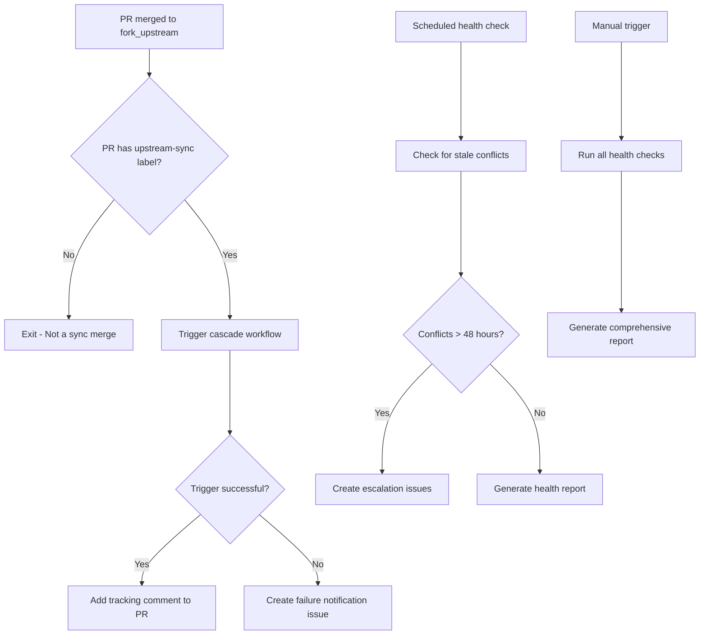

# Cascade Monitor Workflow Specification

This document specifies the cascade monitor workflow (`cascade-monitor.yml`) that detects when upstream sync changes are merged and automatically triggers the cascade integration process. **The monitor benefits from the sync workflow's duplicate prevention system**, which ensures only one sync PR per upstream state, providing clear and unambiguous monitoring.

## Overview

The cascade monitor workflow implements the **Cascade Monitor Pattern** (ADR-019) to provide reliable, event-driven triggering of cascade operations. It separates trigger detection from cascade execution, providing better error handling and observability than direct event triggers.

## Architecture Decision

**References**: 
- [ADR-019: Cascade Monitor Pattern](../src/adr/019-cascade-monitor-pattern.md)
- [ADR-021: Pull Request Target Trigger Pattern](../src/adr/021-pull-request-target-trigger-pattern.md)

**Key Benefits**:
- **Reliable Triggering**: Uses `pull_request_target` to read workflow from main branch, solving missing YAML issues
- **Error Handling**: Failed triggers create trackable issues for manual intervention
- **Separation of Concerns**: Monitor focuses on detection, cascade focuses on execution
- **Health Monitoring**: Periodic checks ensure pipeline health and escalate stale issues

**Important Note**: This workflow uses `pull_request_target` instead of `pull_request` to ensure the workflow file is read from the main branch, not from the PR's head branch. This is critical because fork_upstream typically doesn't contain workflow files.

## Workflow Configuration

### Triggers
```yaml
on:
  schedule:
    - cron: '0 */6 * * *'  # Health monitoring every 6 hours
  pull_request_target:
    types: [closed]
    branches:
      - fork_upstream      # Monitor PRs merged into fork_upstream
  workflow_dispatch:       # Allow manual trigger
```

### Permissions
```yaml
permissions:
  contents: read
  pull-requests: write
  issues: write
  actions: write          # Required to trigger other workflows
```

## Workflow Process

### High-Level Flow


## Job Specifications

### Job 1: Trigger Cascade on Upstream Merge

**Purpose**: Detect sync PR merges and trigger cascade workflow

**Trigger Conditions**:
```yaml
if: >
  github.event_name == 'pull_request_target' &&
  github.event.pull_request.merged == true &&
  github.event.pull_request.base.ref == 'fork_upstream' &&
  (contains(github.event.pull_request.labels.*.name, 'upstream-sync') ||
   contains(github.event.pull_request.labels.*.name, 'sync'))
```

**Implementation**:
```yaml
steps:
  - name: Checkout repository
    uses: actions/checkout@v5
  
  - name: Trigger cascade workflow
    env:
      GITHUB_TOKEN: ${{ secrets.GH_TOKEN }}
    run: |
      echo "🔄 PR #${{ github.event.pull_request.number }} merged into fork_upstream"
      echo "📋 PR title: ${{ github.event.pull_request.title }}"
      echo "🏷️ PR labels: ${{ join(github.event.pull_request.labels.*.name, ', ') }}"
      
      # Trigger the cascade integration workflow
      echo "Triggering cascade integration workflow..."
      if gh workflow run "Cascade Integration" --repo ${{ github.repository }}; then
        echo "✅ Cascade workflow triggered successfully"
        
        # Create tracking comment on merged PR
        gh pr comment ${{ github.event.pull_request.number }} \
          --body "🔄 **Cascade Triggered**
          
          This PR merge into \`fork_upstream\` has automatically triggered the cascade integration workflow.
          
          **Next Steps:**
          1. Monitor the cascade workflow for completion
          2. Review any integration conflicts if they arise  
          3. Validate the final integration before production merge
          
          🔗 [View Workflow Runs](https://github.com/${{ github.repository }}/actions/workflows/cascade.yml)"
      else
        echo "❌ Failed to trigger cascade workflow"
        
        # Create failure notification issue
        gh issue create \
          --title "🚨 Failed to trigger cascade workflow - $(date +%Y-%m-%d)" \
          --body "Failed to automatically trigger the cascade integration workflow after PR #${{ github.event.pull_request.number }} was merged into fork_upstream.
          
          **Manual Action Required:**
          1. Go to Actions → Cascade Integration
          2. Click 'Run workflow' manually
          3. Monitor for completion
          
          **PR Details:**
          - PR: #${{ github.event.pull_request.number }}
          - Title: ${{ github.event.pull_request.title }}
          - Merged at: $(date -u +%Y-%m-%dT%H:%M:%SZ)" \
          --label "cascade-trigger-failed,human-required,high-priority"
        
        exit 1
      fi
```

### Job 2: Check Stale Cascade Conflicts

**Purpose**: Monitor for conflicts that exceed SLA timeouts and create escalation issues

**Trigger**: Runs every 6 hours via schedule or manual dispatch

**Implementation**:
```yaml
steps:
  - name: Check for stale conflict PRs
    env:
      GITHUB_TOKEN: ${{ secrets.GH_TOKEN }}
    run: |
      echo "Checking for cascade PRs with unresolved conflicts..."
      
      # Find conflict PRs older than 48 hours
      stale_prs=$(gh pr list \
        --repo ${{ github.repository }} \
        --label "conflict,cascade-blocked" \
        --json number,createdAt,title,url \
        --jq '.[] | select((now - (.createdAt | fromdateiso8601)) > 172800)')
      
      if [ -n "$stale_prs" ]; then
        echo "Found stale conflict PRs:"
        echo "$stale_prs" | jq .
        
        echo "$stale_prs" | jq -r '.number' | while read pr_number; do
          pr_data=$(echo "$stale_prs" | jq -r --arg num "$pr_number" '.[] | select(.number == ($num | tonumber))')
          pr_title=$(echo "$pr_data" | jq -r '.title')
          pr_url=$(echo "$pr_data" | jq -r '.url')
          pr_created=$(echo "$pr_data" | jq -r '.createdAt')
          
          # Check if already escalated
          existing_labels=$(gh pr view $pr_number --json labels --jq '.labels[].name')
          if echo "$existing_labels" | grep -q "cascade-escalated"; then
            echo "PR #$pr_number already escalated, skipping"
            continue
          fi
          
          # Create escalation issue
          issue_url=$(gh issue create \
            --title "🚨 ESCALATION: Cascade conflict unresolved for 48+ hours (PR #$pr_number)" \
            --body "URGENT: PR #$pr_number has unresolved conflicts blocking the cascade pipeline. PR: $pr_url. Title: $pr_title. Created: $pr_created. SLA Status: EXCEEDED (48+ hours). The cascade pipeline is blocked. Assign a developer to resolve conflicts immediately." \
            --label "escalation,high-priority,cascade-escalated,human-required")
          
          echo "Created escalation issue: $issue_url"
          
          # Update PR with escalation notice
          gh pr comment $pr_number --body "ESCALATION: This conflict has exceeded the 48-hour SLA and has been escalated. Escalation Issue: $issue_url. Time Since Creation: >48 hours. Action Required: Immediate conflict resolution. Please resolve conflicts as soon as possible to unblock the cascade pipeline."
          
          # Add escalation label to PR
          gh pr edit $pr_number --add-label "cascade-escalated"
          echo "Added escalation label to PR #$pr_number"
        done
      else
        echo "✅ No stale conflict PRs found"
      fi
```

### Job 3: Generate Cascade Health Report

**Purpose**: Provide overall health monitoring and status visibility

**Implementation**:
```yaml
steps:
  - name: Generate cascade health report
    env:
      GITHUB_TOKEN: ${{ secrets.GH_TOKEN }}
    run: |
      echo "## Cascade Pipeline Health Report - $(date)"
      echo
      
      # Check active cascades
      active_cascades=$(gh pr list \
        --repo ${{ github.repository }} \
        --label "cascade-active" \
        --json number,title,createdAt)
      
      active_count=$(echo "$active_cascades" | jq length)
      echo "### Active Cascades: $active_count"
      if [ "$active_count" -gt 0 ]; then
        echo "$active_cascades" | jq -r '.[] | "- PR #\(.number): \(.title) (started: \(.createdAt))"'
      fi
      echo
      
      # Check blocked cascades
      blocked_cascades=$(gh pr list \
        --repo ${{ github.repository }} \
        --label "cascade-blocked" \
        --json number,title,createdAt)
      
      blocked_count=$(echo "$blocked_cascades" | jq length)
      echo "### Blocked Cascades: $blocked_count"
      if [ "$blocked_count" -gt 0 ]; then
        echo "$blocked_cascades" | jq -r '.[] | "- PR #\(.number): \(.title) (blocked since: \(.createdAt))"'
      fi
      echo
      
      # Check escalated issues
      escalated_issues=$(gh issue list \
        --repo ${{ github.repository }} \
        --label "cascade-escalated" \
        --state open \
        --json number,title,createdAt)
      
      escalated_count=$(echo "$escalated_issues" | jq length)
      echo "### Escalated Issues: $escalated_count"
      if [ "$escalated_count" -gt 0 ]; then
        echo "$escalated_issues" | jq -r '.[] | "- Issue #\(.number): \(.title)"'
      fi
      echo
      
      # Overall health status
      echo "### Overall Status"
      if [ "$blocked_count" -eq 0 ] && [ "$escalated_count" -eq 0 ]; then
        echo "✅ **HEALTHY**: Cascade pipeline is operating normally"
      elif [ "$escalated_count" -gt 0 ]; then
        echo "🔴 **CRITICAL**: Cascade pipeline has escalated issues requiring immediate attention"
      elif [ "$blocked_count" -gt 0 ]; then
        echo "🟡 **WARNING**: Cascade pipeline has blocked PRs"
      fi
      
      # Save report to step summary
      {
        echo "# Cascade Pipeline Health Report"
        echo "Generated: $(date)"
        echo
        echo "## Summary"
        echo "- Active Cascades: $active_count"
        echo "- Blocked Cascades: $blocked_count"
        echo "- Escalated Issues: $escalated_count"
        echo
        if [ "$blocked_count" -gt 0 ] || [ "$escalated_count" -gt 0 ]; then
          echo "## ⚠️ Action Required"
          echo "There are blocked or escalated items in the cascade pipeline that need attention."
        fi
      } >> $GITHUB_STEP_SUMMARY
```

## Error Handling and Recovery

### Trigger Failures
- **Detection**: Failed `gh workflow run` command
- **Action**: Create issue with `cascade-trigger-failed,human-required,high-priority` labels
- **Recovery**: Manual workflow dispatch available as fallback

### Network/API Failures
- **Strategy**: Exit gracefully, let next scheduled run retry
- **Logging**: Clear error messages in workflow logs
- **Escalation**: Persistent failures caught by health monitoring

### Rate Limiting
- **GitHub API**: Monitor rate limit headers
- **Backoff**: Built-in retry logic in `gh` CLI
- **Mitigation**: Spread operations across time windows

## Performance Considerations

### Execution Frequency
- **Event-Driven**: Immediate response to sync PR merges (optimal)
- **Health Checks**: Every 6 hours (balance of responsiveness vs. resource usage)
- **Resource Impact**: Minimal - mostly API calls and simple processing

### Scaling Characteristics
- **Repository Size**: Performance independent of repository size
- **Activity Level**: Scales linearly with number of sync operations
- **Team Size**: No impact on execution performance

## Monitoring and Alerts

### Success Metrics
- **Trigger Success Rate**: % of sync merges that successfully trigger cascades
- **Detection Latency**: Time between PR merge and cascade trigger
- **Health Check Coverage**: % of potential issues caught by monitoring

### Failure Indicators
- Issues with `cascade-trigger-failed` label
- PRs with `cascade-escalated` label
- Health reports showing degraded status

### Alerting Integration
```yaml
# Example Slack notification on critical status
- name: Alert on Critical Status
  if: contains(steps.health-check.outputs.status, 'CRITICAL')
  run: |
    curl -X POST $SLACK_WEBHOOK_URL \
      -H 'Content-type: application/json' \
      --data '{"text":"🔴 Cascade pipeline critical status detected"}'
```

## Integration Points

### With Sync Workflow
- **Dependency**: Monitors PRs created by sync workflow
- **Labels**: Relies on `upstream-sync` label from sync workflow
- **Coordination**: No direct communication - event-driven architecture
- **Duplicate Prevention**: Benefits from sync workflow's duplicate prevention system ensuring single PR per upstream state

### With Cascade Workflow
- **Triggering**: Uses `gh workflow run` to start cascade
- **Context**: Cascade runs independently once triggered
- **Error Handling**: Creates issues if trigger fails

### With Label Management (ADR-008)
- **Labels Used**: `upstream-sync`, `cascade-trigger-failed`, `human-required`, `high-priority`, `cascade-escalated`
- **Label Lifecycle**: Adds labels for tracking and escalation
- **Consistency**: Follows established label patterns

## Testing Strategy

### Unit Testing
- Label detection logic
- PR filtering conditions
- Issue creation templates

### Integration Testing
- End-to-end trigger detection
- Error handling scenarios
- Health monitoring accuracy

### Manual Testing
```bash
# Test trigger detection with mock PR
gh pr create --title "Test sync" --label "upstream-sync" --base fork_upstream

# Test health monitoring
gh workflow run "Cascade Monitor"

# Test escalation logic (requires stale PRs)
# (Run after creating old conflict PRs)
```

## Configuration Options

### Environment Variables
```yaml
# Health monitoring intervals
CONFLICT_SLA_HOURS: 48          # Hours before escalating conflicts
HEALTH_CHECK_INTERVAL: 6h       # Frequency of health checks

# Trigger behavior
TRIGGER_RETRY_ATTEMPTS: 3       # Retries for failed triggers
TRIGGER_RETRY_DELAY: 30s        # Delay between retries
```

### Workflow Customization
```yaml
# Adjust health check frequency
schedule:
  - cron: '0 */4 * * *'  # Every 4 hours instead of 6

# Additional label patterns
contains(github.event.pull_request.labels.*.name, 'sync-upstream')
```

## Future Enhancements

### Planned Improvements
1. **Batch Triggering**: Group rapid consecutive merges
2. **Smart Scheduling**: Avoid triggers during maintenance windows
3. **Advanced Health Metrics**: Trend analysis and predictive alerting
4. **Cross-Repository Monitoring**: Monitor multiple fork instances

### Integration Opportunities
- **External Monitoring**: Integration with Datadog, NewRelic
- **Slack/Teams**: Rich notifications with action buttons
- **Project Management**: Auto-update project boards based on status

## Related Decisions

- [ADR-019: Cascade Monitor Pattern](../src/adr/019-cascade-monitor-pattern.md) - Core architecture
- [ADR-020: Human-Required Label Strategy](../src/adr/020-human-required-label-strategy.md) - Task management approach
- [ADR-008: Centralized Label Management Strategy](../src/adr/008-centralized-label-management.md) - Label definitions

## Success Criteria

- 100% of valid sync merges trigger cascade workflows
- Trigger failures detected and resolved within 1 hour
- Stale conflicts escalated within 48 hours
- Zero false positive triggers
- Health reports provide actionable insights
- Team can operate confidently without manual monitoring