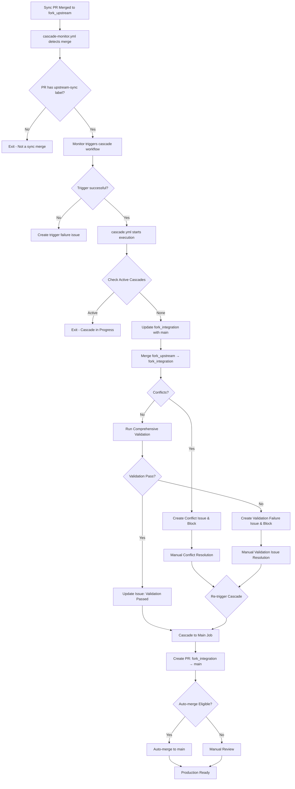
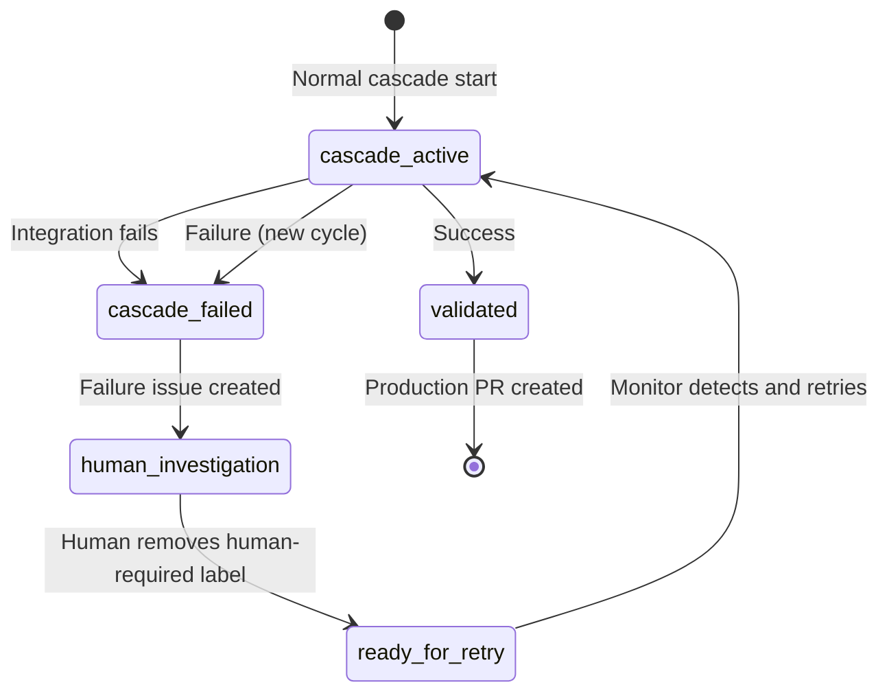

# Cascade Integration Workflow Specification

This document specifies the cascade integration workflow (`cascade.yml`) that automatically propagates upstream changes through the three-branch hierarchy from `fork_upstream` through `fork_integration` to `main`.

## Overview

The cascade workflow automates the progressive integration of upstream changes through the repository's branch hierarchy, ensuring proper validation and conflict resolution at each stage. It implements the integration strategy defined in [ADR-001](../src/adr/001-three-branch-strategy.md) and works in conjunction with the sync workflow. **The cascade workflow benefits from the sync workflow's duplicate prevention system**, which ensures a single sync PR and issue per upstream state, providing clear tracking throughout the cascade process.

## Architecture Decision

**References**: 
- [ADR-001: Three-Branch Fork Management Strategy](../src/adr/001-three-branch-strategy.md)
- [ADR-008: Centralized Label Management Strategy](../src/adr/008-centralized-label-management.md)

**Key Benefits**:
- **Automated Propagation**: Changes flow automatically through branch hierarchy
- **Comprehensive Validation**: Full build, test, and lint validation on integration branch
- **Early Issue Detection**: Validation failures caught before production PRs are created
- **Conflict Isolation**: Conflicts are detected and isolated at appropriate levels
- **Quality Gate**: Only validated, tested changes progress to production
- **Detailed Failure Tracking**: Validation failures create detailed issues with error logs

## Workflow Configuration

### Triggers
```yaml
on:
  workflow_dispatch:       # Manual trigger with issue number input
    inputs:
      issue_number:
        description: 'GitHub issue number for the upstream sync (e.g., 123)'
        required: true
        type: 'string'
```

**Architecture**: The cascade workflow uses the **Human-Centric Cascade Pattern** (ADR-019) with monitor safety net:

1. **Primary Path**: Humans manually trigger cascade after reviewing and merging sync PRs, providing the tracking issue number
2. **Safety Net**: **cascade-monitor.yml** detects missed triggers every 6 hours and auto-initiates with the issue number
3. **Issue Lifecycle**: Comprehensive tracking through GitHub issues using the provided issue number for precise tracking
4. **Error handling** creates notification issues and updates tracking issue status using the provided issue number

This design provides explicit human control with automatic safety net fallback, ensuring no upstream changes are forgotten while maintaining team control over integration timing and complete traceability.

### Permissions
```yaml
permissions:
  contents: write
  pull-requests: write
  issues: write
```

### Concurrency Control
```yaml
concurrency:
  group: cascade-${{ github.workflow }}-${{ github.ref }}
  cancel-in-progress: false  # Never cancel cascade operations
```

**Important**: Cascade operations must never run concurrently to prevent:
- Race conditions between integration stages
- Conflicting branch updates
- Duplicate PR creation
- Lost changes due to force pushes

## Workflow Process

### High-Level Flow


### Phase 0: Cascade Trigger Detection

**Handled by cascade-monitor.yml** (See [ADR-019: Cascade Monitor Pattern](../src/adr/019-cascade-monitor-pattern.md)):

```yaml
# Monitor detects sync PR merges
on:
  pull_request:
    types: [closed]
    branches:
      - fork_upstream

jobs:
  trigger-cascade-on-upstream-merge:
    if: >
      github.event.pull_request.merged == true &&
      contains(github.event.pull_request.labels.*.name, 'upstream-sync')
    steps:
      - name: Trigger cascade workflow
        run: |
          if gh workflow run "Cascade Integration" --repo ${{ github.repository }}; then
            echo "✅ Cascade triggered successfully"
          else
            # Create failure notification issue
            gh issue create \
              --title "🚨 Failed to trigger cascade workflow" \
              --label "cascade-trigger-failed,human-required,high-priority"
          fi
```

### Phase 1: Upstream to Integration Cascade with Validation

This phase executes when triggered by the monitor or manually via `workflow_dispatch`. It includes comprehensive validation to ensure upstream changes integrate successfully before creating production PRs.

#### Step 0: Check Cascade State
```bash
# Check for active cascade operations
# Note: Assumes 'cascade-active' label exists (created during init)
active_cascades=$(gh pr list --label "cascade-active" --json number,title)
if [ "$(echo $active_cascades | jq length)" -gt 0 ]; then
  echo "::notice::Cascade already in progress, exiting"
  exit 0
fi
```

#### Step 1: Prepare Integration Branch
```bash
# Ensure fork_integration has latest from main
git checkout fork_integration
git merge origin/main --no-edit

# This ensures we test upstream changes against current features
```

**Rationale**: By updating `fork_integration` with `main` first, we ensure that upstream changes are tested against the latest feature development, not stale code.

#### Step 2: Create Integration PR
```yaml
# Create timestamped branch
INTEGRATION_BRANCH="integrate/upstream-$(date +%Y%m%d-%H%M%S)"
git checkout -b $INTEGRATION_BRANCH

# Attempt merge
git merge origin/fork_upstream --no-edit
```

#### Step 3: Conflict Detection
```yaml
# Detect conflicts
if git diff --check; then
  CONFLICTS_FOUND=false
else
  CONFLICTS_FOUND=true
  git diff --name-only --diff-filter=U > conflicted_files.txt
fi
```

#### Step 4: Integration Validation

After successful merge (no conflicts), comprehensive validation runs directly on the `fork_integration` branch:

```yaml
# Comprehensive integration validation
- name: Validate integration
  run: |
    echo "🔍 Running comprehensive validation checks on integration branch..."
    
    # Project detection
    IS_JAVA_PROJECT=false
    if [ -f "pom.xml" ] || [ -n "$(find . -name 'pom.xml' -type f 2>/dev/null)" ]; then
      IS_JAVA_PROJECT=true
      echo "📋 Detected Java/Maven project"
    fi
    
    # Run Java-specific validation
    if [ "$IS_JAVA_PROJECT" = "true" ]; then
      echo "🔧 Setting up Java environment..."
      # Setup Maven settings if available
      if [ -f ".mvn/community-maven.settings.xml" ]; then
        mkdir -p ~/.m2
        cp .mvn/community-maven.settings.xml ~/.m2/settings.xml
      fi
      
      # Run Maven build and test
      echo "🔨 Running Maven build and tests..."
      if mvn -B clean install 2>&1; then
        echo "✅ Maven build and tests passed"
        VALIDATION_SUCCESS=true
      else
        echo "❌ Maven build or tests failed"
        VALIDATION_SUCCESS=false
      fi
    else
      echo "📋 Non-Java project detected - basic validation"
      VALIDATION_SUCCESS=true
    fi
```

**Validation Failure Handling**:
```yaml
# If validation fails
if [ "$VALIDATION_SUCCESS" = "false" ]; then
  # Create detailed validation failure issue
  gh issue create \
    --title "🚨 Integration Validation Failed: Build/Test Errors" \
    --body "$VALIDATION_FAILURE_DETAILS" \
    --label "validation-failed,cascade-blocked,high-priority,human-required"
  
  # Update tracking issue to blocked status
  gh issue edit "$TRACKING_ISSUE" \
    --remove-label "cascade-active" \
    --add-label "cascade-blocked"
  
  # Block progression to production PR
  exit 1
fi
```

#### Step 5: Production PR Creation (Only After Validation Passes)

Once validation passes, the cascade proceeds to Phase 2 (Production PR Creation).

#### Step 6: Conflict Handling (Alternative Path)

**Conflict PR** (when conflicts are detected in Step 3):
```yaml
PR_URL=$(gh pr create \
  --base fork_integration \
  --head $INTEGRATION_BRANCH \
  --title "🚨 CONFLICTS: Integrate upstream changes - $(date +%Y-%m-%d)" \
  --body "$CONFLICT_PR_BODY" \
  --label "conflict,upstream-sync,needs-resolution,cascade-blocked")

# Record conflict creation time for SLA tracking
PR_NUMBER=$(basename $PR_URL)
gh pr comment $PR_NUMBER --body "Conflict detected at $(date -u +%Y-%m-%dT%H:%M:%SZ). SLA: 48 hours for resolution."
```

### Phase 2: Integration to Main Cascade

This phase triggers automatically when Phase 1 validation passes. It only runs if:
- No merge conflicts were detected
- Integration validation (build, test, lint) passed successfully
- Tracking issue is updated with validation success

#### Step 1: Check for Changes
```bash
# Compare fork_integration with main
CHANGES=$(git rev-list --count origin/main..fork_integration)

if [ "$CHANGES" = "0" ]; then
  echo "No changes to cascade"
  exit 0
fi
```

#### Step 2: Create Production PR
```yaml
# Create temporary release branch to preserve fork_integration
RELEASE_BRANCH="release/upstream-$(date +%Y%m%d-%H%M%S)"
git checkout fork_integration
git checkout -b $RELEASE_BRANCH
git push origin $RELEASE_BRANCH

# Create PR to main using temporary release branch
gh pr create \
  --base main \
  --head $RELEASE_BRANCH \
  --title "🚀 Production Release: Upstream Integration - $(date +%Y-%m-%d)" \
  --body "$PR_BODY" \
  --label "upstream-sync,human-required"
```

**Branch Preservation**: The `fork_integration` branch is never used directly for PRs to `main` to prevent accidental deletion. Instead, temporary release branches are created and can be safely deleted after merge, preserving the core three-branch structure.

## Integration Testing

### Integration Branch Testing
When PRs target `fork_integration`, additional integration tests should run:

```yaml
# In build.yml, detect integration PRs
- name: Run Integration Tests
  if: github.base_ref == 'fork_integration'
  run: |
    # Run extended integration test suite
    mvn verify -Pintegration-tests
```

### Test Categories
1. **Unit Tests**: Run on all PRs (existing)
2. **Integration Tests**: Run on PRs to `fork_integration`
3. **Smoke Tests**: Run on PRs to `main`

## Error Handling and Recovery

### Merge Conflicts
```yaml
# When conflicts detected in Phase 1
- Create PR with conflict markers
- Add "conflict", "needs-resolution", and "cascade-blocked" labels
- Create linked issue for tracking
- Notify team via issue mentions
- Start 48-hour SLA timer
```

### Conflict Escalation
```yaml
# Run daily via scheduled workflow
- name: Check Stale Conflicts
  run: |
    # Find conflict PRs older than 48 hours
    stale_prs=$(gh pr list \
      --label "conflict,cascade-blocked" \
      --json number,createdAt,title \
      --jq '.[] | select((now - (.createdAt | fromdateiso8601)) > 172800)')
    
    for pr in $stale_prs; do
      pr_number=$(echo $pr | jq -r .number)
      
      # Create escalation issue
      gh issue create \
        --title "🚨 ESCALATION: Cascade conflict unresolved for 48+ hours" \
        --body "PR #$pr_number has unresolved conflicts blocking the cascade pipeline." \
        --label "escalation,high-priority,cascade-blocked" \
        --assignee "@$(gh api /repos/:owner/:repo/collaborators --jq '.[].login' | head -1)"
      
      # Update PR with escalation notice
      gh pr comment $pr_number --body "⚠️ This conflict has exceeded the 48-hour SLA and has been escalated."
    done
```

### Integration Validation Failures
```yaml
# If validation fails on fork_integration branch
- Detailed validation failure issue created with build logs
- Tracking issue updated to 'cascade-blocked' status
- Production PR creation blocked until resolution
- Team investigates validation failure
- May require upstream fix, local adaptation, or dependency updates

# Validation failure issue includes:
- Complete build/test output
- Error details and stack traces  
- Resolution steps and guidance
- Links to workflow logs
- SLA timer (48 hours for resolution)
```

### Build Failures (Legacy - now handled by Integration Validation)
```yaml
# If build fails on integration PR (deprecated - validation now runs directly)
- PR remains open
- Build status prevents merge
- 'cascade-failed' label added
- Team investigates failure
- May require upstream fix or local adaptation
```

### Recovery Procedures
1. **Conflict Resolution**:
   ```bash
   # Developer checks out branch
   git checkout integrate/upstream-TIMESTAMP
   # Resolve conflicts
   git merge --continue
   # Push resolution
   git push
   ```

2. **Integration Validation Failure Resolution**:
   ```bash
   # Check out integration branch to debug
   git checkout fork_integration
   
   # For Java projects - run local build to see errors
   mvn clean install
   
   # Fix issues locally:
   # - Update dependencies if compatibility issues
   # - Fix compilation errors from upstream changes
   # - Resolve test failures
   # - Update configuration if needed
   
   # Push fixes to integration branch
   git add .
   git commit -m "fix: resolve integration validation issues"
   git push origin fork_integration
   
   # Re-trigger cascade workflow with same issue number
   gh workflow run "Cascade Integration" -f issue_number="<ISSUE_NUMBER>"
   ```

3. **Build Failure Resolution** (Legacy):
   - Fix in integration branch if local issue
   - Report upstream if upstream issue
   - Apply temporary patch if critical

## Automation Rules

### Auto-merge Eligibility

#### Phase 1: Upstream → Integration
**Always Manual Review** - This is the critical safety gate where upstream changes are first introduced.

#### Phase 2: Integration → Main
**Always Manual Review Required** - All production PRs require human approval before merge.

```yaml
# All production PRs require manual review
echo "Production PR requires manual review before merge"
# All production PRs require human review (indicated by human-required label)
```

### Manual Intervention Points
1. **Conflict Resolution**: Always requires manual intervention
2. **Production PRs**: All PRs to main require human review and approval
3. **Breaking Changes**: Detected via commit messages or file patterns
4. **Security Alerts**: Triggered by security scanning

## Performance Optimization

### Concurrent Operations
- Run build checks in parallel with PR creation
- Pre-fetch branches to reduce network calls
- Cache dependency resolution between stages

### Resource Management
```yaml
# Limit concurrent cascade operations
concurrency:
  group: cascade-${{ github.ref }}
  cancel-in-progress: false  # Never cancel cascade operations
```

## Cascade State Management

### State Labels
The cascade workflow uses predefined system labels to track state and enable visibility. All labels are created during repository initialization from `.github/labels.json` as defined in [ADR-008](../src/adr/008-centralized-label-management.md).

See [Label Management Strategy](label-strategy.md) for the complete label reference.

#### Cascade-Specific Labels:
- `cascade-active` - Currently processing through pipeline
- `cascade-blocked` - Waiting on conflict or validation resolution  
- `cascade-failed` - Integration failed, automatic recovery system engaged
- `cascade-escalated` - SLA exceeded, needs attention
- `validation-failed` - Integration validation (build/test) failed
- `validated` - Integration completed successfully

#### Additional Labels Used:
- `upstream-sync` - Marks PRs containing upstream changes
- `conflict` - Indicates merge conflicts exist
- `needs-resolution` - Requires manual intervention
- `human-required` - All production PRs require human review
- `escalation` - Escalated issues
- `high-priority` - High priority items
- `emergency` - Emergency issues
- `rollback` - Rollback operations
- `production-ready` - Ready for production

### Label Lifecycle
1. **cascade-active**: Added when PR created, removed when merged/closed
2. **cascade-blocked**: Added on conflict detection
3. **cascade-ready**: Added when all checks pass
4. **cascade-escalated**: Added after 48-hour SLA

## Visibility and Communication

### Status Dashboard
Create a GitHub Project board with automated rules:
- **In Progress**: PRs with `cascade-active`
- **Blocked**: PRs with `cascade-blocked`
- **Ready**: PRs with `cascade-ready`
- **Escalated**: Issues with `cascade-escalated`

### Notifications
```yaml
# Team notification on key events
- name: Notify Team
  if: steps.cascade.outputs.notification_required == 'true'
  run: |
    # Post to team slack/teams channel
    # Create GitHub notification
    # Update status dashboard
```

## Automated Failure Recovery System

The cascade workflow includes a sophisticated failure recovery system that enables self-healing operations through label-based state management.

### Failure Detection and Response

When a cascade integration fails, the system automatically:

1. **Creates Failure Issue**: Technical details in a separate high-priority issue
2. **Updates Tracking Issue**: Adds `cascade-failed + human-required` labels
3. **Provides Recovery Instructions**: Clear steps for human intervention

```yaml
# Failure handling in cascade.yml
if cascade_fails:
  # Create technical failure issue
  FAILURE_ISSUE_URL=$(gh issue create \
    --title "🚨 Cascade Pipeline Failure: $FAILURE_TYPE" \
    --label "high-priority,human-required")
  
  # Update original tracking issue
  gh issue edit "$TRACKING_ISSUE" \
    --remove-label "cascade-active" \
    --add-label "cascade-failed,human-required"
  
  # Link issues and provide recovery instructions
  gh issue comment "$TRACKING_ISSUE" --body "Recovery Instructions..."
```

### Automatic Recovery Detection

The cascade monitor (`cascade-monitor.yml`) runs every 6 hours and detects when failures have been resolved:

```yaml
# Recovery detection logic
detect-recovery-ready:
  steps:
    - name: Check for recovery-ready issues
      run: |
        # Find issues with cascade-failed but NOT human-required
        RECOVERY_ISSUES=$(gh issue list \
          --label "cascade-failed" \
          --state open \
          --jq '.[] | select(.labels | contains(["cascade-failed"]) and (contains(["human-required"]) | not))')
        
        # Automatically retry cascade for each recovery-ready issue
        echo "$RECOVERY_ISSUES" | jq -r '.number' | while read ISSUE_NUMBER; do
          # Update labels: cascade-failed → cascade-active  
          gh issue edit "$ISSUE_NUMBER" \
            --remove-label "cascade-failed" \
            --add-label "cascade-active"
          
          # Trigger automatic retry
          gh workflow run "Cascade Integration" -f issue_number="$ISSUE_NUMBER"
        done
```

### Human Recovery Workflow

1. **Failure Notification**: Developer receives notification about cascade failure
2. **Investigation**: Review failure issue for technical details and root cause
3. **Fix Implementation**: Make necessary changes (may require updates to `fork_integration` branch)
4. **Signal Resolution**: Remove `human-required` label from tracking issue
5. **Automatic Retry**: Monitor detects label removal and retries cascade within 6 hours
6. **Success/New Failure**: Either completes successfully or creates new failure issue

### Recovery State Transitions



### Benefits

- **Self-Healing**: No manual workflow re-triggering required
- **Clear Communication**: Separate issues for tracking vs. technical problems  
- **Audit Trail**: Complete failure/recovery history in tracking issues
- **Predictable Process**: Developers know exactly how to signal resolution
- **Robust Error Handling**: Multiple failure attempts tracked separately

## Monitoring and Metrics

### Key Metrics
- **Cascade Success Rate**: Clean cascades vs. conflicts vs. validation failures
- **Integration Validation Success Rate**: % of upstream changes that pass validation
- **Time to Production**: fork_upstream → main duration
- **Conflict Resolution Time**: Average time to resolve conflicts
- **Validation Failure Resolution Time**: Average time to resolve build/test issues
- **Build Success Rate**: Per cascade stage
- **SLA Compliance**: % of conflicts and validation failures resolved within 48 hours
- **Manual Review Time**: Average time from PR creation to human approval
- **Early Detection Rate**: % of issues caught in integration vs. production

### Alerting
```yaml
# Create alert issue on cascade failure
- name: Alert on Cascade Failure
  if: failure()
  run: |
    gh issue create \
      --title "🚨 Cascade Pipeline Failure" \
      --body "$FAILURE_DETAILS" \
      --label "cascade-failed,high-priority"
```

## Integration with Other Workflows

### Sync Workflow
- Triggers cascade when PR merges to `fork_upstream`
- Provides upstream changes to cascade
- **Duplicate prevention ensures single sync PR per upstream state**, providing clear tracking throughout cascade process

### Build Workflow
- Validates each cascade PR
- Runs appropriate test suites per stage

### Validate Workflow
- Ensures commit standards
- Checks PR compliance

### Release Workflow
- Triggered after successful cascade to main
- Includes upstream changes in release notes

## Configuration Options

### Environment Variables
```yaml
# Cascade behavior customization
CASCADE_MANUAL_REVIEW: true       # All production PRs require human review
CASCADE_CONFLICT_TIMEOUT: 48h     # Time before escalating conflicts
CASCADE_INTEGRATION_TESTS: true   # Run integration tests
CASCADE_BATCH_WINDOW: 1h         # Wait time for batching changes
```

### Workflow Customization
```yaml
# Disable specific cascade paths
SKIP_INTEGRATION_CASCADE: false   # Skip fork_integration stage
DIRECT_TO_MAIN: false            # Allow direct upstream→main (dangerous)
```

## Testing Strategy

### Unit Tests
- Cascade logic functions
- Conflict detection accuracy
- PR creation templates

### Integration Tests
- Full cascade simulation
- Multi-stage propagation
- Conflict scenario handling

### End-to-End Tests
- Complete sync→cascade→release flow
- Performance under load
- Recovery procedure validation

## Rollback Strategy

### Identifying Cascade Commits
All cascade PRs are tagged with specific labels and branch patterns:
- Branch pattern: `integrate/upstream-*` or `release/upstream-*`
- Labels: `upstream-sync`, `cascade-active` (from `.github/labels.json`)
- Commit messages: Include upstream version references

### Rollback Procedures
```yaml
# Emergency rollback script
- name: Rollback Cascade
  run: |
    # Find the last cascade merge to main
    LAST_CASCADE=$(git log --grep="Cascade upstream changes" -1 --format="%H")
    
    # Create revert PR
    git checkout -b revert/cascade-$(date +%Y%m%d-%H%M%S)
    git revert $LAST_CASCADE --no-edit
    
    # Create high-priority revert PR
    gh pr create \
      --title "🔥 REVERT: Rollback cascade changes" \
      --body "Emergency rollback of upstream cascade" \
      --label "emergency,rollback,high-priority" \
      --reviewer "@$(gh api /repos/:owner/:repo/collaborators --jq '.[].login' | head -1)"
```

### Post-Rollback Actions
1. Create incident report issue
2. Analyze root cause
3. Fix upstream or add local patches
4. Re-run cascade with fixes

## Security Considerations

### Branch Protection
- Cascade branches require PR reviews
- No direct pushes to protected branches
- Signed commits enforced

### Secret Management
- PAT token with minimal required scopes
- No secrets in PR descriptions
- Audit trail for all operations

## Future Enhancements

### Planned Improvements
1. **Intelligent Conflict Resolution**: AI-assisted conflict suggestions
2. **Batch Processing**: Group multiple upstream changes
3. **Rollback Capability**: Automated rollback on critical failures
4. **Custom Test Stages**: Configurable test suites per project type

### Extensibility Points
- Custom conflict resolution strategies
- Project-specific validation rules
- External integration notifications
- Advanced merge strategies

## References

- [ADR-001: Three-Branch Fork Management Strategy](../src/adr/001-three-branch-strategy.md)
- [ADR-005: Automated Conflict Management Strategy](../src/adr/005-conflict-management.md)
- [ADR-008: Centralized Label Management Strategy](../src/adr/008-centralized-label-management.md)
- [ADR-019: Cascade Monitor Pattern](../src/adr/019-cascade-monitor-pattern.md)
- [ADR-020: Human-Required Label Strategy](../src/adr/020-human-required-label-strategy.md)
- [Label Management Strategy](label-strategy.md)
- [Sync Workflow Specification](sync-workflow.md)
- [Build Workflow Specification](build-workflow.md)
- [Validation Workflow Specification](validate-workflow.md)