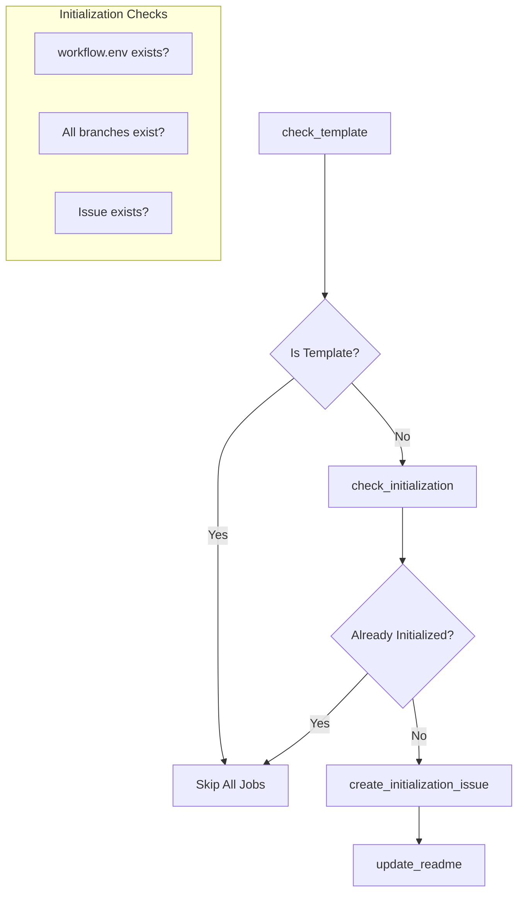
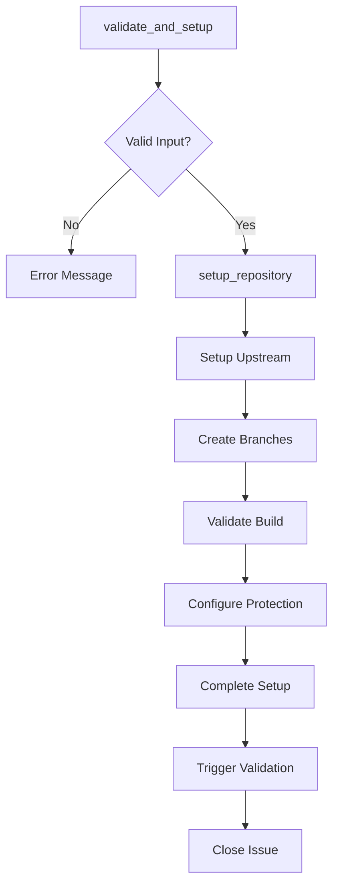
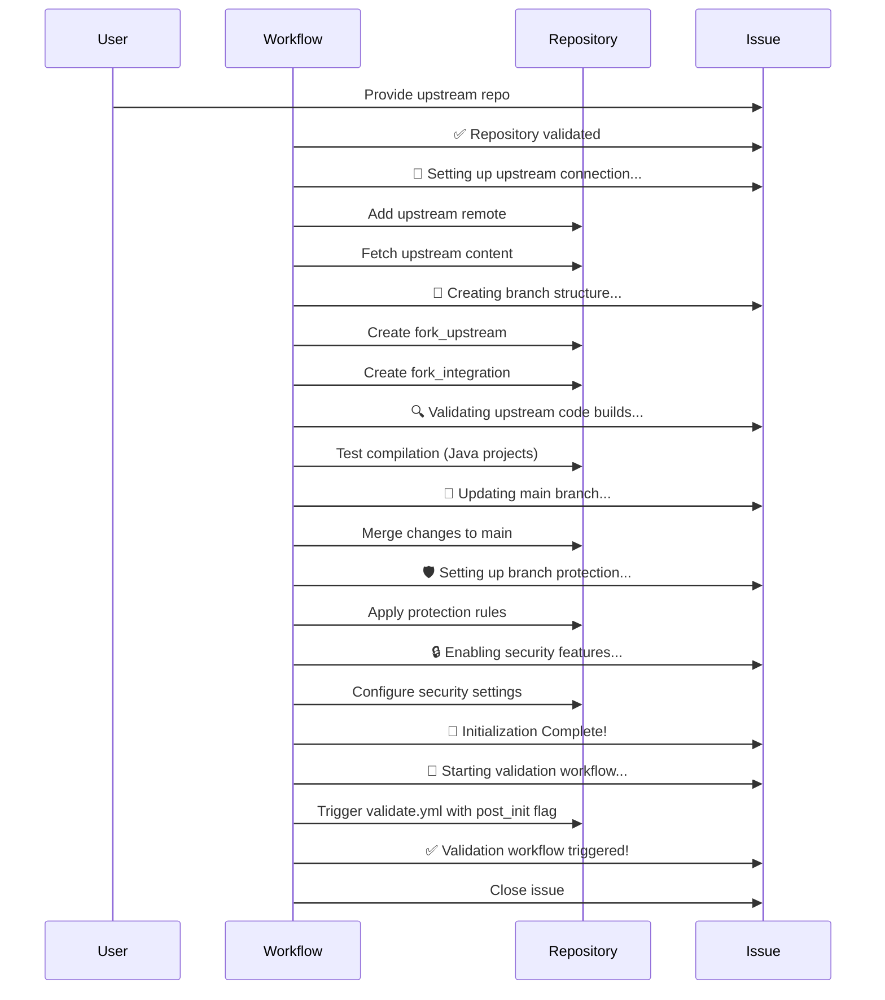

# Fork Management Initialization Workflow Specification

This document specifies the two-workflow initialization pattern for the Fork Management Template, implementing ADR-006 for improved user experience and maintainability.

## Overview

The initialization process is split into two focused workflows that handle distinct phases:

1. **`init.yml`** - User interface and issue management (~40 lines, streamlined)
2. **`init-complete.yml`** - Repository setup and configuration (~300 lines, comprehensive)

This separation provides better error handling, clearer user communication, and improved maintainability compared to the previous single-workflow approach.

## Architecture Decisions

**References**: 
- [ADR-006: Two-Workflow Initialization Pattern](../src/adr/006-two-workflow-initialization.md)
- [ADR-015: Template-Workflows Separation Pattern](../src/adr/015-template-workflows-separation-pattern.md)

**Key Benefits**:
- **Separation of Concerns**: User interaction vs. system setup
- **Better UX**: Friendly messages with progress updates
- **Maintainability**: Focused workflows easier to debug and modify
- **State Management**: Clear initialization indicators
- **Clean Fork Repositories**: Only production workflows copied (no template pollution)

## Workflow 1: init.yml - User Interface

### Purpose
Creates user-friendly initialization issue and manages initial repository state for template instances.

### Triggers
```yaml
on:
  push:
    branches: [main]  # Template creation detection
```

### Jobs Overview



### State Detection Logic

**Primary Indicator**: `.github/workflow.env` file
- Contains `INITIALIZATION_COMPLETE=true`
- Most reliable indicator of completed setup

**Secondary Checks**:
- Existence of all three branches (`main`, `fork_upstream`, `fork_integration`)
- Existing initialization issues with `initialization` label

### User Experience Features

**Welcome Message**:
```markdown
# 🚀 Welcome to the OSDU Fork Management Template!

## Supported Formats
**GitHub Repository:** `owner/repository-name`
**GitLab Repository:** `https://gitlab.company.com/group/repository-name`

### Instructions
1. Reply to this issue with just the repository reference
2. Automation will validate and begin setup
3. You'll receive progress updates
4. Issue closes automatically when complete
```

**README Integration**:
- Adds initialization status banner to README
- Provides direct link to initialization issue
- Removed automatically upon completion

## Workflow 2: init-complete.yml - Repository Setup

### Purpose
Validates user input, creates repository structure, and completes initialization setup.

### Triggers
```yaml
on:
  issue_comment:
    types: [created]
```

### Conditional Execution
```yaml
if: |
  github.event.issue.state == 'open' &&
  contains(github.event.issue.labels.*.name, 'initialization')
```

### Jobs Overview



### Validation Logic

**GitHub Format**: `^[A-Za-z0-9_.-]+/[A-Za-z0-9_.-]+$`
- Example: `microsoft/OSDU`, `Azure/osdu-infrastructure`

**GitLab Format**: `^https?://[^/]+/[^/]+/[^/]+(/.*)?$`
- Example: `https://gitlab.company.com/group/repository-name`

**Error Handling**:
```yaml
# User-friendly error messages
echo "❌ Invalid repository format. Expected 'owner/repo' but got '$REPO'" | 
  gh issue comment "${{ github.event.issue.number }}" --body-file -
```

### Repository Setup Process



### Branch Creation Strategy

1. **fork_upstream**: Created from upstream's default branch (main/master)
   ```bash
   git checkout -b fork_upstream upstream/$DEFAULT_BRANCH
   git push -u origin fork_upstream
   ```

2. **fork_integration**: Created from fork_upstream
   ```bash
   git checkout -b fork_integration fork_upstream
   
   # Copy files according to sync configuration
   git checkout main -- .github/sync-config.json
   
   # Copy directories and files from main based on .github/sync-config.json rules
   # Copy template configuration and support files
   
   # Add template remote for workflow and template updates
   git remote add template "$TEMPLATE_REPO_URL"
   git fetch template main --depth=1
   
   # Copy fork production workflows from template-workflows/ (ADR-015)
   git checkout template/main -- .github/template-workflows/
   mkdir -p .github/workflows
   cp .github/template-workflows/*.yml .github/workflows/
   
   # Initialize tracking files including .github/.template-sync-commit
   
   git commit -m "chore: copy configuration and workflows from main branch"
   git push -u origin fork_integration
   ```

3. **Build Validation**: Validates upstream code quality
   ```bash
   # For Java projects: Set up JDK and test compilation
   mvn clean compile -q -B
   # Provides user feedback on build status and requirements
   ```

4. **main**: Updated via merge from fork_integration
   ```bash
   git checkout main
   git merge fork_integration --no-ff -m "chore: complete repository initialization"
   git push origin main
   ```

### Build Validation Strategy

Before merging upstream code to the main branch, the workflow validates that the code can be built successfully. This prevents broken code from being merged and provides early feedback about potential issues.

**Java Project Detection**:
```bash
# Check for Maven projects
if [ -f "pom.xml" ] || [ -n "$(find . -name 'pom.xml' -type f)" ]; then
  # Java project detected
fi
```

**Build Validation Process**:
1. **Setup**: Configure JDK 17 with Maven caching
2. **Dependencies**: Copy community Maven settings if available
3. **Compilation**: Run `mvn clean compile` with 5-minute timeout
4. **Feedback**: Provide detailed status and guidance

**Success Scenarios**:
- ✅ **Compilation Success**: Code compiles without errors
- ⚠️ **Compilation Warnings**: Code has issues but initialization continues

**User Guidance on Build Issues**:
- Check upstream README for build requirements
- Verify dependency accessibility
- Review Maven settings configuration
- Manual build verification recommended post-init

**Non-Java Projects**:
- Skips build validation with informational message
- Recommends manual verification after initialization

### Post-Initialization Validation

After the main initialization completes, the validation workflow is automatically triggered to verify the repository builds correctly.

**Workflow**: `validate.yml`

**Trigger**: Automatically dispatched by `init-complete.yml` using `workflow_dispatch` with `post_init=true`

**Validation Process**:

The standard validation workflow performs comprehensive checks:

1. **Initialization Status Check**
   - Verifies workflow environment file exists
   - Confirms `INITIALIZATION_COMPLETE=true`

2. **Repository State Check**
   - Detects project type (Java/Maven or other)
   - Identifies initialized vs. template state

3. **Build Validation** (Java Projects)
   - Sets up JDK 17 with Maven caching
   - Copies community Maven settings if available
   - Runs full Maven build with tests
   - Reports build status and test results

4. **Code Quality Checks**
   - Validates commit messages (conventional commits)
   - Checks for merge conflicts
   - Verifies branch status

**Benefits of Using validate.yml**:
- **No extra workflows**: Reuses existing validation infrastructure
- **Consistent validation**: Same checks for init and ongoing development
- **Automatic cleanup**: No one-time workflows left in repository
- **Manual trigger**: Can be re-run anytime via Actions tab

**User Experience**:
- Validation triggered automatically after initialization
- Results visible in Actions tab
- No additional issue comments (keeps issue clean)
- Full logs available for troubleshooting

### State Management

**Repository Variables**:
```bash
gh variable set INITIALIZATION_COMPLETE --body "true"
```

**Repository Variables**:
```bash
gh variable set UPSTREAM_REPO_URL --body "$UPSTREAM_URL"
```

**Validation Detection**: Uses repository variables:
```bash
gh variable set INITIALIZATION_COMPLETE --body "true"
```

### Branch Protection Configuration

```json
{
  "required_status_checks": {
    "strict": true,
    "contexts": []
  },
  "enforce_admins": false,
  "required_pull_request_reviews": {
    "required_approving_review_count": 1,
    "dismiss_stale_reviews": true
  },
  "restrictions": null,
  "allow_force_pushes": false,
  "allow_deletions": false
}
```

Applied to all three branches: `main`, `fork_upstream`, `fork_integration`

### Security Features

**Repository Security Settings**:
- Secret scanning enabled
- Dependency vulnerability alerts
- Security advisory database updates

**Configuration File**: `.github/security-on.json`

### Completion Messaging

**Success Summary**:
```markdown
🎉 **Initialization Complete!**

✅ **Branch Structure:**
- `main` - Your stable development branch
- `fork_upstream` - Tracks upstream changes  
- `fork_integration` - Integration and conflict resolution

✅ **Branch Protection:** All branches protected with PR requirements
✅ **Upstream Connection:** Connected to `upstream/repo`
✅ **Automated Workflows:** Sync, validation, and release workflows active
✅ **Build Validation:** Upstream code validated during initialization
✅ **Security Features:** Secret scanning and dependency updates enabled

## Next Steps
1. Review workflows in Actions tab
2. Check documentation in `doc/` folder
3. Start developing with feature branches from `main`
4. Upstream sync happens automatically via sync workflow
```

## Concurrency Control

```yaml
concurrency:
  group: ${{ github.workflow }}-${{ github.event.issue.number }}
  cancel-in-progress: false
```

Prevents multiple initialization attempts on the same issue while allowing parallel processing of different repositories.

## Error Recovery

**Validation Failures**:
- Clear error messages with expected format examples
- No repository changes made on validation failure
- User can immediately retry with correct format

**Setup Failures**:
- Detailed error context in issue comments
- State preserved for manual intervention if needed
- Logs available in Actions tab for debugging

## Performance Characteristics

**Execution Time**:
- Issue creation: < 30 seconds
- Full setup: 2-5 minutes (depending on upstream size)
- README updates: < 15 seconds

**Resource Usage**:
- Standard GitHub Actions runner
- No external dependencies
- Minimal network usage (GitHub API + git operations)

## Testing Strategy

**Unit Testing**:
- Validation logic testing with various input formats
- State detection logic verification
- Error message accuracy

**Integration Testing**:
- End-to-end template creation and initialization
- Multi-provider upstream repository testing
- Branch protection and security feature verification

**User Acceptance Testing**:
- Non-technical user initialization flow
- Error recovery and retry scenarios
- Documentation clarity and completeness

## Maintenance Considerations

**Monitoring**:
- Issue creation success rate
- Setup completion rate
- User error patterns
- Performance metrics

**Evolution**:
- Template customization support
- Additional validation rules
- Enhanced progress reporting
- Multi-language repository support

## References

- [ADR-006: Two-Workflow Initialization Pattern](../src/adr/006-two-workflow-initialization.md)
- [ADR-015: Template-Workflows Separation Pattern](../src/adr/015-template-workflows-separation-pattern.md)
- [Product Architecture: Initialization](architecture.md#42-initialize-architecture-initylm--init-completeyml)
- [Workflow Distribution Strategy](workflow-strategy-spec.md)
- [Sync Workflow Specification](sync-workflow-spec.md)
- [Build Workflow Specification](build-workflow-spec.md)