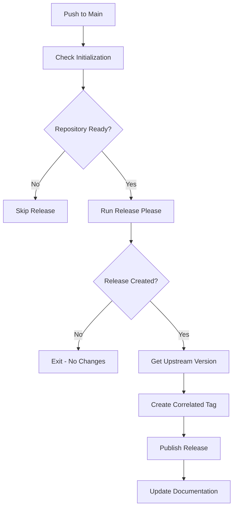
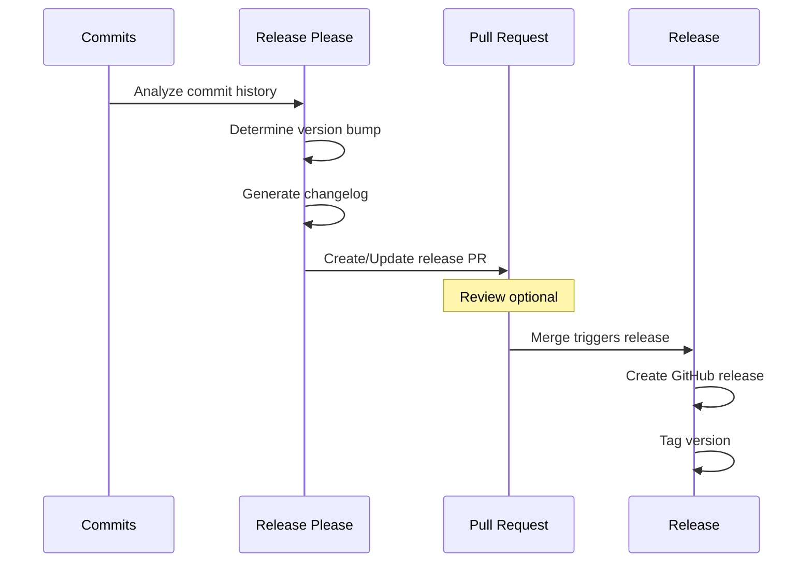

# Release Management Workflow Specification

This document specifies the release management workflow (`release.yml`) that automates semantic versioning, changelog generation, and GitHub release publication using Release Please and conventional commits.

## Overview

The release workflow implements automated version management as defined in [ADR-004](../src/adr/004-release-please-versioning.md). It uses Google's Release Please action to analyze commit history, determine version bumps, generate comprehensive changelogs, and publish GitHub releases with upstream version correlation.

## Architecture Integration

**References**: 
- [ADR-004: Release Please for Version Management](../src/adr/004-release-please-versioning.md)
- [ADR-001: Three-Branch Fork Management Strategy](../src/adr/001-three-branch-strategy.md)

**Key Benefits**:
- **Automated Versioning**: Semantic version determination from commit messages
- **Comprehensive Documentation**: Auto-generated changelogs with categorization
- **Upstream Correlation**: Version tags maintain upstream references
- **Zero Manual Intervention**: Fully automated release process
- **Meta Commit Integration**: Works seamlessly with meta commits from upstream sync ([ADR-023](../src/adr/023-meta-commit-strategy-for-release-please.md))

## Workflow Configuration

### Triggers
```yaml
on:
  push:
    branches:
      - main
  workflow_dispatch:  # Manual trigger capability
```

### Permissions
```yaml
permissions:
  contents: write
  pull-requests: write
```

### Environment
```yaml
env:
  RELEASE_TYPE: 'simple'  # Simple versioning for non-library projects
```

## Workflow Architecture

### High-Level Flow


### Release Please Process


## Phase 1: Initialization Check

### Repository State Validation
```yaml
- name: Check initialization status
  run: |
    if [ ! -f ".github/workflow.env" ]; then
      echo "::warning::Repository not initialized - skipping release"
      echo "initialized=false" >> $GITHUB_OUTPUT
      exit 0
    fi
    
    # Verify upstream configuration
    if [ -f ".github/workflow.env" ]; then
      source .github/workflow.env
      if [ -z "$UPSTREAM_REPO_URL" ]; then
        echo "::warning::Upstream repository not configured"
      fi
    fi
    
    echo "initialized=true" >> $GITHUB_OUTPUT
```

### Prerequisites Verification
- Repository must be initialized (`.github/workflow.env` exists)
- Main branch must have commit history
- Conventional commits must be used for proper versioning

## Phase 2: Release Please Execution

### Configuration
```yaml
- name: Run Release Please
  uses: googleapis/release-please-action@v4
  id: release
  with:
    release-type: simple
    package-name: ${{ github.event.repository.name }}
    token: ${{ secrets.GITHUB_TOKEN }}
    
    # Changelog configuration
    changelog-types: |
      [
        {"type": "feat", "section": "🚀 Features", "hidden": false},
        {"type": "fix", "section": "🐛 Bug Fixes", "hidden": false},
        {"type": "perf", "section": "⚡ Performance Improvements", "hidden": false},
        {"type": "revert", "section": "🔄 Reverts", "hidden": false},
        {"type": "docs", "section": "📚 Documentation", "hidden": false},
        {"type": "style", "section": "💎 Style", "hidden": false},
        {"type": "refactor", "section": "♻️ Code Refactoring", "hidden": false},
        {"type": "test", "section": "🧪 Tests", "hidden": false},
        {"type": "build", "section": "🏗️ Build System", "hidden": false},
        {"type": "ci", "section": "🤖 CI/CD", "hidden": false},
        {"type": "chore", "section": "🧹 Miscellaneous", "hidden": false},
        {"type": "upstream", "section": "⬆️ Upstream Updates", "hidden": false}
      ]
    
    # Version file locations
    version-file: "version.txt"
    
    # PR configuration
    pull-request-title-pattern: "chore: release ${version}"
    pull-request-header: |
      :robot: I am a robot. This PR was created by Release Please.
```

### Version Determination Logic

**Conventional Commit → Version Bump Mapping**:
```yaml
# Breaking changes (!) → Major version
feat!: Complete API redesign → v1.0.0 → v2.0.0

# New features → Minor version  
feat: Add user authentication → v1.0.0 → v1.1.0

# Bug fixes → Patch version
fix: Resolve login issue → v1.1.0 → v1.1.1

# Other changes → No version bump
chore: Update dependencies → No release
```

### Release Please Outputs
```yaml
outputs:
  release_created: ${{ steps.release.outputs.release_created }}
  tag_name: ${{ steps.release.outputs.tag_name }}
  version: ${{ steps.release.outputs.version }}
  upload_url: ${{ steps.release.outputs.upload_url }}
  html_url: ${{ steps.release.outputs.html_url }}
```

## Phase 3: Upstream Version Correlation

### Fetch Upstream Version
```yaml
- name: Get upstream version
  if: steps.release.outputs.release_created
  run: |
    # Source configuration
    source .github/workflow.env
    
    # Add upstream remote if needed
    if ! git remote | grep -q upstream; then
      git remote add upstream "$UPSTREAM_REPO_URL"
    fi
    
    # Fetch upstream tags
    git fetch upstream --tags --quiet
    
    # Get latest upstream version
    UPSTREAM_VERSION=$(git describe --tags --abbrev=0 upstream/main 2>/dev/null || echo "unknown")
    
    # Clean version format (remove 'v' prefix if present)
    UPSTREAM_VERSION=${UPSTREAM_VERSION#v}
    
    echo "upstream_version=$UPSTREAM_VERSION" >> $GITHUB_OUTPUT
    echo "Upstream version: $UPSTREAM_VERSION"
```

### Create Correlated Tag
```yaml
- name: Create upstream-correlated tag
  if: steps.release.outputs.release_created
  env:
    RELEASE_TAG: ${{ steps.release.outputs.tag_name }}
    UPSTREAM_VERSION: ${{ steps.get-upstream.outputs.upstream_version }}
  run: |
    # Create correlated tag
    CORRELATED_TAG="${RELEASE_TAG}-upstream-${UPSTREAM_VERSION}"
    
    # Tag the release commit
    git tag "$CORRELATED_TAG" "${{ github.sha }}"
    
    # Push the correlated tag
    git push origin "$CORRELATED_TAG"
    
    echo "Created correlated tag: $CORRELATED_TAG"
    echo "correlated_tag=$CORRELATED_TAG" >> $GITHUB_OUTPUT
```

## Phase 4: Release Enhancement

### Update Release Description
```yaml
- name: Update release with upstream info
  if: steps.release.outputs.release_created
  uses: actions/github-script@v7
  with:
    script: |
      const releaseId = ${{ steps.release.outputs.id }};
      const upstreamVersion = '${{ steps.get-upstream.outputs.upstream_version }}';
      const correlatedTag = '${{ steps.create-tag.outputs.correlated_tag }}';
      
      // Get current release
      const { data: release } = await github.rest.repos.getRelease({
        owner: context.repo.owner,
        repo: context.repo.repo,
        release_id: releaseId
      });
      
      // Append upstream information
      const updatedBody = release.body + `
      
      ## 📌 Upstream Correlation
      
      - **Upstream Version**: \`${upstreamVersion}\`
      - **Correlated Tag**: \`${correlatedTag}\`
      - **Upstream Repository**: ${{ env.UPSTREAM_REPO_URL }}
      
      This release includes all changes from upstream version ${upstreamVersion}.
      `;
      
      // Update release
      await github.rest.repos.updateRelease({
        owner: context.repo.owner,
        repo: context.repo.repo,
        release_id: releaseId,
        body: updatedBody
      });
```

## Changelog Format

### Generated CHANGELOG.md Structure
```markdown
# Changelog

## [1.2.0](https://github.com/org/repo/compare/v1.1.0...v1.2.0) (2025-05-28)

### 🚀 Features

* Add user authentication system ([#123](https://github.com/org/repo/issues/123)) ([abc1234](https://github.com/org/repo/commit/abc1234))
* Implement data export functionality ([#125](https://github.com/org/repo/issues/125)) ([def5678](https://github.com/org/repo/commit/def5678))

### 🐛 Bug Fixes

* Resolve login timeout issue ([#124](https://github.com/org/repo/issues/124)) ([ghi9012](https://github.com/org/repo/commit/ghi9012))

### ⬆️ Upstream Updates

* Sync upstream changes from v2.3.4 ([#126](https://github.com/org/repo/issues/126)) ([jkl3456](https://github.com/org/repo/commit/jkl3456))

### 🧹 Miscellaneous

* Update dependencies ([#127](https://github.com/org/repo/issues/127)) ([mno7890](https://github.com/org/repo/commit/mno7890))
```

### Commit Message Examples
```bash
# Feature (minor version bump)
feat: Add OAuth2 authentication support

# Bug fix (patch version bump)
fix: Correct null pointer in user service

# Breaking change (major version bump)
feat!: Redesign authentication API

BREAKING CHANGE: The authentication API now requires...

# Upstream sync (patch version bump)
upstream: Sync changes from upstream v2.3.4

# No version bump
chore: Update CI configuration
docs: Improve API documentation
style: Format code with prettier
```

## Configuration Options

### Release Please Configuration (.release-please-config.json)
```json
{
  "packages": {
    ".": {
      "release-type": "simple",
      "bump-minor-pre-major": true,
      "bump-patch-for-minor-pre-major": true,
      "include-component-in-tag": false,
      "changelog-sections": [
        {"type": "feat", "section": "Features"},
        {"type": "fix", "section": "Bug Fixes"},
        {"type": "upstream", "section": "Upstream Updates"}
      ]
    }
  }
}
```

### Version File (version.txt)
```
1.2.0
```

### Manifest (.release-please-manifest.json)
```json
{
  ".": "1.2.0"
}
```

## Error Handling

### Common Scenarios

**No Conventional Commits**:
```yaml
# Detection and warning
- name: Check for releasable commits
  run: |
    COMMITS=$(git log --format=%s ${{ github.event.before }}..${{ github.sha }})
    if ! echo "$COMMITS" | grep -qE '^(feat|fix|perf|revert)(\(.+\))?!?:'; then
      echo "::warning::No releasable commits found (feat/fix/perf/revert)"
    fi
```

**Upstream Fetch Failures**:
```yaml
# Graceful degradation
- name: Handle upstream errors
  continue-on-error: true
  run: |
    if ! git fetch upstream --tags; then
      echo "::warning::Could not fetch upstream tags"
      echo "upstream_version=unknown" >> $GITHUB_OUTPUT
    fi
```

**Release PR Conflicts**:
```yaml
# Automatic resolution attempt
- name: Resolve release PR conflicts
  if: steps.release.outputs.pr && steps.release.outputs.pr_has_conflicts
  run: |
    gh pr checkout ${{ steps.release.outputs.pr }}
    git pull origin main --rebase
    git push --force-with-lease
```

## Integration Points

### Validation Workflow
- Conventional commits enforced by validation workflow
- Clean build required before release

### Sync Workflow
- Upstream sync commits trigger patch releases
- Conflict resolution reflected in changelog

### Build Workflow
- Release builds trigger additional artifact generation
- Version stamping in build outputs

## Performance Optimization

### Caching Strategy
```yaml
# Cache release please data
- name: Cache release data
  uses: actions/cache@v4
  with:
    path: .release-please
    key: release-please-${{ github.ref }}
```

### Conditional Execution
```yaml
# Skip if no changes since last release
- name: Check for changes
  run: |
    LAST_RELEASE=$(git describe --tags --abbrev=0 2>/dev/null || echo "")
    if [ -n "$LAST_RELEASE" ]; then
      CHANGES=$(git rev-list --count $LAST_RELEASE..HEAD)
      if [ "$CHANGES" -eq 0 ]; then
        echo "No changes since last release"
        exit 0
      fi
    fi
```

## Monitoring and Analytics

### Release Metrics
```yaml
# Track release frequency and size
- name: Collect release metrics
  if: steps.release.outputs.release_created
  run: |
    # Time since last release
    LAST_RELEASE_DATE=$(git log -1 --format=%ai $(git describe --tags --abbrev=0 HEAD^ 2>/dev/null || echo HEAD))
    DAYS_SINCE_RELEASE=$(( ($(date +%s) - $(date -d "$LAST_RELEASE_DATE" +%s)) / 86400 ))
    
    # Commit count in release
    LAST_TAG=$(git describe --tags --abbrev=0 HEAD^ 2>/dev/null || echo "")
    COMMIT_COUNT=$(git rev-list --count ${LAST_TAG:+$LAST_TAG..}HEAD)
    
    echo "Days since last release: $DAYS_SINCE_RELEASE"
    echo "Commits in release: $COMMIT_COUNT"
```

### Release Quality Checks
```yaml
# Verify release integrity
- name: Validate release
  if: steps.release.outputs.release_created
  run: |
    # Check tag exists
    git fetch --tags
    if ! git tag -l | grep -q "^${{ steps.release.outputs.tag_name }}$"; then
      echo "::error::Release tag not found"
      exit 1
    fi
    
    # Verify changelog updated
    if ! git diff HEAD^ HEAD -- CHANGELOG.md | grep -q "+## "; then
      echo "::warning::Changelog may not be updated"
    fi
```

## Troubleshooting

### Common Issues

**Release Please PR Not Created**:
- Verify conventional commits in history
- Check for existing open release PR
- Ensure proper permissions

**Version Not Bumping**:
- Confirm commit types match configuration
- Check for `chore: release` commits blocking

**Upstream Version Missing**:
- Verify upstream remote configuration
- Check network connectivity
- Ensure upstream has tags

### Debug Commands
```bash
# Check commit history
git log --oneline --format="%s" -10

# Verify conventional commits
git log --format="%s" | grep -E "^(feat|fix|docs|style|refactor|test|chore)(\(.+\))?:"

# Test upstream connectivity
git ls-remote --tags upstream

# Check Release Please state
cat .release-please-manifest.json
```

## Future Enhancements

### Planned Features
- **Multi-Package Support**: Monorepo versioning
- **Pre-Release Management**: Alpha/beta version support
- **Custom Version Strategies**: Beyond semantic versioning
- **Release Notes Templates**: Customizable formats
- **Automated Rollback**: Failed release recovery

### Integration Opportunities
- **Container Registry**: Push versioned images
- **Package Managers**: Publish to npm/Maven
- **Documentation Sites**: Update version references
- **Notification Systems**: Release announcements

## References

- [ADR-004: Release Please for Version Management](../src/adr/004-release-please-versioning.md)
- [ADR-023: Meta Commit Strategy for Release Please](../src/adr/023-meta-commit-strategy-for-release-please.md)
- [Product Architecture: Release Management](product-architecture.md#45-release-architecture-releaseyml)
- [Google Release Please Documentation](https://github.com/googleapis/release-please)
- [Conventional Commits Specification](https://www.conventionalcommits.org/)
- [Semantic Versioning](https://semver.org/)