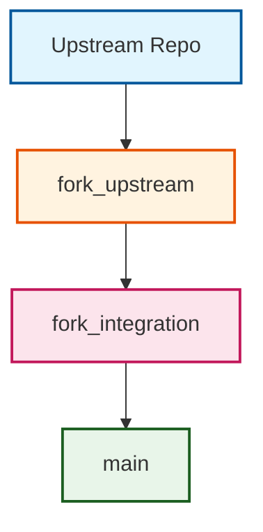
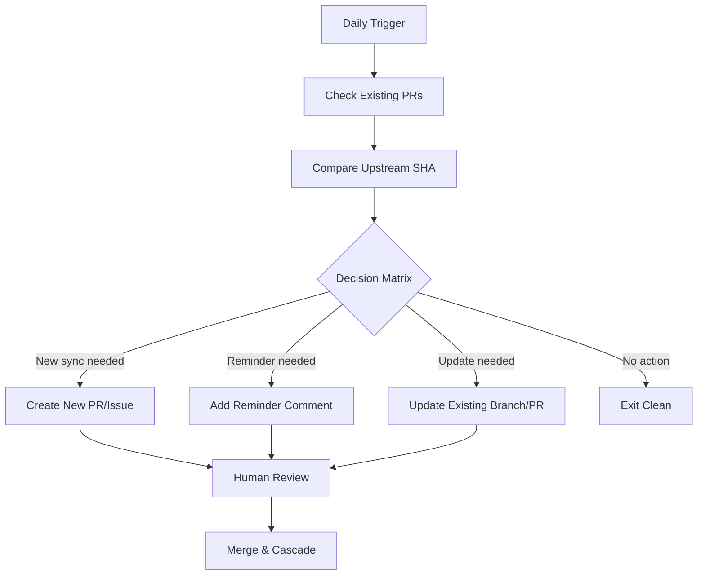
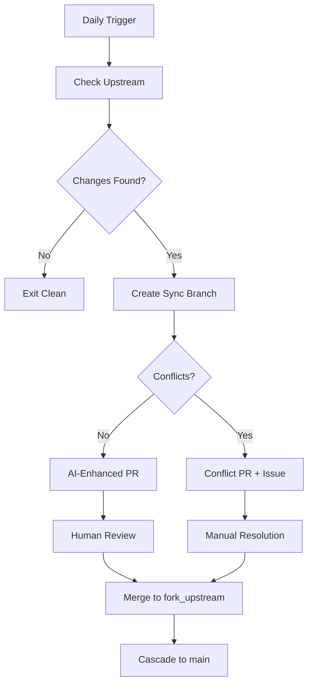

# Upstream Synchronization Workflow Specification

🧠 **AI-powered sync** | 🔁 **Three-branch safety** | 🚧 **Human-reviewed conflict resolution** | 🔄 **Duplicate prevention**

This workflow regularly syncs changes from the upstream repository, which often include unconventional or inconsistent commit messages. Rather than preserving those commits as-is, the workflow uses AI to analyze the incoming changeset (via a git diff) and generate a single, conventional meta-commit that summarizes the entire upstream changeset—replacing the original, often inconsistent commits with a standardized summary. The AI classifies the changes (e.g., feat, fix, chore) and creates a detailed, multi-line commit message that adheres to conventional commit standards. A three-branch strategy (`fork_upstream` → `fork_integration` → `main`) is used to isolate changes, manage potential conflicts safely, and generate pull requests automatically. **The workflow now includes intelligent duplicate prevention** to avoid creating multiple PRs and issues for the same upstream state.

## Duplicate Prevention System

### Smart State Management
The workflow automatically prevents duplicate PRs and issues through intelligent state tracking:

- **Upstream SHA Comparison**: Tracks the last synced upstream state to detect when new changes are available
- **Existing PR Detection**: Scans for open sync PRs with the `upstream-sync` label
- **Branch Management**: Updates existing sync branches instead of creating new ones when upstream advances
- **Abandoned Branch Cleanup**: Automatically removes stale sync branches (>24h old with no associated PR)

### Decision Matrix
The workflow uses a smart decision matrix to handle all duplicate scenarios:

| Scenario | Existing PR | Upstream Changed | Action |
|----------|-------------|------------------|---------|
| New sync needed | No | Yes | Create new PR and issue |
| Gentle reminder | Yes | No | Add reminder comment to existing issue |
| Upstream advanced | Yes | Yes | Update existing branch and PR |
| No action needed | No | No | Exit cleanly |

### Benefits of Duplicate Prevention
- **Single tracking issue** throughout entire sync cycle
- **No duplicate PRs or notifications** reducing noise
- **Always current upstream state** in active PR
- **Clean repository hygiene** with automatic cleanup
- **Reduced human cognitive load** - same URLs to track
- **Clear progression history** in issue comments

## Three-Branch Strategy

The workflow uses a three-branch approach to ensure safe integration:



- **fork_upstream**: Mirror of upstream, updated first
- **fork_integration**: Conflict resolution and testing
- **main**: Your stable production branch

## Key Benefits
- **Automated Scheduled Sync**: No manual intervention for clean merges
- **Conflict Safety**: Conflicts isolated and handled safely
- **AI-Enhanced Analysis**: Intelligent PR descriptions and conflict categorization
- **Complete Audit Trail**: Full tracking of all changes and decisions
- **Duplicate Prevention**: Intelligent state management prevents duplicate PRs and issues

## Configuration Options

| Setting | Default | Description |
|---------|---------|-------------|
| **Schedule** | `0 0 * * *` | Daily at midnight UTC (customizable) |
| **Diff Size Limit** | `20,000 lines` | Maximum diff size for AI analysis |
| **AI Provider** | Azure Foundry | AI services for PR descriptions |
| **Auto-merge** | Disabled | Automatic merging for small changes |
| **Conflict Timeout** | 6 hours | How long before monitor auto-triggers cascade |
| **Retry Attempts** | 3 | Network operation retry count |

💡 **AI Enhancement**: To enable AI-powered PR descriptions, configure either `AZURE_API_KEY` (for Azure OpenAI) or `OPENAI_API_KEY` secret in your repository settings. This provides intelligent analysis of upstream changes with structured commit summaries.

### Workflow Triggers
- **Automatic**: Daily at midnight UTC
- **Manual**: Click "Run workflow" in GitHub Actions tab
- **API**: Trigger via GitHub REST ∏API

### Required Permissions
The workflow needs these GitHub permissions:
- `contents: write` - Update repository files and branches
- `pull-requests: write` - Create and manage pull requests
- `issues: write` - Create tracking issues for conflicts

## How It Works

### The Happy Path (No Conflicts)
1. **Check for Duplicates**: Workflow first checks for existing sync PRs and compares upstream state
2. **Smart Decision Making**: Uses decision matrix to determine if new sync is needed
3. **Create or Update**: Creates new sync branch or updates existing one based on state
4. **AI Analysis**: Generates intelligent PR description with change summary
5. **Create or Update PR**: Opens new pull request or updates existing one
6. **Human Review**: Team reviews and merges the PR
7. **Cascade**: Manual or automatic cascade moves changes to `main`

### Duplicate Prevention Flow


### When Conflicts Occur
1. **Conflict Detection**: Workflow identifies merge conflicts during integration
2. **Create Conflict PR**: Opens PR with conflict markers for manual resolution
3. **Create Tracking Issue**: Detailed issue with step-by-step resolution instructions
4. **Human Resolution**: Developer resolves conflicts and updates PR
5. **Continue Process**: Once resolved, normal cascade process continues



### Immediate Actions
When the workflow detects conflicts, it automatically:

1. **Creates a Conflict Pull Request**
   - Contains the conflicted files with merge markers
   - Targets the `fork_integration` branch for safe resolution
   - Labeled with `conflict`, `upstream-sync`, `human-required`

2. **Creates a Tracking Issue**
   - Comprehensive resolution instructions
   - Links to the conflict PR
   - Complete process overview with checkboxes
   - Labeled with `conflict`, `human-required`, `high-priority`

### Your Resolution Steps

#### Step 1: Review the Conflict
```bash
# Clone the conflict branch locally
git checkout sync/upstream-YYYYMMDD-HHMMSS

# See which files have conflicts
git status
```

#### Step 2: Resolve Conflicts
- Open conflicted files in your preferred merge tool
- Choose between `<<<<<<< HEAD` (your changes) and `>>>>>>> upstream` (their changes)
- Or combine both as appropriate for your use case
- Remove conflict markers (`<<<<<<<`, `=======`, `>>>>>>>`)

#### Step 3: Test and Commit
```bash
# Test your changes
mvn test  # or your project's test command

# Commit the resolution
git add .
git commit -m "resolve: merge conflicts from upstream sync"
git push origin sync/upstream-YYYYMMDD-HHMMSS
```

#### Step 4: Complete the Process
1. Update the conflict PR with your resolution
2. Request review from team members
3. Once approved, merge the PR
4. Manually trigger the cascade workflow (or wait for automatic trigger)

### Getting Help
- Conflict resolution templates in `.github/` directory
- Issue tracking provides complete guidance
- Team members can assist via PR reviews
- [Conflict management documentation](../src/adr/005-conflict-management.md)

## Handling Human-Required Tasks

When you see a sync issue labeled `human-required`, follow this decision tree:

**Clean PR** → Review → Merge → Cascade  
**Conflict PR** → Resolve Locally → Push → Review → Merge → Cascade

### For Clean Syncs (No Conflicts)
1. **Review the PR**: Click the link in the tracking issue
2. **Check AI Summary**: Review the AI-generated description of changes
3. **Verify No Breaking Changes**: Look for any compatibility issues
4. **Merge the PR**: Approve and merge to `fork_upstream` branch
5. **Trigger Cascade**: 
   - Go to Actions → Cascade Integration workflow
   - Enter the issue number from the tracking issue
   - Click "Run workflow"
6. **Monitor Progress**: Check back in 15-30 minutes for completion

### For Conflict Syncs
1. **Read the Conflict Issue**: Complete step-by-step instructions provided
2. **Checkout the Branch**: Follow the git commands in the issue
3. **Resolve Conflicts**: Use your IDE's merge tools or manual editing
4. **Test Thoroughly**: Run your test suite to ensure stability
5. **Push Resolution**: Commit and push your conflict resolution
6. **Update PR**: The conflict PR will automatically update
7. **Request Review**: Get team approval for your resolution
8. **Merge and Cascade**: Same process as clean syncs after merge

### Safety Features
- **6-Hour Monitor**: If you miss triggering the cascade, automation kicks in
- **Branch Protection**: Prevents accidental damage to stable branches
- **Complete Audit Trail**: Every action tracked in the issue comments
- **Rollback Support**: Can revert to previous stable state if needed

## Monitoring and Troubleshooting

### Finding Your Sync Tasks
Use these GitHub issue filters to find items needing attention:

| Filter | Purpose |
|--------|---------|
| [`label:human-required label:upstream-sync`](../../issues?q=is:open+label:human-required+label:upstream-sync) | All sync items needing review |
| [`label:conflict label:high-priority`](../../issues?q=is:open+label:conflict+label:high-priority) | Urgent conflicts requiring resolution |
| [`label:human-required`](../../issues?q=is:open+label:human-required) | All items across workflows needing attention |

### Common Issues and Solutions

#### "No upstream changes detected"
- **Cause**: Your fork is already up to date
- **Action**: No action needed, workflow will exit cleanly

#### "Duplicate sync prevented"
- **Cause**: Existing sync PR is still open for the same upstream state
- **Action**: Review and merge existing PR, or wait for gentle reminder comments

#### "Sync branch updated"
- **Cause**: Upstream advanced while previous sync PR was open
- **Action**: Review updated PR with latest upstream changes

#### "Failed to fetch upstream"
- **Cause**: Network issues or incorrect `UPSTREAM_REPO_URL`
- **Action**: Check repository secrets and network connectivity

#### "AI description generation failed"
- **Cause**: API key issues or service unavailable
- **Action**: PR created with standard template, no impact on functionality

#### "Cascade workflow not triggered"
- **Cause**: Manual trigger missed
- **Action**: Monitor detects and auto-triggers within 6 hours

### Performance Expectations
- **Typical Sync Time**: 2-5 minutes for clean merges
- **Large Repository Sync**: Up to 15 minutes for repos with extensive history
- **AI Description Generation**: Adds 30-60 seconds when enabled
- **Conflict Resolution**: Variable based on complexity (30 minutes to 2 hours)

## Customization Options

### Changing the Sync Schedule
Edit `.github/workflows/sync.yml`:
```yaml
# Weekly instead of daily
- cron: '0 2 * * 1'  # Monday 2 AM

# Multiple times per day
- cron: '0 0,12 * * *'  # Midnight and noon
```

### Adjusting Diff Size Limits
For larger repositories, increase the AI analysis threshold:
```yaml
env:
  DIFF_SIZE_LIMIT: 50000  # Analyze larger diffs
```

### Disabling AI Enhancement
Remove AI API keys to use standard PR templates:
```yaml
# Remove these secrets to disable AI
# AZURE_API_KEY
# OPENAI_API_KEY
```

### Custom Conflict Handling
Modify templates in `.github/` directory:
- `conflict_pr_template.md` - Conflict PR description
- `conflict_issue_template.md` - Resolution issue template

## Architecture References

For deeper technical understanding:
- [ADR-001: Three-Branch Strategy](../src/adr/001-three-branch-strategy.md) - Core branching approach
- [ADR-020: Human-Required Labels](../src/adr/020-human-required-label-strategy.md) - Task assignment strategy
- [ADR-023: Meta Commit Strategy](../src/adr/023-meta-commit-strategy-for-release-please.md) - Release integration
- [ADR-024: Sync Workflow Duplicate Prevention](../src/adr/024-sync-workflow-duplicate-prevention-architecture.md) - Duplicate prevention system
- [Product Architecture](product-architecture.md#synchronization) - Complete system overview

---

*For setup help, see the [initialization workflow](init-workflow.md). For cascade process details, see the [cascade workflow](cascade-workflow.md).*

⬆️ [Back to top](#upstream-synchronization-workflow)