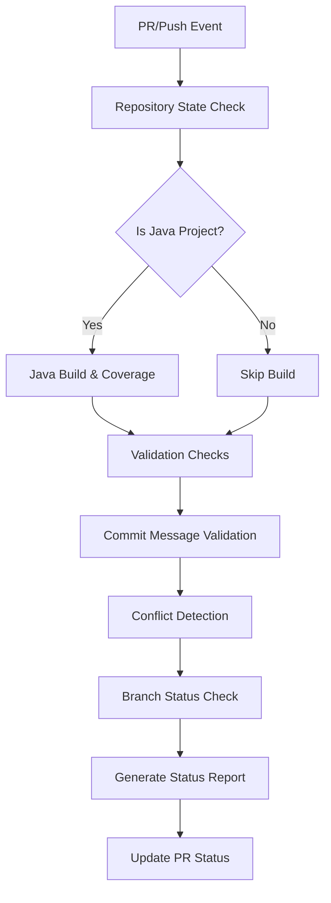
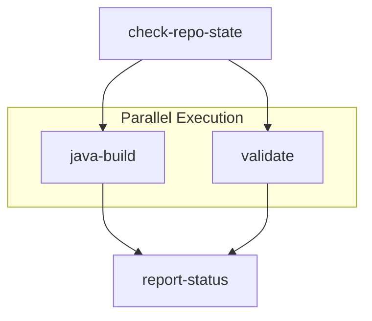

# Pull Request Validation Workflow Specification

This document specifies the pull request validation workflow (`validate.yml`) that ensures code quality, consistency, and readiness before changes are merged into protected branches.

## Overview

The validation workflow provides comprehensive quality gates for pull requests and direct pushes to protected branches. It combines commit message validation, conflict detection, build verification, and branch synchronization checks to maintain repository integrity.

## Architecture Integration

**References**: 
- [ADR-002: GitHub Actions-Based Automation](../src/adr/002-github-actions-automation.md)
- [ADR-004: Release Please for Version Management](../src/adr/004-release-please-versioning.md)

**Key Benefits**:
- **Quality Gates**: Enforced standards before merge
- **Automated Verification**: Comprehensive checks without manual intervention
- **Selective Validation**: Intelligent rule application based on context
- **Developer Feedback**: Clear status reporting on pull requests

## Workflow Configuration

### Triggers
```yaml
on:
  pull_request:
    branches: [main, fork_integration, fork_upstream]
  push:
    branches: [main, fork_integration, fork_upstream]
  workflow_dispatch:
    inputs:
      post_init:
        description: 'Is this a post-initialization validation?'
        type: boolean
        default: false
      initialization_complete:
        description: 'Force initialization status (used during post-init)'
        type: boolean  
        default: false
```

### Permissions
```yaml
permissions:
  contents: read
  pull-requests: write
  statuses: write
  actions: read
```

### Concurrency Control
```yaml
concurrency:
  group: validate-${{ github.event.pull_request.number || github.ref }}
  cancel-in-progress: true
```

## Workflow Architecture

### High-Level Flow


### Job Structure


## Phase 1: Repository State Analysis

### Initialization Verification
```yaml
- name: Check initialization status
  run: |
    if [ -f ".github/workflow.env" ]; then
      echo "initialized=true" >> $GITHUB_OUTPUT
    else
      echo "initialized=false" >> $GITHUB_OUTPUT
      echo "::warning::Repository not fully initialized"
    fi
```

### Project Type Detection
```yaml
- name: Detect project type
  run: |
    # Java detection (Maven/Gradle)
    if [ -f "pom.xml" ] || [ -f "build.gradle" ] || [ -f "build.gradle.kts" ]; then
      echo "project_type=java" >> $GITHUB_OUTPUT
      echo "build_required=true" >> $GITHUB_OUTPUT
    else
      echo "project_type=unknown" >> $GITHUB_OUTPUT
      echo "build_required=false" >> $GITHUB_OUTPUT
    fi
```

### Metadata Collection
```yaml
outputs:
  initialized: ${{ steps.check.outputs.initialized }}
  project_type: ${{ steps.detect.outputs.project_type }}
  build_required: ${{ steps.detect.outputs.build_required }}
```

## Phase 2: Java Build Validation

### Conditional Execution
```yaml
if: |
  needs.check-repo-state.outputs.project_type == 'java' &&
  needs.check-repo-state.outputs.initialized == 'true'
```

### Build Process
```yaml
- name: Build with Maven
  uses: ./.github/actions/java-build
  with:
    java-version: '17'
    cache-key: validate-${{ hashFiles('**/pom.xml') }}
```

### Coverage Analysis for PRs
```yaml
- name: Generate Coverage Report
  if: github.event_name == 'pull_request'
  run: |
    mvn jacoco:report
    
    # Extract coverage percentage
    COVERAGE=$(grep -o '<counter type="INSTRUCTION".*' target/site/jacoco/index.html | \
               grep -o 'missed="[0-9]*" covered="[0-9]*"' | \
               awk -F'"' '{missed+=$2; covered+=$4} END {
                 if(missed+covered > 0) print int(covered/(missed+covered)*100)
                 else print 0
               }')
    
    echo "coverage=$COVERAGE" >> $GITHUB_OUTPUT
```

### Build Status Reporting
```yaml
- name: Report Build Status
  uses: ./.github/actions/java-build-status
  with:
    status: ${{ job.status }}
    coverage: ${{ steps.coverage.outputs.coverage }}
    pr-number: ${{ github.event.pull_request.number }}
```

## Phase 3: Validation Checks

### Commit Message Validation

**Selective Application Logic**:
```yaml
# Skip validation for:
# 1. Non-main target branches
# 2. Dependabot PRs
# 3. Fork-related branches
# 4. Upstream sync PRs

if: |
  github.event_name == 'pull_request' &&
  github.event.pull_request.base.ref == 'main' &&
  !contains(github.actor, 'dependabot') &&
  !contains(github.event.pull_request.head.ref, 'fork_') &&
  !startsWith(github.event.pull_request.title, 'chore(sync)')
```

**Conventional Commits Enforcement**:
```yaml
- name: Validate Conventional Commits
  uses: wagoid/commitlint-github-action@v5
  with:
    configFile: .commitlintrc.json
    firstParent: false
```

**Supported Commit Types**:
```json
{
  "extends": ["@commitlint/config-conventional"],
  "rules": {
    "type-enum": [
      2,
      "always",
      [
        "feat",      // New features
        "fix",       // Bug fixes
        "docs",      // Documentation
        "style",     // Code style changes
        "refactor",  // Code refactoring
        "test",      // Test additions/changes
        "chore",     // Maintenance tasks
        "perf",      // Performance improvements
        "ci",        // CI/CD changes
        "upstream"   // Upstream sync commits
      ]
    ]
  }
}
```

### Merge Conflict Detection

**Comprehensive Conflict Scanning**:
```yaml
- name: Check for merge conflicts
  run: |
    # Scan all files for conflict markers
    CONFLICTS=$(find . -type f -name "*.java" -o -name "*.xml" -o -name "*.yml" \
                -o -name "*.yaml" -o -name "*.json" -o -name "*.md" \
                -o -name "*.properties" | \
                xargs grep -l "^<<<<<<< \|^======= \|^>>>>>>> " 2>/dev/null || true)
    
    if [ -n "$CONFLICTS" ]; then
      echo "conflicts_found=true" >> $GITHUB_OUTPUT
      echo "::error::Merge conflicts detected in the following files:"
      echo "$CONFLICTS" | while read file; do
        echo "::error::  - $file"
      done
    else
      echo "conflicts_found=false" >> $GITHUB_OUTPUT
    fi
```

### Branch Synchronization Check

**Up-to-Date Verification**:
```yaml
- name: Check branch status
  if: github.event_name == 'pull_request'
  run: |
    # Fetch latest base branch
    git fetch origin ${{ github.event.pull_request.base.ref }}
    
    # Check if PR branch contains all base branch commits
    BEHIND=$(git rev-list --count HEAD..origin/${{ github.event.pull_request.base.ref }})
    
    if [ "$BEHIND" -gt 0 ]; then
      echo "branch_outdated=true" >> $GITHUB_OUTPUT
      echo "behind_by=$BEHIND" >> $GITHUB_OUTPUT
      echo "::warning::Branch is $BEHIND commits behind ${{ github.event.pull_request.base.ref }}"
    else
      echo "branch_outdated=false" >> $GITHUB_OUTPUT
    fi
```

## Phase 4: Status Reporting

### Comprehensive Status Generation
```yaml
- name: Generate Status Report
  uses: actions/github-script@v7
  with:
    script: |
      const status = {
        initialized: '${{ needs.check-repo-state.outputs.initialized }}',
        buildStatus: '${{ needs.java-build.result }}',
        validationStatus: '${{ needs.validate.result }}',
        conflicts: '${{ needs.validate.outputs.conflicts_found }}',
        branchOutdated: '${{ needs.validate.outputs.branch_outdated }}',
        coverage: '${{ needs.java-build.outputs.coverage }}'
      };
      
      let report = '## 📋 Validation Report\n\n';
      
      // Repository Status
      if (status.initialized === 'true') {
        report += '✅ **Repository Status**: Initialized\n';
      } else {
        report += '⚠️ **Repository Status**: Not fully initialized\n';
      }
      
      // Build Status
      if (status.buildStatus === 'success') {
        report += `✅ **Build Status**: Successful`;
        if (status.coverage) {
          report += ` (Coverage: ${status.coverage}%)\n`;
        } else {
          report += '\n';
        }
      } else if (status.buildStatus === 'skipped') {
        report += '⏭️ **Build Status**: Not applicable\n';
      } else {
        report += '❌ **Build Status**: Failed\n';
      }
      
      // Conflict Status
      if (status.conflicts === 'true') {
        report += '❌ **Merge Conflicts**: Detected - manual resolution required\n';
      } else {
        report += '✅ **Merge Conflicts**: None\n';
      }
      
      // Branch Status
      if (status.branchOutdated === 'true') {
        report += '⚠️ **Branch Status**: Behind base branch - update required\n';
      } else {
        report += '✅ **Branch Status**: Up to date\n';
      }
      
      // Overall Status
      report += '\n### Overall Status\n';
      if (status.conflicts === 'true' || 
          status.buildStatus === 'failure' ||
          status.branchOutdated === 'true') {
        report += '🔴 **Action Required**: Please address the issues above\n';
      } else {
        report += '🟢 **Ready for Review**: All checks passed\n';
      }
      
      return report;
```

### PR Comment Update
```yaml
- name: Update PR Status
  if: github.event_name == 'pull_request'
  uses: actions/github-script@v7
  with:
    script: |
      // Find existing comment
      const comments = await github.rest.issues.listComments({
        owner: context.repo.owner,
        repo: context.repo.repo,
        issue_number: context.issue.number
      });
      
      const botComment = comments.data.find(comment => 
        comment.user.type === 'Bot' && 
        comment.body.includes('📋 Validation Report')
      );
      
      const body = ${{ steps.generate-report.outputs.report }};
      
      if (botComment) {
        // Update existing comment
        await github.rest.issues.updateComment({
          owner: context.repo.owner,
          repo: context.repo.repo,
          comment_id: botComment.id,
          body: body
        });
      } else {
        // Create new comment
        await github.rest.issues.createComment({
          owner: context.repo.owner,
          repo: context.repo.repo,
          issue_number: context.issue.number,
          body: body
        });
      }
```

## Special Handling

### Dependabot Integration
```yaml
# Dependabot-specific handling
- name: Dependabot Status
  if: contains(github.actor, 'dependabot')
  run: |
    echo "::notice::Dependabot PR - relaxed validation rules applied"
    echo "dependabot=true" >> $GITHUB_OUTPUT
```

**Dependabot Exemptions**:
- Commit message validation skipped
- Auto-merge eligible for patch updates
- Simplified status reporting

### Fork Branch Handling
```yaml
# Special handling for fork-related branches
- name: Fork Branch Detection
  if: contains(github.event.pull_request.head.ref, 'fork_')
  run: |
    echo "::notice::Fork management branch - upstream sync rules applied"
    echo "fork_branch=true" >> $GITHUB_OUTPUT
```

### Upstream Sync Validation
```yaml
# Upstream sync PR handling
- name: Upstream Sync Detection
  if: startsWith(github.event.pull_request.title, 'chore(sync)')
  run: |
    echo "::notice::Upstream sync PR - automated validation rules"
    echo "upstream_sync=true" >> $GITHUB_OUTPUT
```

## Performance Optimization

### Caching Strategy
```yaml
# Shared cache between validation runs
- name: Setup Validation Cache
  uses: actions/cache@v4
  with:
    path: |
      ~/.m2/repository
      ~/.gradle/caches
      target/
    key: validate-${{ runner.os }}-${{ hashFiles('**/*.xml', '**/*.gradle*') }}
```

### Parallel Execution
- Java build and validation checks run in parallel
- Status reporting aggregates results from all jobs
- Early termination on critical failures

## Error Handling

### Graceful Degradation
```yaml
# Continue validation even if non-critical steps fail
- name: Non-Critical Check
  continue-on-error: true
  run: |
    # Optional validation that shouldn't block PR
```

### Clear Error Reporting
```yaml
# Structured error messages
- name: Report Validation Errors
  if: failure()
  run: |
    echo "::error title=Validation Failed::Please review the validation report for details"
    echo "::error file=${{ github.event.pull_request.head.ref }}::Branch validation failed"
```

## Integration Points

### Build Workflow
- Shares build configuration and caching
- Consistent Java environment setup
- Artifact compatibility

### Release Workflow
- Conventional commit validation ensures proper versioning
- Clean validation required before release

### Sync Workflow
- Special validation rules for upstream sync PRs
- Conflict detection assists sync process

## Configuration Options

### Environment Variables
```yaml
env:
  JAVA_VERSION: '17'
  VALIDATION_TIMEOUT: '15'
  COVERAGE_THRESHOLD: '70'
  CONVENTIONAL_COMMITS: 'true'
```

### Customization Points
```yaml
# Workflow inputs for manual triggers
on:
  workflow_dispatch:
    inputs:
      skip_build:
        description: 'Skip build validation'
        type: boolean
        default: false
      strict_mode:
        description: 'Enable strict validation'
        type: boolean
        default: false
```

## Testing Strategy

### Unit Testing
- Individual validation rule testing
- Mock PR scenarios
- Error condition handling

### Integration Testing
- End-to-end PR validation
- Multi-job coordination
- Status reporting accuracy

### Performance Testing
- Validation execution time
- Cache effectiveness
- Parallel job optimization

## Maintenance Guidelines

### Monitoring Requirements
- **Validation Success Rate**: Track pass/fail ratios
- **Performance Metrics**: Execution time trends
- **Error Patterns**: Common validation failures
- **Cache Hit Rates**: Optimization effectiveness

### Evolution Considerations
- Additional language support beyond Java
- Custom validation rules per repository
- Enhanced conflict resolution suggestions
- AI-powered commit message improvements

## References

- [ADR-002: GitHub Actions-Based Automation](../src/adr/002-github-actions-automation.md)
- [ADR-004: Release Please for Version Management](../src/adr/004-release-please-versioning.md)
- [Product Architecture: Validation](product-architecture.md#44-validation-architecture-validateyml)
- [Build Workflow Specification](build-workflow.md)
- [Conventional Commits](https://www.conventionalcommits.org/)
- [GitHub Actions Documentation](https://docs.github.com/en/actions)