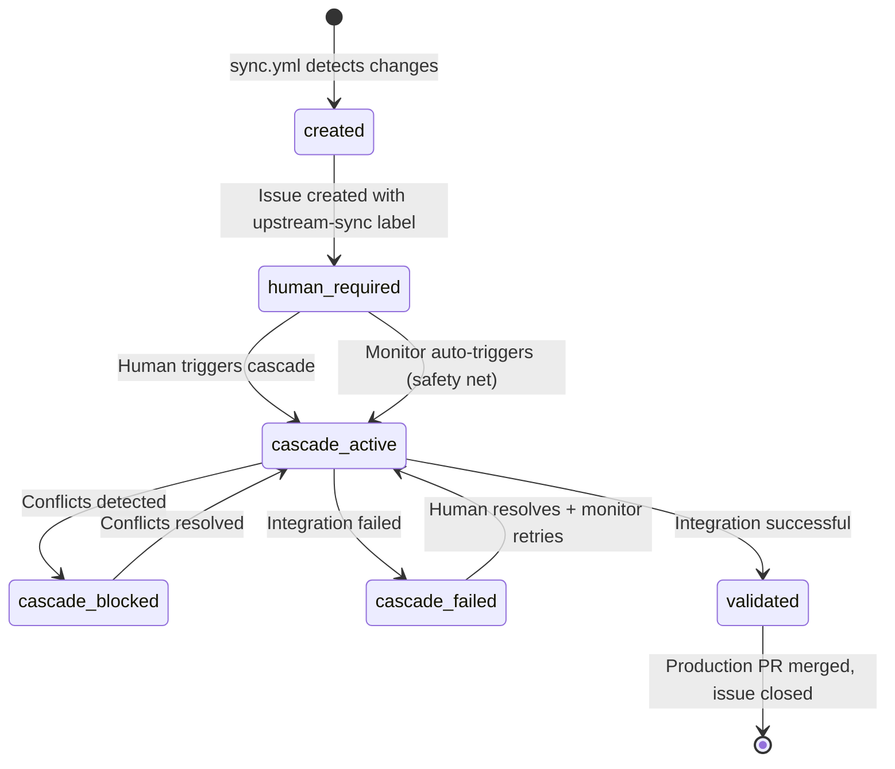

# ADR-022: Issue Lifecycle Tracking Pattern

## Status
**Accepted** - 2025-10-01

## Context

The fork management template's three-branch cascade strategy (ADR-001) and human-centric cascade pattern (ADR-019) require comprehensive visibility into the state and progress of upstream integration workflows. Teams need to understand:

1. **Current State**: Where is a particular upstream changeset in the integration pipeline?
2. **Progress Tracking**: What stage of the cascade process is currently executing?
3. **Error Visibility**: When conflicts or failures occur, how are they communicated?
4. **Human Actions Required**: When do humans need to intervene and what actions should they take?
5. **Audit Trail**: Complete history of how upstream changes flowed through the system

**Challenges Without Issue Tracking:**

- **Poor Visibility**: No central place to see cascade status
- **Lost Context**: Hard to understand what changes are being integrated
- **Error Isolation**: Failures buried in workflow logs
- **Action Ambiguity**: Unclear when human intervention is needed
- **Audit Gaps**: Difficult to trace upstream changeset history

**Requirements for Issue Lifecycle System:**

- **Single Source of Truth**: One issue tracks entire cascade lifecycle
- **Real-time Updates**: Issue reflects current cascade state
- **Clear Actions**: Obvious next steps for humans
- **Error Tracking**: Conflicts and failures prominently displayed
- **Label-based State**: Machine-readable state management via GitHub labels
- **Comment-based Progress**: Human-readable progress updates

## Decision

Implement **Issue Lifecycle Tracking Pattern** that creates and maintains GitHub issues throughout the cascade process:

### 1. **Issue Creation**: sync.yml creates tracking issue with duplicate prevention

```yaml
# When upstream sync detects changes (prevents duplicates)
gh issue create \
  --title "📥 Upstream Sync Ready for Review - $(date +%Y-%m-%d)" \
  --body "Sync Details: PR #X, N commits, manual cascade required" \
  --label "upstream-sync,human-required"
```

### 2. **State Transitions**: cascade.yml updates issue labels and comments

```yaml
# Human-required → cascade-active
gh issue edit "$ISSUE_NUMBER" \
  --remove-label "human-required" \
  --add-label "cascade-active"

# cascade-active → cascade-blocked (on conflicts)
gh issue edit "$ISSUE_NUMBER" \
  --remove-label "cascade-active" \
  --add-label "cascade-blocked"

# cascade-active → production-ready (success)
gh issue edit "$ISSUE_NUMBER" \
  --remove-label "cascade-active" \
  --add-label "production-ready"
```

### 3. **Progress Comments**: Detailed updates at each stage

```yaml
gh issue comment "$ISSUE_NUMBER" --body "🚀 **Cascade Integration Started**
Integration workflow has been triggered and is now processing upstream changes.
**Status:** Merging \`fork_upstream\` → \`fork_integration\` → \`main\`"
```

### 4. **Safety Net Integration**: Monitor comments on auto-triggers

```yaml
gh issue comment "$ISSUE_NUMBER" --body "🤖 **Auto-Cascade Initiated**
Safety net detected missed manual trigger and automatically initiated cascade."
```

## Issue State Machine



## Label Strategy

| Label | Meaning | Human Action | Next State |
|-------|---------|--------------|------------|
| `upstream-sync, human-required` | Upstream sync complete, awaiting manual cascade trigger | Review sync PR, merge, trigger cascade | `cascade-active` |
| `upstream-sync, cascade-active` | Cascade integration in progress | Monitor progress, wait for completion | `validated`, `cascade-blocked`, or `cascade-failed` |
| `upstream-sync, cascade-blocked` | Conflicts detected, manual resolution needed | Resolve conflicts, commit fixes | `cascade-active` |
| `upstream-sync, cascade-failed, human-required` | Integration failed, human intervention required | Review failure issue, fix problems, remove `human-required` label | `cascade-active` (automatic retry) |
| `upstream-sync, validated` | Production PR created, ready for final review | Review and merge production PR | Issue closed |

## Implementation Details

### Cascade Workflow Integration

The cascade workflow accepts an `issue_number` input parameter that directly links to the tracking issue:

```yaml
# In cascade.yml workflow dispatch inputs
issue_number:
  description: 'GitHub issue number for the upstream sync (e.g., 123)'
  required: true
  type: 'string'
```

This eliminates the need for complex issue searching logic and ensures precise tracking throughout the cascade process.

### Issue Creation Pattern

```yaml
# In sync.yml after PR creation
NOTIFICATION_BODY="## 📥 Upstream Sync Ready for Review

New upstream changes are available and ready for review.

**Sync Details:**

- **PR:** $PR_URL  
- **Upstream Version:** $UPSTREAM_VERSION
- **Commits:** $COMMIT_COUNT new commits from upstream
- **Branch:** \`$SYNC_BRANCH\` → \`fork_upstream\`

**Next Steps:**

1. 🔍 **Review the sync PR** for any breaking changes or conflicts
2. ✅ **Merge the PR** when satisfied with the changes  
3. 🚀 **Manually trigger 'Cascade Integration' workflow** to integrate changes
4. 📊 **Monitor cascade progress** in Actions tab

**Timeline:**

- Sync detected: $(date -u +%Y-%m-%dT%H:%M:%SZ)
- Action required: Human review, merge, and cascade trigger"

gh issue create \
  --title "📥 Upstream Sync Ready for Review - $(date +%Y-%m-%d)" \
  --body "$NOTIFICATION_BODY" \
  --label "upstream-sync,human-required"
```

### Issue Update Pattern

```yaml
# In cascade.yml - Use provided issue number directly
ISSUE_NUMBER="${{ github.event.inputs.issue_number }}"

if [ -n "$ISSUE_NUMBER" ]; then
  # Update labels
  gh issue edit "$ISSUE_NUMBER" \
    --remove-label "human-required" \
    --add-label "cascade-active"
  
  # Add progress comment
  gh issue comment "$ISSUE_NUMBER" --body "🚀 **Cascade Integration Started** - $(date -u +%Y-%m-%dT%H:%M:%SZ)
  
  Integration workflow has been triggered and is now processing upstream changes.
  
  **Status:** Merging \`fork_upstream\` → \`fork_integration\` → \`main\`
  **Workflow:** [View Progress](${{ github.server_url }}/${{ github.repository }}/actions/runs/${{ github.run_id }})"
fi
```

### Conflict Handling Pattern

```yaml
# When conflicts detected in cascade.yml - use provided issue number
TRACKING_ISSUE="${{ github.event.inputs.issue_number }}"
if [ -n "$TRACKING_ISSUE" ]; then
  gh issue edit "$TRACKING_ISSUE" \
    --remove-label "cascade-active" \
    --add-label "cascade-blocked"
  
  gh issue comment "$TRACKING_ISSUE" --body "🚨 **Conflicts Detected** - $(date -u +%Y-%m-%dT%H:%M:%SZ)
  
  Merge conflicts were detected during integration. A separate conflict resolution issue has been created.
  
  **Status:** Cascade blocked - manual conflict resolution required
  **SLA:** 48 hours for resolution"
fi
```

### Production Ready Pattern

```yaml
# When production PR created in cascade.yml - use provided issue number
TRACKING_ISSUE="${{ github.event.inputs.issue_number }}"
if [ -n "$TRACKING_ISSUE" ]; then
  gh issue edit "$TRACKING_ISSUE" \
    --remove-label "cascade-active" \
    --add-label "production-ready"
  
  gh issue comment "$TRACKING_ISSUE" --body "🎯 **Production PR Created** - $(date -u +%Y-%m-%dT%H:%M:%SZ)
  
  Integration completed successfully! Production PR has been created and is ready for final review.
  
  **Production PR:** $PR_URL
  **Auto-merge:** $([ "$BREAKING_CHANGES" == "false" ] && echo "✅ Enabled" || echo "❌ Manual review required")
  
  **Final Steps:**
  1. Review and merge the production PR
  2. This issue will be closed when changes reach main"
fi
```

## Rationale

### Single Source of Truth

- **Centralized Tracking**: One GitHub issue per upstream changeset provides single place to check status
- **Cross-Reference**: Issue links to all related PRs, workflow runs, and conflict issues
- **Searchable History**: GitHub issue search provides easy access to historical cascade information

### Real-time State Management

- **Label-based State**: Machine-readable state via GitHub labels enables automation
- **Comment-based Progress**: Human-readable updates provide detailed context
- **Workflow Integration**: Cascade workflows automatically update issue state

### Human-Centric Design

- **Clear Next Actions**: Each state clearly indicates what humans should do next
- **Progress Visibility**: Teams can see cascade progress without checking workflow logs
- **Error Prominence**: Conflicts and failures are prominently displayed in issue

### Audit Trail Benefits

- **Complete History**: Issue comments provide complete record of cascade progression
- **Decision Points**: Clear record of when humans intervened and why
- **Timing Information**: Timestamps show how long each stage took
- **Troubleshooting**: Historical issues help debug similar problems

## Alternatives Considered

### 1. **Workflow-only Tracking**

- **Pros**: No additional GitHub resources needed
- **Cons**: Poor visibility, hard to track across multiple workflow runs
- **Decision**: Rejected due to poor user experience

### 2. **Multiple Issues per Stage**

- **Pros**: Very detailed tracking, clear separation of concerns
- **Cons**: Issue proliferation, hard to follow overall story
- **Decision**: Rejected due to complexity

### 3. **External Tracking System**

- **Pros**: More powerful tracking capabilities
- **Cons**: Additional infrastructure, not integrated with GitHub
- **Decision**: Rejected due to complexity and integration concerns

### 4. **PR-based Tracking Only**

- **Pros**: Uses existing PR infrastructure
- **Cons**: Sync PR gets closed, losing tracking capability for integration
- **Decision**: Rejected because sync PR lifecycle doesn't match cascade lifecycle

### 5. **Project Board Tracking**

- **Pros**: Kanban-style visualization
- **Cons**: Requires manual movement, less automated than label-based approach
- **Decision**: Rejected in favor of automated label management

## Consequences

### Positive

- **Excellent Visibility**: Teams can see cascade status at a glance
- **Clear Action Items**: Obvious next steps for humans at each stage
- **Complete Audit Trail**: Full history of how upstream changes flowed through system
- **Error Prominence**: Conflicts and failures are highly visible
- **Search Capability**: Easy to find information about specific upstream changes
- **Integration**: Works seamlessly with existing GitHub workflows and tooling
- **Automation Friendly**: Labels enable automated tooling and reporting

### Negative

- **Additional GitHub Resources**: Creates more issues in repository
- **Maintenance Complexity**: Workflow changes require issue tracking updates
- **Potential for Stale Issues**: Issues might not be closed if workflows fail
- **Label Management**: Need to maintain consistent label strategy across workflows

### Mitigation Strategies

- **Issue Templates**: Standardized issue creation reduces variation
- **Cleanup Jobs**: Monitor workflows can detect and close stale issues
- **Label Standardization**: Centralized label strategy (ADR-020) ensures consistency
- **Documentation**: Clear guidance on issue lifecycle for team members

## Integration Points

### With Human-Centric Cascade Pattern (ADR-019

- **Manual Trigger Integration**: Issues provide clear instructions for manual cascade triggering
- **Safety Net Coordination**: Monitor workflow updates issues when auto-triggering cascades
- **Error Handling**: Both manual and automatic error scenarios tracked through issues

### With Label Management Strategy (ADR-020)

- **Consistent Labels**: Uses predefined label strategy for state management
- **Label Combinations**: Defines specific label combinations for cascade states
- **Automated Label Management**: Workflows automatically apply and remove labels

### With Conflict Management Strategy (ADR-005)

- **Conflict Visibility**: Issues prominently display conflict status
- **Resolution Tracking**: Clear indication when conflicts are resolved
- **SLA Management**: 48-hour conflict resolution SLA tracked through issue updates

## Success Criteria

- **100% Issue Creation**: Every upstream sync creates tracking issue (no duplicates due to duplicate prevention system)
- **95% State Accuracy**: Issue labels accurately reflect cascade state
- **< 2 hour Update Lag**: Issue updates within 2 hours of state changes
- **90% Human Adoption**: Teams actively use issues for cascade tracking
- **Zero Stale Issues**: All issues closed within 30 days of creation
- **Complete Audit Trail**: 100% of cascade decisions documented in issue comments
- **Error Visibility**: 100% of conflicts and failures visible in issue tracking

## Monitoring and Alerting

### Health Metrics

- **Issue Lifecycle Completeness**: % of cascades with complete issue tracking
- **State Transition Accuracy**: % of correct label transitions
- **Human Response Time**: Time from issue creation to human action
- **Issue Resolution Time**: Time from creation to closure

### Failure Detection

- **Stale Issue Detection**: Issues in same state for > 48 hours
- **Missing State Transitions**: Cascades without corresponding issue updates
- **Label Inconsistency**: Issues with invalid label combinations

## Future Enhancements

### Potential Improvements

1. **Automated Issue Closure**: Close issues automatically when production PRs merge
2. **Cross-Repository Tracking**: Track cascades across multiple related repositories
3. **Metrics Dashboard**: Visualization of cascade performance metrics
4. **Smart Notifications**: Targeted notifications based on issue state and team preferences
5. **Template Customization**: Allow teams to customize issue templates for their needs

### Integration Opportunities

- **Slack Integration**: Post issue updates to team Slack channels
- **Email Notifications**: Automated email updates for critical state changes
- **Metrics Integration**: Feed issue data into organizational metrics systems
- **AI Enhancement**: Use AI to generate better issue descriptions and status updates

## Related ADRs

- [ADR-001: Three-Branch Fork Management Strategy](001-three-branch-strategy.md) - Defines cascade process being tracked
- [ADR-019: Cascade Monitor Pattern](019-cascade-monitor-pattern.md) - Human-centric cascade approach that this supports
- [ADR-020: Human-Required Label Strategy](020-human-required-label-strategy.md) - Label management strategy used for state tracking
- [ADR-005: Automated Conflict Management Strategy](005-conflict-management.md) - Conflict handling that this tracks

---

[← ADR-021](021-pull-request-target-trigger-pattern.md) | :material-arrow-up: [Catalog](index.md) | [ADR-023 →](023-meta-commit-strategy-for-release-please.md)
