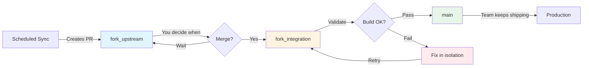
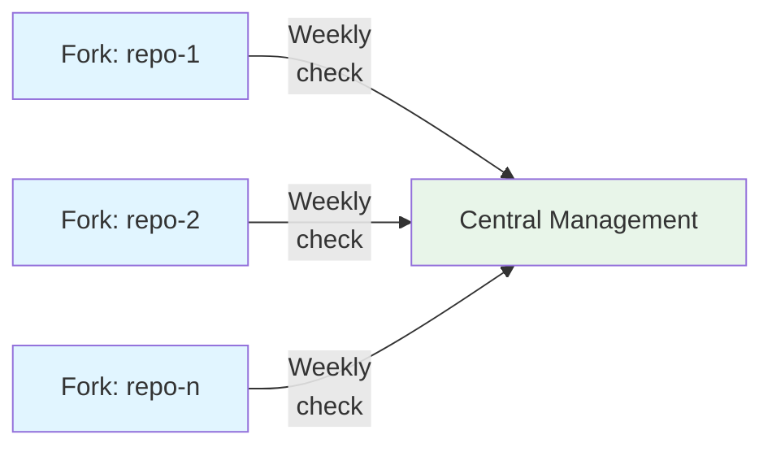

# Learnings & Insights

!!! abstract "Living Document"
    These learnings represent accumulated wisdom from building, deploying, and maintaining a complex fork management system. They serve as guideposts for future development and as context for understanding the current architecture.

---


## The Power of Isolation

!!! quote ":material-lightbulb-outline: Learning"
    Complex integration problems become manageable when properly isolated. Adding isolation stages doesn't slow teams down, it accelerates them by preventing cascade failures.

The system runs upstream sync on a schedule, creating a PR to `fork_upstream`. You control when to merge—batching multiple changes or merging immediately. Once merged, the cascade automatically moves changes to `fork_integration` for validation. If builds pass, changes flow to `main`. If validation fails, the issue is isolated and fixed without blocking the team. Main stays protected and the team keeps shipping.



!!! example "The Airlock Pattern"
    Think of `fork_integration` as an isolation airlock. Upstream changes enter the chamber where it is prepared for "decompression" (breaking changes). Breach detected? Fix it, while crews in main chamber continue to work. Only proven-safe changes pass through into main.

| Branch | Purpose | Can Break? | Team Impact |
|--------|---------|------------|-------------|
| `fork_upstream` | Pure mirror | No | Zero - accumulates until you're ready |
| `fork_integration` | Validation workspace | Yes | Zero - isolated from production |
| `main` | Protected production | Never | Zero - only receives validated changes |

**Team Impact**: When integration breaks, engineers fix, feature flag, or add integration necessary while others continue shipping. If main breaks, everyone must stop.

---

## Managing Engineering Systems Across Many Repositories

!!! quote ":material-lightbulb-outline: Learning"
    Managing engineering systems (workflows, actions, configs) across many repositories requires separating shared logic from instance-specific data. One central repository controls the engineering system; other repositories receive updates via PR.

**The Challenge**: You have many different repositories. Each needs the same workflows (sync, cascade, build, release) but different upstream sources, labels, and settings. How do you improve workflows without manually updating each repository?

**The Pattern** (Phone Home):



**Separation Strategy**:

| Type | Lives In | Controlled By | Example |
|------|----------|---------------|---------|
| **Logic** | Template workflows | Template owner | How to sync, how to cascade, how to build |
| **Data** | Fork config files | Fork owner | Which upstream URL, which files to sync, which labels |

**How It Works**:

1. You fix a bug in `sync.yml` → commit to central template
2. Weekly sync creates PRs in all repositories
3. **Repository owners control when to merge** → Review changes, merge when ready
4. Logic improves everywhere; data stays repository-specific

!!! note "Key Insight"
    Externalizing repository-specific values (upstream URLs, file patterns, labels) into config files enables engineering system evolution without merge conflicts. Pull-based distribution via PR gives repository owners full control over timing. Cost of indirection < cost of manually synchronizing many repositories.

---


## Separation of Concerns Wins

!!! quote ":material-lightbulb-outline: Learning"
    Splitting complex operations into focused components improves reliability and maintainability.

**Decision Framework: When to Split Workflows**

Ask: *"What are the distinct responsibilities?"*

| Indicator | Example | Solution |
|-----------|---------|----------|
| Multiple failure modes | Init workflow handles user input AND system config | Split into `init.yml` + `init-complete.yml` |
| Different execution contexts | Template development vs fork production | Separate directories ([ADR-015](015-template-workflows-separation-pattern.md)) |
| Conflicting requirements | User interaction vs automation | Isolate human touchpoints |

**Pattern**: When a workflow becomes complex, identify distinct responsibilities and split them.

**Impact**: Both workflows become simpler, more testable, and easier to debug. Template-workflows separation eliminated workflow pollution entirely.

---

## Safety Net Pattern: The Sweeper

!!! quote ":material-lightbulb-outline: Learning"
    Human-triggered workflows need automated sweeper processes to catch missed triggers and enable self-healing recovery.

**The Problem**:

- You merge upstream sync PR but forget to trigger cascade → Changes stuck
- Cascade fails due to temporary issue, you fix it → How does it retry?

**The Solution**: `cascade-monitor.yml` runs every 6 hours as a sweeper:

1. **Checks for pending work**: Compares `fork_upstream` vs `fork_integration` branches
2. **Detects missed triggers**: Finds merged sync PRs without cascade started
3. **Auto-triggers cascade**: Starts integration automatically when found
4. **Enables recovery**: When humans remove `human-required` label after fixes, sweeper detects and retries

**Pattern**: For human-triggered critical workflows, add scheduled sweeper that detects incomplete state and auto-triggers recovery.

!!! tip "Safety Net, Not Replacement"
    The sweeper is a fallback for human error or recovery scenarios. Primary path is still manual triggering after review. Sweeper ensures nothing gets permanently stuck.

---

## The "Missing YAML" Problem

!!! quote ":material-lightbulb-outline: Learning"
    Sometimes the simplest solution provides dramatic improvements.

**The Problem**: Workflows not found when using `pull_request` events because init workflows don't exist in the PR branch yet.

**The Solution**: Switch to `pull_request_target` which reads workflows from the target branch.

| Event Type | Workflow Source | Use Case |
|------------|----------------|----------|
| `pull_request` | PR branch | Standard PR validation |
| `pull_request_target` | Target branch | Bootstrap scenarios |

**Takeaway**: When facing GitHub Actions issues, thoroughly understand event contexts and workflow execution environments before building complex workarounds. One line of configuration solved weeks of reliability issues.

---

## AI as Enhancement, Not Dependency

!!! quote ":material-lightbulb-outline: Learning"
    AI capabilities should improve workflows without creating critical dependencies.

**Implementation Strategy:**

- Core functionality operates reliably when AI services unavailable
- AI-enhanced PR descriptions fall back to structured templates
- Conflict analysis succeeds with or without AI suggestions
- AIPR with Azure Foundry provides single, reliable AI integration

**Pattern**: Build resilient fallbacks first, then layer on AI enhancements.

**Current Approach**: Using AIPR tool with Azure Foundry exclusively. Detection logic checks for Azure API credentials and gracefully falls back to static descriptions when unavailable. This single-provider approach simplifies configuration while maintaining reliability through comprehensive fallback handling.

**Impact**: Teams trust and adopt workflows that work consistently, with AI providing value when available rather than creating blocking dependencies.

---

## Human-Centric Automation Philosophy

!!! quote ":material-lightbulb-outline: Learning"
    The most successful automation enhances human capabilities rather than replacing human judgment.

**Applied Pattern:**

- **Cascade workflow**: Manual triggering after sync PR review gives teams explicit control over timing and batching
- **Conflict analysis**: AI provides guidance and categorization; humans make resolution decisions
- **Release decisions**: Automation suggests version bumps; humans approve before release

**Takeaway**: Automation should handle toil and provide analysis; humans should make decisions with clear context and control.

**Impact**: Teams trust and adopt workflows that respect their expertise rather than treating them as obstacles to overcome.

---


## Conflict Category Analysis

!!! quote ":material-lightbulb-outline: Learning"
    Most conflicts fall into predictable, manageable categories with clear resolution strategies.

**Category Breakdown:**

| Category | Frequency | Risk Level | Resolution Strategy |
|----------|-----------|------------|---------------------|
| **Structural** | ~40% | Low | Preserve local structure while adopting upstream organization |
| **Functional** | ~35% | High | Preserve local enhancement intent while adopting improvements |
| **Merge Artifacts** | ~25% | Medium | Focus on testing behavior, not just compilation |

**Resolution Philosophy**: Always understand the **intent** behind local modifications. Test functionality thoroughly—successful compilation doesn't guarantee correct integration.

**Practical Impact**: Categorizing conflicts reduces time-to-understanding and provides clear resolution approaches for each type.

---

## Detection vs Resolution

!!! quote ":material-lightbulb-outline: Learning"
    Detecting conflicts is valuable even when you can't automatically resolve them.

**Value Provided:**

- Structured analysis and categorization
- Significantly reduced time-to-understanding
- Guided resolution even when manual work required

**Pattern**: Build detection and analysis layers first; automated resolution emerges as patterns become clear over time.

**Takeaway**: The value lies in guidance and structure, not full automation. AI-enhanced conflict detection provides immediate value even without automated fixes.

---


## Backward Compatibility is Non-Negotiable

!!! quote ":material-lightbulb-outline: Learning"
    Template changes must work seamlessly with existing fork instances. The cost of supporting backward compatibility is far less than the cost of breaking production instances.

**Requirements:**

- Migration strategies for breaking changes
- Clear communication to affected users
- Often automated migration tooling
- Testing against multiple real instances before deployment

**Pattern**: Every template change requires validation against real fork instances, not just the template repository.

**Impact**: Production fork instances continue operating smoothly through template evolution without surprise breakage or emergency fixes.

---

## Template Pollution Problem

!!! quote ":material-lightbulb-outline: Learning"
    Mixing template development and fork production workflows creates confusion and pollutes fork repositories with infrastructure they don't need.

**The Solution: Directory Separation**

- `.github/workflows/` - Template infrastructure (this repository only)
- `.github/template-workflows/` - Fork production workflows (copied during initialization)

**Pattern**: Clear separation between "infrastructure for this repository" and "infrastructure we deploy to instances."

**Takeaway**: What seems obvious in retrospect emerged from painful experience. Separate contexts require separate locations.

---

## Bootstrap Problem: Local Actions Solution

!!! quote ":material-lightbulb-outline: Learning"
    Extract critical logic to local actions that ship with the template instead of building complex workflow self-update mechanisms.

**The Problem**: New repository workflows execute from the initial template state, potentially missing critical bug fixes (like `--allow-unrelated-histories`) made after template creation.

**The Solution**: Extract critical initialization logic to `.github/local-actions/` which are part of the template repository and copied during initialization. Since these actions exist in the initial commit, fixes are automatically available without workflow self-update complexity.

**Implementation Example**:
```bash
# .github/local-actions/merge-with-theirs-resolution/action.sh
git merge "$SOURCE_BRANCH" --allow-unrelated-histories --no-ff -X theirs
```

**Why Local Actions Win**:

| Benefit | Description |
|---------|-------------|
| **Always Available** | Part of initial commit, no bootstrap needed |
| **No External Dependencies** | Self-contained within repository |
| **Testable** | Can test independently of workflows |
| **Cleaner** | No workflow self-modification complexity |
| **Maintainable** | Single source of truth |

**Pattern**: For template infrastructure that needs to evolve, extract critical logic to local actions rather than building self-update mechanisms.

**Impact**: Initialization uses latest fixes immediately without complex bootstrap patterns. See [ADR-007](007-initialization-workflow-bootstrap.md) and [ADR-028](028-workflow-script-extraction-pattern.md) for detailed rationale.

---


## Labels as Workflow State Machines

!!! quote ":material-lightbulb-outline: Learning"
    GitHub labels provide reliable, queryable state management for multi-stage workflows. Use labels to track state and control automation flow.

**How Labels Enable Automation**:

| Label | Workflow Behavior | Human Signal |
|-------|-------------------|--------------|
| `cascade-active` | Automation running, do not interfere | Work in progress |
| `human-required` | Automation paused, waiting for human action | Please investigate and fix |
| `cascade-blocked` | Automation stopped due to conflicts/failures | Blocked on issue |
| `validated` | Passed all checks, ready for next stage | Safe to proceed |

**State Transitions Example (Cascade)**:
```
upstream-sync → cascade-active → validated → (closed when merged to main)
                     ↓
                cascade-blocked → human-required → (human fixes) → cascade-active (retry)
```

**Why Labels Work**:

- **Queryable**: `gh issue list --label "human-required"` finds all paused work
- **Reliable**: Never fail due to API issues or permission problems
- **Machine-Readable**: Workflows make decisions based on label presence
- **Human-Readable**: Team sees state at a glance

**Pattern**: Use labels to represent workflow state. When automation needs to pause for human intervention, add `human-required`. When humans signal "ready to retry," remove it and let the sweeper detect and continue.

**Impact**: Workflows can pause, wait for humans, and automatically resume without complex state management infrastructure.

---

## Issue Lifecycle Tracking

!!! quote ":material-lightbulb-outline: Learning"
    Issues make excellent state machines for multi-stage workflows spanning hours or days.

**Capabilities Provided:**

- **Audit Trail**: Full history for debugging and compliance
- **Progress Updates**: Clear updates stakeholders can understand
- **Queryable State**: Automation can track and react to changes
- **Handoff Points**: Explicit transitions between workflow stages

**Pattern**: For complex workflows with multiple stages, use issues as state containers rather than workflow-local variables that disappear between runs.

**Practical Impact**: Complete visibility into cascade progression with automated state tracking and human-readable progress updates.

---

## Duplicate Prevention Architecture

!!! quote ":material-lightbulb-outline: Learning"
    State persistence between workflow runs prevents duplicate work and notification fatigue.

**Storage Mechanism**: Git config provides lightweight, reliable storage for workflow state.

**Capabilities Enabled:**

- Skip creating duplicate PRs for unchanged upstream
- Update existing branches when upstream advances
- Clean up abandoned sync branches automatically

**Pattern**: Workflows often need persistent state between runs; git config provides the perfect storage mechanism without external dependencies.

**Impact**: Smart decision-making eliminates duplicate PRs and unnecessary noise while keeping sync branches current.

---


## Meta Commit Strategy for Versioning

!!! quote ":material-lightbulb-outline: Learning"
    You can have both complete upstream history AND automated version management—they're not mutually exclusive.

**The Approach**: Layer automation-friendly metadata on top of preserved original data rather than transforming or losing the original.

**Benefits Comparison:**

| Aspect | Traditional | Meta Commit Approach |
|--------|-------------|---------------------|
| **History** | Squashed/modified | Complete preservation |
| **Debugging** | Partial context | Full upstream history |
| **Versioning** | Manual tracking | Automated Release Please |
| **Fallback** | None | Conservative auto-versioning |

**Pattern**: Don't transform or lose original data—add metadata layers instead.

**Practical Impact**: Full debugging capability with complete upstream history while enabling automated version management and proper release correlation.

---

## Dependabot Integration Complexity

!!! quote ":material-lightbulb-outline: Learning"
    Automated dependency updates need workflow validation and auto-merge criteria—aggressive automation without guardrails creates problems.

**Strategy:**

| Update Type | SLA | Auto-Merge Criteria |
|-------------|-----|---------------------|
| Security patches | 48 hours | Tests pass + limited scope |
| Feature updates | Standard review | Manual review required |
| Grouped updates | Reduced noise | Related dependencies only |

**Pattern**: Define clear auto-merge criteria (security patches, passing tests, limited scope) before enabling aggressive automation.

**Impact**: Security updates get fast-tracked with 48-hour SLA while feature updates follow careful review, balancing speed with safety.

---

## Monitor Everything From Day One

!!! quote ":material-lightbulb-outline: Learning"
    Comprehensive monitoring enables rapid issue identification and resolution—but it must be built in from the beginning, not bolted on later.

**Built In From Start:**

- Health checks and status reporting
- SLA tracking with automated alerts
- Automated escalation workflows
- Complete audit trails

**Pattern**: Build observability into workflows as core functionality, not afterthought instrumentation.

**Impact**: This design choice paid dividends in operational reliability. Issues are identified and resolved quickly because monitoring was designed in, not retrofitted.

---

## Documentation as Code Review

!!! quote ":material-lightbulb-outline: Learning"
    Writing comprehensive documentation often reveals design flaws before implementation begins.

**The Process:**

1. Articulate rationale and context
2. Explore alternative approaches
3. Document consequences and tradeoffs
4. Discover better designs during writing

**Pattern**: Write the ADR before implementing major decisions; treat documentation as a design tool, not just historical recording.

**Practical Impact**: Better designs discovered during documentation phase rather than expensive refactoring during or after implementation.

---

## The Human-Required Label Strategy

!!! quote ":material-lightbulb-outline: Learning"
    Username resolution is fragile; label-based workflow management is robust and reliable.

**The Problem**: Organization names can't be assigned to issues. User accounts change. API failures block workflows.

**The Solution**: Labels have none of these problems and provide better filtering capabilities.

**Pattern**: Design for reliability over convenience—labels may seem less direct than assignees, but they work consistently across all scenarios.

**Impact**: Workflows operate reliably without fragile user resolution dependencies or API failure blocking.

---

## Future Directions

Based on accumulated learnings, these areas show promise for continued evolution:

=== "Pattern Recognition"

    **Machine Learning Opportunities**

    Learning from resolved conflicts could enable:

    - Automated resolution suggestions for common patterns
    - Confidence scoring for resolution approaches
    - Learning from team-specific resolution preferences

    **Impact**: Progressively better automated assistance as the system learns from real conflict resolutions.

=== "Cross-Repository Intelligence"

    **Multi-Fork Coordination**

    Managing multiple related fork instances could leverage:

    - Dependency analysis across forks
    - Coordinated update orchestration
    - Template ecosystem versioning

    **Impact**: Intelligent coordination across the entire OSDU service portfolio rather than isolated per-repository management.

=== "Deeper AI Integration"

    **Enhanced AI Capabilities**

    Building on successful AI enhancement patterns:

    - Proactive analysis of upstream changes before sync
    - Integration testing suggestions for conflicts
    - Advanced context awareness for complex scenarios

    **Impact**: AI provides even more valuable guidance while maintaining human control and reliable fallbacks.

---

## Start Simple, Evolve Systematically

!!! quote ":material-lightbulb-outline: Learning"
    The most successful features began with minimal viable implementations and evolved based on real usage feedback.

**Anti-Pattern**: Over-engineering early wastes effort on wrong assumptions.

**Impact**: Focus effort on solving real problems discovered through usage rather than theoretical problems that may never materialize.

---

## Real-World Testing Beats Assumptions

!!! quote ":material-lightbulb-outline: Learning"
    Template changes tested only against the template repository often failed when deployed to real fork instances.

**Pattern**: Real-world scenarios reveal edge cases that perfect plans miss.

**Takeaway**: Budget time for testing against multiple real fork instances before declaring template changes complete.

---

## Clear Error Messages Are Feature Requirements

!!! quote ":material-lightbulb-outline: Learning"
    Actionable error messages with recovery instructions aren't nice-to-have polish—they're essential for reliable automation.

**Impact**: Users can resolve issues themselves with clear guidance rather than requiring expert intervention for every problem.

**Pattern**: Budget time for clear error messages as core functionality, not optional polish added if time permits.

---

## Bash Script Extraction Enables Testing

!!! quote ":material-lightbulb-outline: Learning"
    Extracting embedded bash scripts into separate .sh files with action.yml wrappers dramatically improves maintainability and testability.

**The Problem**: Embedded bash scripts in workflows (~3,500 lines across 9 files) couldn't be tested locally, led to code duplication, and made debugging difficult.

**The Solution**: Extract scripts to `.github/actions/*/script.sh` with composite action wrappers (`action.yml`).

**Benefits Achieved**:

| Benefit | Description |
|---------|-------------|
| **Local Testing** | Run `./script.sh` locally without triggering workflows |
| **Code Reuse** | Eliminate duplication (e.g., LLM detection duplicated 2x, now shared) |
| **Better Diffs** | Script changes separate from workflow structure changes in git |
| **Debuggability** | Debug bash logic with standard tools (shellcheck, bash -x) |
| **40% Size Reduction** | Workflows became dramatically shorter and clearer |

**Implementation Pattern**:
```
.github/actions/llm-provider-detect/
├── action.yml          # Composite action wrapper
├── detect-provider.sh  # Testable bash script
└── README.md           # Usage and testing docs
```

**Usage in Workflows**:
```yaml
- uses: ./.github/actions/llm-provider-detect
  id: llm
  env:
    AZURE_API_KEY: ${{ secrets.AZURE_API_KEY }}
```

**Pattern**: When bash scripts exceed ~20 lines or need reuse, extract to separate files with action wrappers. See [ADR-028](028-workflow-script-extraction-pattern.md) for comprehensive rationale.

**Impact**: Complex logic can be tested, debugged, and maintained like regular code rather than embedded workflow snippets.

---

## Configuration Flexibility Compounds Value

!!! quote ":material-lightbulb-outline: Learning"
    Every configuration option added multiplies the template's applicability across different scenarios and use cases.

**ROI**: The extra design effort pays back many times over through broader adoption and fewer special-case implementations.

**Pattern**: Ask "could someone need this to work differently?" when making design decisions. If yes, make it configurable.

**Impact**: Template serves diverse scenarios without forking or modification, dramatically increasing reusability.


