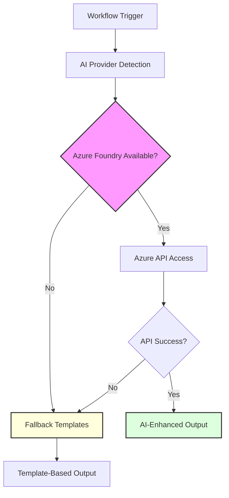
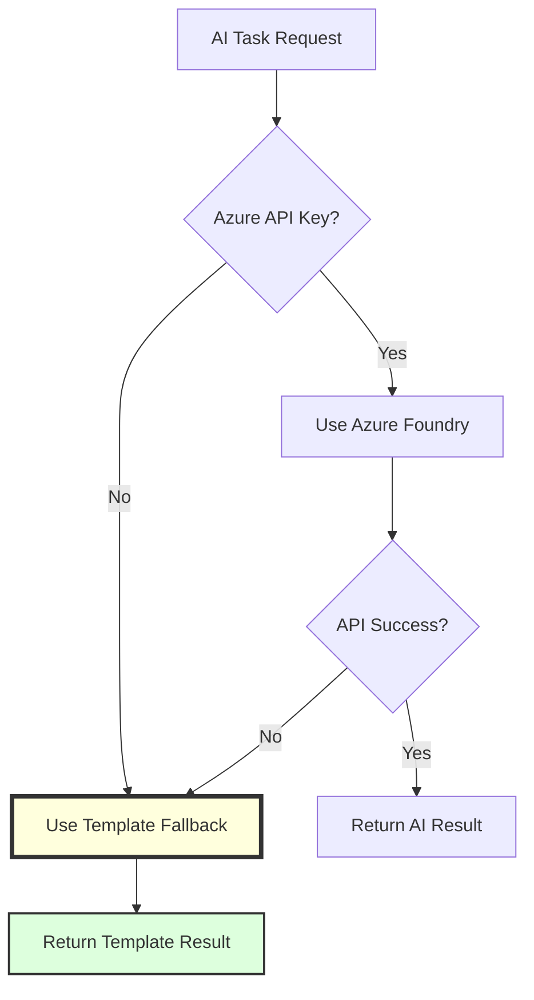

# AI Integration Architecture

The OSDU SPI Fork Management system incorporates sophisticated AI capabilities to enhance development workflows while maintaining reliability and cost-effectiveness. This integration provides intelligent analysis, automated documentation generation, and enhanced decision-making support throughout the fork management lifecycle.

## AI Integration Philosophy

<div class="grid cards" markdown>

-   :material-robot-outline:{ .lg .middle } **Enhancement, Not Dependency**

    ---

    AI capabilities enhance existing workflows without creating dependencies. All core functionality operates normally when AI services are unavailable, ensuring system reliability.

</div>

<div class="grid cards" markdown>

-   :material-microsoft-azure:{ .lg .middle } **Azure Foundry Primary**

    ---

    Standardized on Azure Foundry for enterprise compliance, Microsoft ecosystem integration, and consistent AI capabilities with graceful template fallback.

</div>

<div class="grid cards" markdown>

-   :material-shield-star:{ .lg .middle } **Secure by Design**

    ---

    API keys and sensitive data are handled through secure GitHub secrets management with proper access controls and audit trails.

</div>

<div class="grid cards" markdown>

-   :material-cash-multiple:{ .lg .middle } **Cost-Conscious Usage**

    ---

    Intelligent usage patterns, caching, and fallback strategies control API costs while maximizing value from AI capabilities.

</div>

## AI Provider Architecture



## Supported AI Providers

The system uses Azure Foundry as the primary AI provider with graceful fallback to structured templates:

| Provider | Priority | Integration Method | Key Capabilities | Typical Use Cases |
|----------|----------|-------------|---------------|---------------|
| :material-microsoft-azure: **Azure Foundry** | Primary | Azure API + Enterprise features | Enterprise integration, compliance, GPT-4o access | All AI-enhanced workflows |
| :material-file-document: **Template Fallback** | Fallback | Structured templates | Consistent output, zero-cost operation | When Azure unavailable |

## AI Enhancement Points

### Pull Request Descriptions

AI-generated PR descriptions provide comprehensive change analysis:

```yaml
# AI-powered PR description generation
- Change categorization (feat, fix, chore, etc.)
- Impact analysis
- Security vulnerability assessment
- Breaking change detection
- Review recommendations
```

### Commit Message Generation

Intelligent conventional commit messages from changesets:

```bash
# AI analyzes changes and generates conventional commit
# Input: Git diff
# Output: "feat(sync): add duplicate PR prevention logic"
```

### Security Analysis

AI-powered triage of vulnerability scans:

```yaml
# Trivy scan results → AI analysis → Actionable insights
- Vulnerability severity assessment
- Exploitation likelihood analysis
- Mitigation recommendations
- Priority ranking for remediation
```

## Implementation Patterns

### Provider Detection Logic

```bash
# Automatic provider detection based on available credentials
USE_LLM=false
LLM_MODEL=""

# Check for Azure Foundry
if [[ -n "$AZURE_API_KEY" ]] && [[ -n "$AZURE_API_BASE" ]]; then
  USE_LLM=true
  LLM_MODEL="azure"
  echo "Using Azure Foundry for AI tasks"
else
  echo "No Azure Foundry configured - using templates"
fi
```


## Fallback Mechanisms

Robust fallback ensures workflow continuity:



## Security Considerations

### API Key Management

```yaml
# GitHub Secrets Configuration
secrets:
  AZURE_API_KEY:         # Azure Foundry API key (required for AI features)
  AZURE_API_BASE:        # Azure endpoint URL (required for AI features)
  AZURE_API_VERSION:     # API version (required for AI features)

# Access Control
- Repository-level secrets
- Environment-specific configurations
- Audit logging for all AI API usage
- Rotation reminders via GitHub notifications
```

### Data Privacy

```yaml
# Data handling practices
- No sensitive data in AI prompts
- Sanitize repository contents before AI processing
- Use ephemeral environments for AI operations
- Clear AI context after each workflow run
```


## Related Documentation

- [ADR-014: AI-Enhanced Development Workflow](../decisions/adr_014_ai_integration.md)
- [Workflow System Architecture](./workflow_system.md)
- [Security Architecture](./security.md)