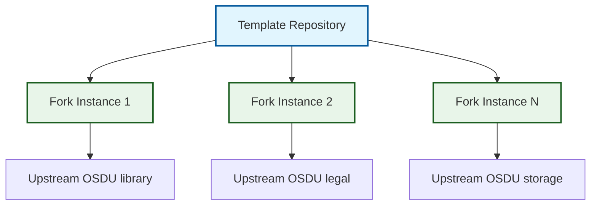

# Overview

## Principles

The OSDU SPI Fork Management system is built on a foundation of **template-driven automation** that prioritizes zero-configuration deployment, intelligent automation, and continuous maintenance. The architecture leverages GitHub's native capabilities to provide fork management without external dependencies.

-   :material-cog-clockwise:{ .lg .middle } **Self Configuring**

    ---

    Template repositories automatically adapt to specific upstream sources through intelligent initialization workflows that detect and configure appropriate settings.

-   :material-shield-check:{ .lg .middle } **Safety First**

    ---

    Multiple validation points prevent unstable code promotion through the three-branch strategy, with branch protection rules and automated security scanning.

-   :material-lightning-bolt:{ .lg .middle } **Event Driven**

    ---

    Automated response to repository changes, schedules, and external triggers enables real-time synchronization and conflict management.

-   :material-trending-up:{ .lg .middle } **Scalable**

    ---

    Support unlimited repository deployments with consistent patterns, enabling enterprise-wide adoption across multiple OSDU repository forks.

## System Design

The system implements a sophisticated template repository pattern that separates concerns:

!!! info "Template Repository Pattern"
    This pattern separates template development from instance operation, enabling scalable management of unlimited fork deployments while maintaining consistent automation patterns.

**Template Development Context** includes `.github/workflows/` for template development and maintenance workflows, template-specific documentation and configuration, and update propagation mechanisms with testing frameworks.

**Fork Instance Context** encompasses `.github/template-workflows/` for production fork management workflows, instance-specific configuration and customization, and upstream-specific synchronization and integration.

**Event Driven Architecture** enables intelligent automation through GitHub's native event system. The system responds to scheduled events (daily sync), change events (PR validation), and manual events (on-demand resolution), providing comprehensive lifecycle management.

!!! tip "Architectural Success Pattern"
    The combination of template-driven deployment with event-driven automation creates a self-managing system that scales across unlimited fork instances while maintaining consistent behavior and zero-configuration operation.

**System Components** provide comprehensive automation through three specialized layers that work together to deliver fork management capabilities.

-   :material-source-branch:{ .lg .middle } **Three-Branch Strategy**

    ---

    Isolated conflict resolution and controlled integration from upstream through staging to production environments.

    [:octicons-arrow-right-24: Learn about branch strategy](three_branch_strategy.md)

-   :material-cog-clockwise:{ .lg .middle } **Workflow System**

    ---

    Event-driven automation with AI-enhanced capabilities for synchronization, validation, and release management.

    [:octicons-arrow-right-24: Explore workflow architecture](workflow_system.md)

-   :material-brain:{ .lg .middle } **AI Integration**

    ---

    Multi-provider AI support with intelligent analysis, automated documentation, and fallback strategies.

    [:octicons-arrow-right-24: Discover AI capabilities](ai_integration.md)

## Enterprise Capabilities

The system delivers enterprise-grade features through comprehensive security, proven scalability patterns, and native GitHub integration. Branch protection strategies ensure production stability while enabling flexible conflict resolution workflows.

!!! success "Enterprise Ready"
    Production deployments benefit from automated security scanning, unlimited scalability through template propagation, and seamless integration with existing development toolchains and AI services.

---