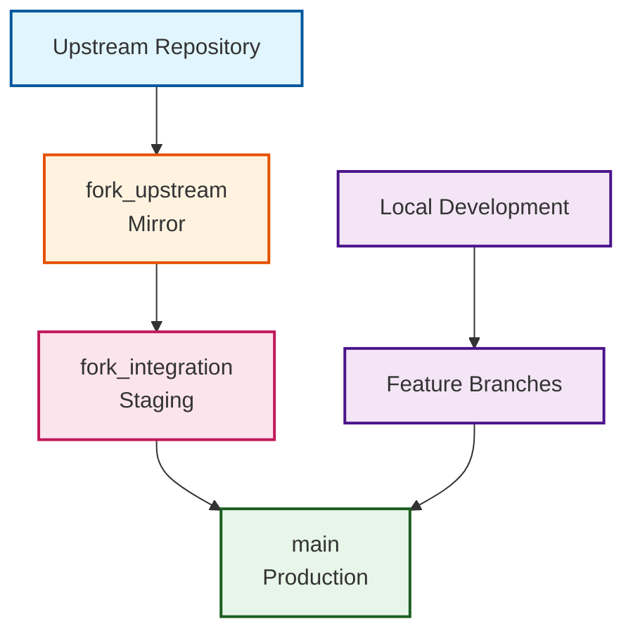
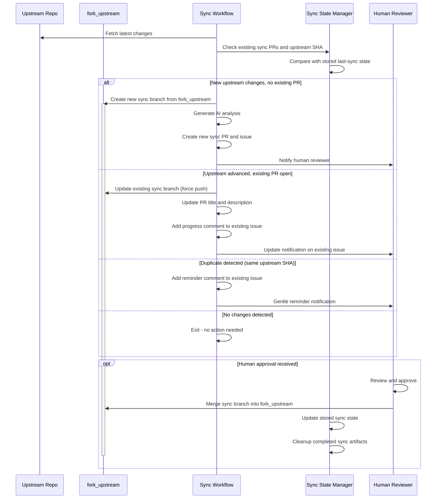
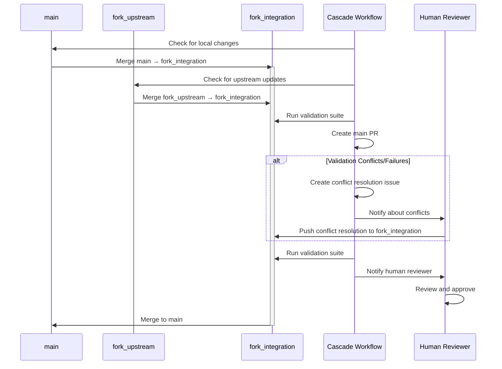
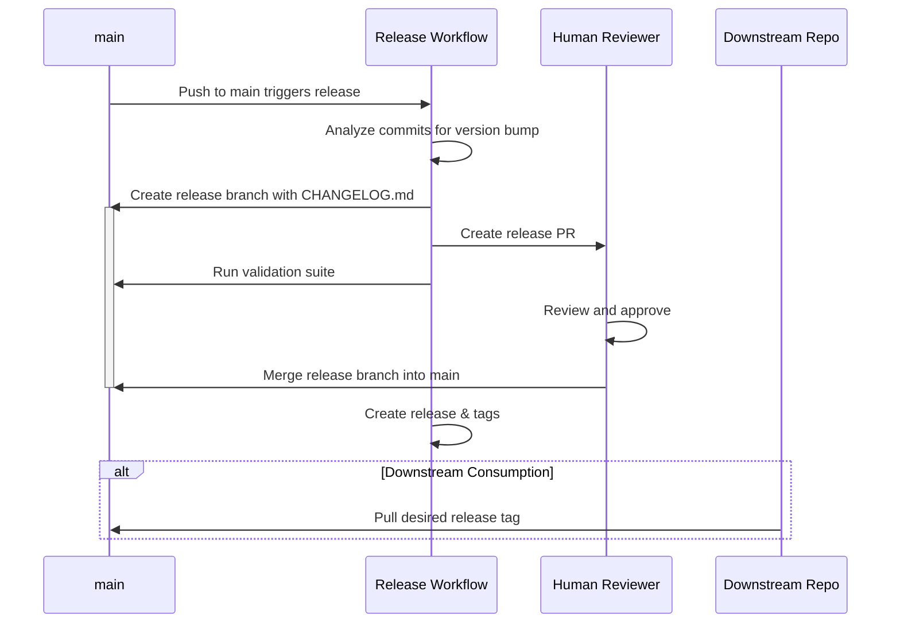

# Three-Branch Strategy

The three-branch strategy forms the cornerstone of safe, systematic fork management in the OSDU SPI Fork Management system. This architectural pattern provides controlled integration checkpoints that prevent cascade failures while enabling continuous upstream synchronization.

## Branch Architecture

### Branch Purposes

-   :material-source-branch-check:{ .lg .middle } **`main` - Production Branch**

    ---

    Stable production branch containing successfully integrated changes

    - Maximum security with required PR reviews
    - Production-ready Azure SPI implementations  
    - Updates only through validated pull requests from `fork_integration`
    - All changes must pass comprehensive validation

-   :material-source-commit:{ .lg .middle } **`fork_upstream` - Upstream Mirror**

    ---

    Clean tracking of upstream OSDU repository without local modifications

    - Automation-only updates to maintain purity
    - Exact mirror of upstream repository state
    - Automated synchronization from upstream repository
    - Enables clear diff analysis and change detection

-   :material-source-merge:{ .lg .middle } **`fork_integration` - Integration Workspace**

    ---

    Dedicated space for conflict resolution and comprehensive validation

    - Flexible protection for conflict resolution workflows
    - Merge workspace for upstream changes with local modifications
    - Automated merges from `fork_upstream` with conflict resolution
    - Complete build, test, and security scanning before production

## Process Flow

#### **Synchronize**

!!! info "Sync State Management"
    The synchronization process includes intelligent duplicate prevention that maintains sync continuity. The **Sync State Manager** tracks upstream SHA, active PR numbers, and issue state between runs to prevent duplicate PRs and maintain human workflow continuity. When upstream advances while a PR is open, the existing branch is updated rather than creating duplicates.

#### **Integrate**

#### **Release**

## Safety Mechanisms

### Branch Protection Rules

| Protection Setting | :material-source-branch: *main* | :material-source-branch: *fork_upstream* | :material-source-branch: *fork_integration* |
|-------------------|-------|---------------|------------------|
| **Required Reviews** | 1 minimum | Not required | Not required |
| **Status Checks** | All workflows | Not required | Validation only |
| **Up-to-date Branch** | Required | Not enforced | Not enforced |
| **Force Push** | Blocked | Allowed | Allowed |
| **Human Access** | PR only | Blocked | Direct push |

### Quality Gates

!!! check "Integration Validation"
    ✓ **Build Verification**: Complete compilation and dependency resolution  
    ✓ **Test Execution**: Full test suite including integration tests  
    ✓ **Security Scanning**: Automated vulnerability and compliance checks  
    ✓ **Code Quality**: Linting and code quality metrics verification

!!! warning "Production Validation"
    ⚠️ **Human Review**: Manual approval for all production changes  
    ⚠️ **Impact Assessment**: Analysis of changes to Azure SPI implementations  
    ⚠️ **Rollback Planning**: Verification of rollback procedures if needed  
    ⚠️ **Documentation**: Change documentation and release notes

## Workflow Benefits

-   :material-target:{ .lg .middle } **Conflict Isolation**

    ---

    Merge conflicts are resolved in the dedicated `fork_integration` branch, preventing disruption to the stable `main` branch during resolution.

-   :material-magnify:{ .lg .middle } **Clear Change Attribution**

    ---

    Easy identification of what changes originate from upstream versus local Azure SPI modifications through clean branch separation.

-   :material-shield-account:{ .lg .middle } **Multi-Stage Validation**

    ---

    Multiple review and validation points ensure problematic changes are caught before reaching production systems.

-   :material-history:{ .lg .middle } **Upstream Tracking**

    ---

    Pure upstream branch enables accurate diff analysis, change detection, and impact assessment for each synchronization.

-   :material-backup-restore:{ .lg .middle } **Rollback Capability**

    ---

    Easy reversion of problematic integrations without losing upstream synchronization state or affecting ongoing development.

-   :material-database:{ .lg .middle } **Branch Preservation**

    ---

    All three branches are permanently preserved, maintaining historical state for analysis and providing continuous availability.

## Operational Patterns

### Daily Synchronization Cycle

**Automated Processing:**

:material-arrow-right: **Step 1:** Check Upstream - Daily automated check for new upstream changes  
:material-arrow-right: **Step 2:** Sync Detection - AI-enhanced analysis of change scope and impact  
:material-arrow-right: **Step 3:** Integration Attempt - Automated merge to integration branch  
:material-arrow-right: **Step 4:** Validation Execution - Comprehensive testing and security scanning

**Human Intervention Points:**

:material-arrow-right: **Step 1:** Conflict Resolution - Manual resolution when automated merge fails  
:material-arrow-right: **Step 2:** Validation Review - Assessment of test results and security findings  
:material-arrow-right: **Step 3:** Production Approval - Final authorization for changes to reach `main`  
:material-arrow-right: **Step 4:** Release Coordination - Alignment with downstream system requirements

### Emergency Procedures

#### **Upstream Rollback**
If upstream changes cause issues:

1. Identify last known good state in `fork_upstream`
2. Create rollback branch from previous stable point
3. Update `fork_integration` with rollback changes
4. Execute normal validation and approval process

#### **Production Hotfix**
For urgent Azure SPI fixes:

1. Create hotfix branch from current `main`
2. Implement and test fix in isolation
3. Fast-track through integration validation
4. Deploy with minimal upstream integration delay

!!! info "Release Strategy"
    For production deployments, temporary release branches (`release/upstream-YYYYMMDD-HHMMSS`) are created from `fork_integration` to `main`, allowing safe cleanup while preserving the three-branch core architecture.

---