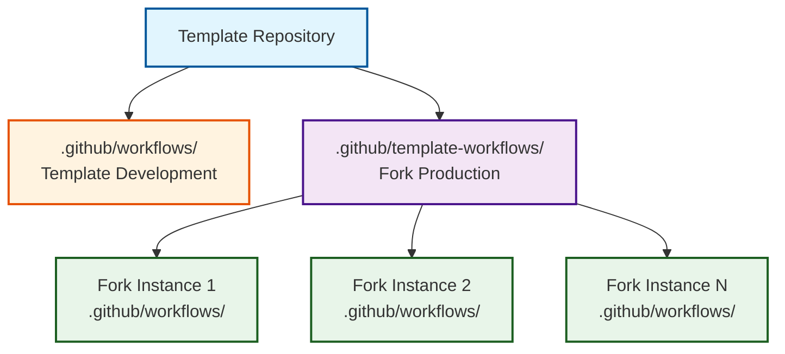
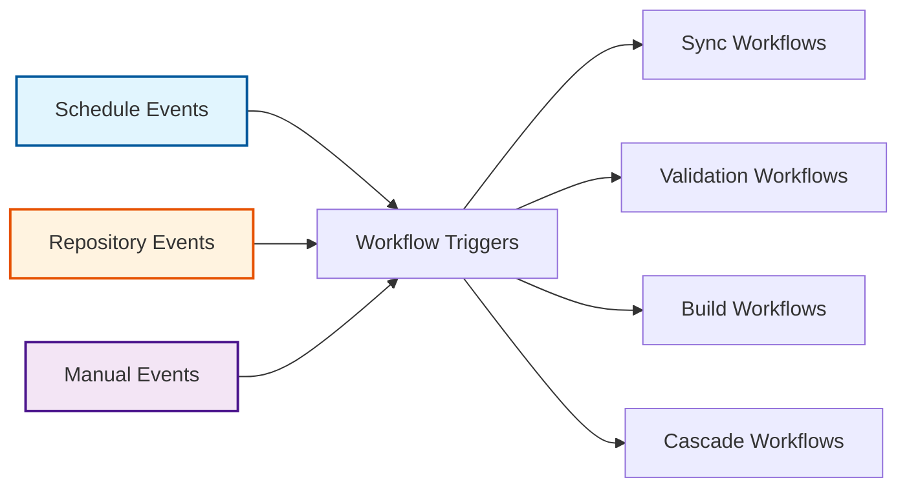

# Workflow System Architecture

The OSDU SPI Fork Management system implements a sophisticated workflow architecture that separates template development concerns from fork production operations. This design enables scalable deployment across multiple fork instances while maintaining centralized template management.

## Workflow Architecture Pattern

### Template-Workflows Separation

The system implements a clean separation between template development and fork production workflows:

-   :material-cog:{ .lg .middle } **Template Development Context**

    ---

    **`.github/workflows/` - Template management and maintenance**

    - Repository initialization and bootstrap workflows
    - Template testing and validation workflows
    - Template versioning and release management
    - Development CI/CD pipelines

-   :material-factory:{ .lg .middle } **Fork Production Context**

    ---

    **`.github/template-workflows/` - Production fork operations**

    - Upstream synchronization workflows
    - Build and validation workflows  
    - Release management for fork instances
    - Monitoring and maintenance workflows

## Core Workflow Categories

### :material-sync: Synchronization Workflows

-   :material-sync:{ .lg .middle } **Daily Upstream Sync** (`sync.yml`)

    ---

    AI powered daily synchronization with intelligent duplicate prevention that fetches upstream changes, analyzes them for conflicts, and creates integration PRs with conventional commit messages

    - **Trigger**: Scheduled daily at midnight UTC with intelligent duplicate prevention
    - **State Management**: Tracks sync state between runs to prevent duplicate PRs and issues
    - **Decision Logic**: Updates existing branches when upstream advances, prevents duplicates for same SHA
    - **Integration**: Three-branch safety pattern (fork_upstream → fork_integration → main)
    - **AI Features**: Intelligent change analysis and conventional commit generation
    - **Conflict Handling**: Automated detection with human-guided resolution

    [:octicons-arrow-right-24: Detailed spec](../workflows/synchronization.md)

-   :material-update:{ .lg .middle } **Template Propagation** (`sync-template.yml`)

    ---

    Distributes template improvements across multiple fork instances with selective synchronization and automated validation

    - **Trigger**: Daily scheduled execution at 8 AM UTC
    - **Scope**: Selective file synchronization based on configuration rules
    - **Safety**: Automated testing and validation before deployment
    - **Scalability**: Supports unlimited fork instances with consistent patterns

    [:octicons-arrow-right-24: Detailed spec](../workflows/synchronization.md)

### :material-check-circle: Validation Workflows

-   :material-check-circle:{ .lg .middle } **Pull Request Validation** (`validate.yml`)

    ---

    Comprehensive quality assurance system that enforces code standards, verifies build integrity, and ensures consistency across all changes

    - **Quality Gates**: Multi-phase validation pipeline with adaptive rules
    - **Scope**: Commit format, branch naming, build verification, conflict detection
    - **Intelligence**: Context-aware validation for different contribution types
    - **Feedback**: Detailed status reporting with actionable developer guidance

    [:octicons-arrow-right-24: Detailed spec](../workflows/validation.md)

-   :material-robot-excited:{ .lg .middle } **Dependabot Automation** (`dependabot-validation.yml`)

    ---

    Automated dependency update validation with intelligent risk assessment and selective auto-merging for routine updates

    - **Automation**: Validates and tests all Dependabot dependency updates
    - **Security**: Comprehensive vulnerability assessment of new dependencies
    - **Intelligence**: Risk-based auto-merging for low-impact updates
    - **Integration**: Seamless coordination with main validation pipeline

    [:octicons-arrow-right-24: Detailed spec](../workflows/validation.md)

### :material-hammer-wrench: Build & Release Workflows

-   :material-hammer-wrench:{ .lg .middle } **Project Build** (`build.yml`)

    ---

    Feature branch build verification with comprehensive testing, coverage analysis, and performance-optimized execution

    - **Focus**: Rapid developer feedback for feature branch development
    - **Coverage**: Unit tests, integration tests, and comprehensive quality metrics
    - **Performance**: Intelligent caching and parallel execution strategies
    - **Support**: Java/Maven projects with extensible patterns for other languages

    [:octicons-arrow-right-24: Detailed spec](../workflows/build.md)

-   :material-tag:{ .lg .middle } **Semantic Release** (`release.yml`)

    ---

    Automated semantic versioning with conventional commit analysis, changelog generation, and coordinated release distribution

    - **Versioning**: Release Please integration with conventional commit standards
    - **Coordination**: Upstream version tracking and alignment strategies
    - **Documentation**: Automated changelog and release notes generation
    - **Distribution**: Package publication and artifact management

    [:octicons-arrow-right-24: Detailed spec](../workflows/release.md)

### :material-water-outline: Cascade Workflows

-   :material-water-outline:{ .lg .middle } **Integration Cascade** (`cascade.yml`)

    ---

    Multi-stage integration workflow that safely promotes changes through the three-branch strategy with comprehensive validation

    - **Flow**: Systematic progression from fork_upstream → fork_integration → main
    - **Safety**: Comprehensive testing and validation at each integration stage
    - **Flexibility**: Manual execution with automated monitoring capabilities
    - **Tracking**: Complete progress monitoring through GitHub Issues

    [:octicons-arrow-right-24: Detailed spec](../workflows/cascade.md)

-   :material-monitor-eye:{ .lg .middle } **Cascade Monitoring** (`cascade-monitor.yml`)

    ---

    Intelligent monitoring system that detects completed synchronizations and automatically triggers cascade operations with SLA management

    - **Detection**: Automated monitoring for completed upstream synchronizations
    - **SLA Management**: Ensures cascade operations meet timing requirements
    - **Escalation**: Proactive alerts and notifications for overdue operations
    - **Recovery**: Automatic retry mechanisms with intelligent backoff strategies

    [:octicons-arrow-right-24: Detailed spec](../workflows/cascade.md)

## AI Enhanced Integration Workflows

### :material-git: Cross-Platform Integration

!!! info "AI Enhanced Extensions"
    These workflows extend the core fork management system with AI-powered capabilities that bridge platforms and enhance developer productivity. They operate alongside the core workflows without disrupting the fundamental three-branch strategy.

## Workflow Event Architecture

### Event-Driven Triggers

| Trigger Type | Workflow | Schedule/Event | Description |
|-------------|----------|----------------|-------------|
| **Scheduled** | Daily Sync | `0 0 * * *` | Midnight UTC upstream synchronization with duplicate prevention |
| **Scheduled** | Template Sync | `0 8 * * *` | Daily 8 AM UTC template updates with duplicate prevention |
| **Scheduled** | Monitoring | `0 */6 * * *` | 6-hour cascade monitoring |
| **Event-Based** | PR Validation | PR creation/updates | Validation workflows on pull requests |
| **Event-Based** | Cascade Trigger | Issue creation | Cascade triggering on sync completion |
| **Event-Based** | Build | Push to main | Build workflows on main branch updates |
| **Event-Based** | Release | Tag creation | Distribution workflows on releases |
| **Manual** | Emergency Sync | On-demand | Immediate upstream synchronization |
| **Manual** | Cascade Override | On-demand | Manual cascade operation initiation |
| **Manual** | Template Update | On-demand | Immediate template propagation |
| **Manual** | Validation Retry | On-demand | Re-execution of failed workflows |

## Workflow Integration Patterns

### AI-Enhanced Automation

-   :material-microsoft-azure:{ .lg .middle } **Azure OpenAI**

    ---

    Primary AI provider with enterprise integration, Microsoft compliance features, and comprehensive reasoning capabilities

-   :material-brain:{ .lg .middle } **OpenAI GPT-4**

    ---

    Secondary AI provider providing comprehensive coverage and established performance baselines

-   :material-robot:{ .lg .middle } **Claude (Anthropic)**

    ---

    Third-tier AI provider for analysis and generation with advanced reasoning capabilities

**AI-Powered Capabilities** enhance every stage of the workflow system:

- **Change Analysis**: Intelligent assessment of upstream modifications
- **Commit Generation**: Conventional commit message creation
- **PR Descriptions**: Comprehensive pull request documentation
- **Conflict Guidance**: Step-by-step conflict resolution instructions

### Security Integration

!!! warning "Security-First Approach"
    All workflows integrate comprehensive security scanning and branch protection to ensure production stability and compliance.

-   :material-shield-search:{ .lg .middle } **Automated Security Scanning**

    ---

    - Trivy scanning for container and dependency vulnerabilities
    - Secret detection and automated leak prevention
    - GitHub security advisory integration
    - Automated compliance rule validation

-   :material-shield-check:{ .lg .middle } **Branch Protection Integration**

    ---

    - Required workflow completion before merge
    - Mandatory human approval for production changes
    - Prevention of unauthorized direct pushes
    - Controlled override procedures for critical issues

## Workflow State Management

### Issue-Based Tracking

#### **Lifecycle Management**
- **State Tracking**: GitHub Issues for workflow state management
- **Progress Updates**: Automated status updates throughout workflow execution
- **Error Reporting**: Detailed failure analysis and resolution guidance
- **Audit Trail**: Complete record of all workflow operations

#### **Label-Based Organization**
- **Workflow Types**: `upstream-sync`, `cascade-active`, `template-update`
- **Status Indicators**: `in-progress`, `completed`, `requires-attention`
- **Priority Levels**: `high-priority`, `critical`, `routine`
- **Assignment Strategy**: `human-required` for manual intervention points

### Performance Optimization

-   :material-lightning-bolt:{ .lg .middle } **Intelligent Caching**

    ---

    - Maven dependencies, Node modules, Docker layers
    - Compiled assets and test results
    - Upstream repository metadata
    - Previously generated AI analysis results

-   :material-speedometer:{ .lg .middle } **Resource Management**

    ---

    - Concurrent workflow execution where safe
    - Intelligent scheduling to prevent resource contention
    - Appropriate timeouts with graceful degradation
    - Exponential backoff for transient failures

## Workflow Extensibility

### Custom Action Integration

#### **Reusable Actions**
- **Enhanced PR Creation**: AI-powered pull request generation
- **Java Build Status**: Specialized build reporting for Maven projects
- **Security Scanning**: Standardized vulnerability assessment
- **Notification Management**: Intelligent alert distribution

#### **Extension Points**
- **Project Type Detection**: Automatic workflow adaptation based on project type
- **Custom Validation**: Project-specific quality gates and testing
- **Integration Hooks**: External system integration capabilities
- **Notification Customization**: Flexible alert and reporting mechanisms

---