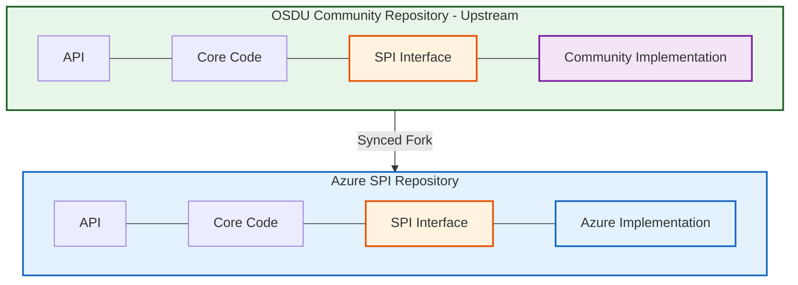
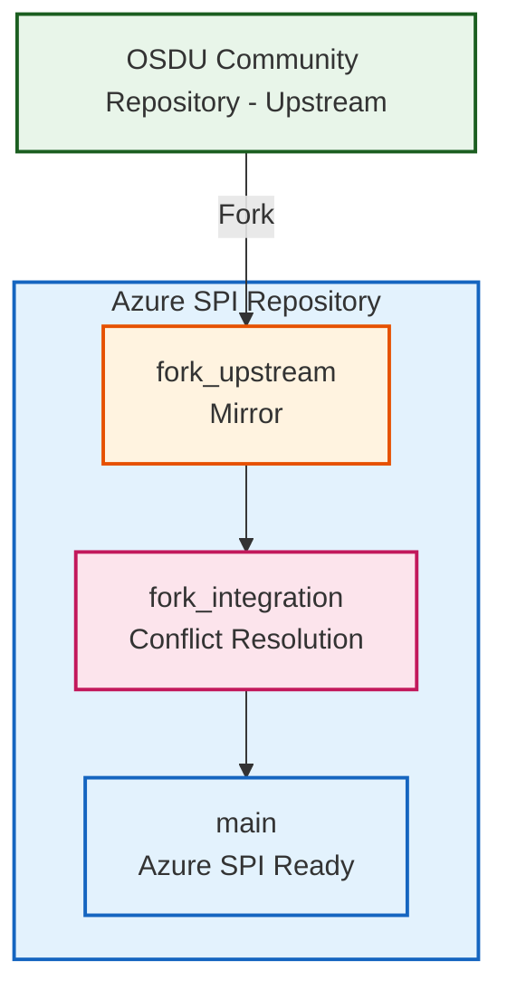

# Concepts

The Open Subsurface Data Universe (OSDU) project presents a fundamental architectural challenge for cloud providers who need to maintain both open-source compatibility and proprietary cloud-specific implementations. This challenge centers on the effective separation and management of Service Provider Interface (SPI) code.

OSDU defines a structured architecture where community standards must remain separate from cloud-specific implementations. The diagram below illustrates how Microsoft maintains this separation through forking:

The **SPI Interface** (highlighted in orange) serves as the critical boundary where community-defined standards meet cloud-specific implementations. Everything to the left must stay synchronized with upstream, while only the implementation layer (rightmost) contains Azure-specific code.

:material-open-source-initiative: **Open Source Components** include OSDU core interfaces, community-validated business logic, standard data models, and reference implementations for testing.

:material-microsoft-azure: **Azure-Specific Components** encompass Azure SPI layer implementations, Azure-native service integrations, proprietary optimizations, and Microsoft-specific configuration and deployment patterns.

!!! info "The Separation Challenge"
    Microsoft must maintain clear boundaries between open-source OSDU core components and Azure-specific SPI implementations, while ensuring both remain compatible and current with upstream community standards.

## The Fork Management Problem

Maintaining long-lived forks of upstream OSDU repositories creates several critical challenges that compound in enterprise environments:

  

:material-merge: **Integration Complexity**

Manual synchronization with upstream changes requires significant engineering effort, particularly when upstream modifications affect interfaces that Azure SPI implementations depend upon.
  

  

:material-source-branch-sync: **Divergence Risk**

Over time, local modifications can diverge significantly from upstream standards, making integration increasingly difficult and potentially compromising compatibility.
  

  

:material-block-helper: **Blocking Dependencies**

Under traditional approaches, compilation or testing failures in any Cloud Provider's SPI implementation could block merging changes to main branches, creating dependencies between unrelated provider implementations.
  

  

:material-source-repository-multiple: **Release Coordination**

Correlating fork versions with upstream releases becomes complex without systematic tracking and version management.
  

!!! warning "Enterprise Compounding Effects"
    These challenges multiply in enterprise environments where quarterly planning cycles cannot accommodate unpredictable upstream changes, teams require different workflows for upstream vs. proprietary code, compliance demands complete audit trails, and multiple downstream systems depend on stable, predictable releases.

**Traditional vs. Automated Approach**

| Aspect | Traditional Fork Management | Automated Solution |
|--------|----------------------------|-------------------|
| **Synchronization** | Manual, error-prone, weekly/monthly | Automated daily with conflict detection |
| **Conflict Resolution** | Ad-hoc, blocking, expertise-dependent | AI-enhanced guidance, isolated resolution |
| **Release Coordination** | Manual tracking, version drift risk | Automatic correlation with upstream tags |
| **Integration Testing** | After conflicts resolved | Continuous validation at each stage |
| **Team Productivity** | 40% time on integration overhead | 90% reduction in manual integration work |
| **Risk Management** | Reactive, cascade failures possible | Proactive, isolated failure containment |

## The Automation Solution

The fork management system implements **controlled isolation** through a three-branch strategy that separates concerns while maintaining automation throughout the integration process.

!!! tip "Success Pattern: Three-Branch Strategy"
    The key insight is controlled isolation - changes flow through `fork_upstream` → `fork_integration` → `main` with validation at each stage, preventing cascade failures while enabling systematic integration.

**Automated Workflow Capabilities:**

  

:material-sync: **Upstream Synchronization**

- Scheduled pulls from upstream repositories
- Automated conflict detection and categorization  
- AI enhanced analysis of change impacts
  

  

:material-source-merge: **Conflict Management**

- Isolated resolution environment in `fork_integration`
- Guided resolution with generated instructions
- Testing validation before production integration
  

  

:material-tag-multiple: **Release Coordination**

- Automatic correlation with upstream version tags
- Semantic versioning aligned with upstream releases
- Clear change documentation and impact analysis
  

**AI Enhanced Development Support** leverages multiple AI providers for intelligent analysis, automated impact assessment, step-by-step conflict resolution guidance, and generated commit messages and PR descriptions through custom agent integration.

## Why This Matters

This automated fork management approach delivers significant operational and strategic value across development teams, operations, and enterprise architecture.

!!! success "Key Impact Areas"
    Teams achieve a major reduction in manual integration work while maintaining full compatibility with upstream OSDU community standards. This enables focus on innovation rather than integration overhead.

=== "Strategic Value"

    

      

    :material-layers-triple: **Separation of Concerns**

    Clear boundaries between open-source and proprietary development enable teams to optimize for their specific technical contexts without compromising either approach.
      

      

    :material-rocket-launch: **Scalable Automation**

    Template-based deployment supports unlimited fork instances with consistent automation patterns, enabling expansion across multiple OSDU repository forks.
      

      

    :material-shield-star: **Future-Proof Architecture**

    The system's design accommodates evolving upstream requirements and changing cloud provider strategies without requiring fundamental architectural changes.
      

    

=== "Development Teams"

    

      

    :material-lightbulb-on: **Focus on Innovation**

    Teams spend time on Azure SPI enhancements rather than integration overhead, accelerating feature delivery and reducing context switching between upstream and proprietary development contexts.
      

      

    :material-code-tags-check: **Reduced Technical Debt**

    Systematic upstream integration prevents accumulation of compatibility issues, maintaining code quality and reducing maintenance burden through predictable automation.
      

      

    :material-calendar-check: **Predictable Planning**

    Automated handling of routine integration tasks enables more reliable sprint planning and feature roadmap execution with fewer unexpected disruptions.
      

    

=== "Operations Teams"

    

      

    :material-shield-check: **Enhanced Compliance**

    Complete audit trails and automated security scanning ensure regulatory requirements are consistently met throughout the integration process.
      

      

    :material-truck-delivery: **Reliable Delivery**

    Structured release correlation provides predictable, stable delivery points for downstream systems like Azure Data Manager for Energy (ADME).
      

      

    :material-security: **Risk Mitigation**

    Early conflict detection and isolated resolution prevent integration issues from impacting production systems through controlled isolation patterns.
      

    

---