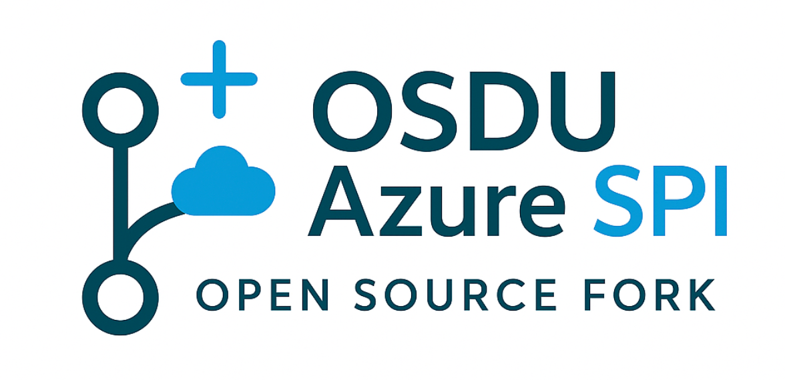

  

    
    
Automation for maintaining long-lived forks

  

## The Challenge

Managing long-lived forks of OSDU repositories is complex. Organizations need to balance upstream compatibility with proprietary implementations while avoiding integration overhead, release delays, and community divergence.

Traditional manual approaches are error-prone and resource-intensive.

## The Solution

Complete automation framework for enterprise fork management:

  

:material-merge: **Smart Synchronization**

Automated daily upstream integration with AI-enhanced conflict detection and resolution guidance.
  

  

:material-source-branch: **Three-Branch Strategy**

Proven branching strategy that isolates changes at each stage, preventing cascade failures.
  

  

:material-robot: **AI Automation**

Intelligent analysis with automated commit messages, PR descriptions, and conflict categorization.
  

  

:material-shield-check: **Enterprise Security**

Built-in vulnerability scanning, compliance checks, and branch protection rules.
  

## Key Benefits

:material-check-circle: **90% reduction** in manual integration work  
:material-check-circle: **Automated conflict detection** with AI guidance  
:material-check-circle: **Enterprise security** and compliance built-in  
:material-check-circle: **Zero-configuration** template deployment  

---