# Cascade Integration Workflow

The cascade integration workflow is the second phase of the fork management process. It is responsible for safely moving synchronized upstream changes through your repository's three-branch hierarchy toward production. After an upstream synchronization PR has been merged into the `fork_upstream` branch, this workflow takes over to validate and integrate those changes into your main development branch.

This workflow acts as a quality gate, running comprehensive validation including Maven builds, unit tests, and compatibility checks before allowing changes to reach your production `main` branch. It embodies a "trust but verify" approach - trusting that the upstream sync was correct, but verifying that the integration works properly with your fork's specific modifications and enhancements.

The cascade process includes built-in safety mechanisms with a dedicated monitor workflow that runs every 6 hours to detect stalled sync PRs. If a sync PR has been merged but no cascade has been triggered within 6 hours, the monitor automatically starts the cascade process, ensuring synchronized changes never get stuck in the pipeline.

## When It Runs

The cascade workflow operates on both manual and automatic triggers to ensure reliable integration:

- **Manual trigger** - You provide the sync issue number in the GitHub Actions tab after reviewing a sync PR
- **Automatic trigger** - The monitor system detects unhandled sync PRs after 6 hours and runs automatically
- **Emergency manual** - Can be run on-demand for any validated upstream changes that need immediate propagation

## What Happens

The workflow follows a structured validation and integration process:

1. **Validates sync completion** - Ensures the upstream sync PR was properly merged and prerequisites are met
2. **Creates integration branch** - Merges changes from `fork_upstream` into `fork_integration` for testing
3. **Runs full validation** - Executes comprehensive Maven build, unit tests, and integration compatibility checks
4. **Creates production PR** - If all validation passes, opens a PR to merge changes into your `main` branch
5. **Provides status updates** - Comments on the original sync issue with progress reports and next steps

## Three-Branch Progression

```mermaid
flowchart LR
    A[fork_upstream<br/>✅ Sync Merged] --> B[fork_integration<br/>🔨 Build & Test]
    B --> C{Validation<br/>Passes?}
    C -->|✅ Pass| D[main<br/>📋 Production PR]
    C -->|❌ Fail| E[🚨 Failure Issue<br/>Human Fix Required]

    style A fill:#fff3e0,stroke:#e65100,stroke-width:2px
    style B fill:#fce4ec,stroke:#c2185b,stroke-width:2px
    style D fill:#e8f5e9,stroke:#1b5e20,stroke-width:2px
    style E fill:#ffebee,stroke:#c62828,stroke-width:2px
```



The workflow produces clear outcomes to guide your next actions:
- **Success**: A production-ready PR is created for final human review before merge to `main`
- **Failure**: Validation errors reported with specific resolution steps and a dedicated failure issue

## When You Need to Act

### Automatic Triggers
- **Monitor alerts** - Issue comments when 6-hour threshold reached
- **Validation failures** - PR created with specific errors to fix

### Manual Triggers Required
- **After sync PR merge** - Trigger cascade with sync issue number
- **Integration conflicts** - Resolve conflicts in `fork_integration` branch
- **Production PR review** - Final approval before merge to `main`

## How to Respond

### Manual Cascade Trigger
1. **Find sync issue number** - From completed upstream sync
2. **Go to Actions** → "Cascade Integration" workflow
3. **Click "Run workflow"** → Enter issue number → Run
4. **Monitor progress** - Watch for completion or error comments

### Handle Integration Conflicts
```bash
# Checkout integration branch
git checkout fork_integration
git status  # See conflict files

# Resolve conflicts
# ... resolve using IDE or manual editing ...

# Test and push
mvn test
git add .
git commit -m "resolve: integration conflicts"
git push origin fork_integration
```

### Review Production PR
1. **Validate changes** - Ensure integration preserved your fork modifications
2. **Check test results** - All validation must pass
3. **Approve and merge** - Final step to production

## Configuration

| Setting | Default | Description |
|---------|---------|-------------|
| **Monitor Schedule** | Every 6 hours | Automatic detection of stalled sync PRs |
| **Validation Process** | Maven build + tests | Required validation before production PR |
| **Auto-merge Production** | Disabled | Always requires human approval for `main` |
| **Integration Conflicts** | Manual resolution | Human intervention required for conflicts |
| **Failure Handling** | Create dedicated issue | Automatic issue creation with resolution steps |

## Troubleshooting

| Issue | Solution |
|-------|----------|
| "Invalid sync issue number" | Verify issue exists and is upstream sync type |
| "Sync PR not merged" | Complete upstream sync process first |
| "Integration conflicts" | Resolve conflicts in `fork_integration` branch |
| "Validation failed" | Check PR comments for specific test/build failures |
| "Production merge blocked" | Ensure all status checks pass |

## Safety Features

- **Three-branch isolation** - Failures don't affect `main` branch
- **Comprehensive validation** - Build, test, security, and quality gates
- **Human approval gates** - Production changes require explicit review
- **Rollback capability** - Can revert to previous stable state
- **Complete audit trail** - All actions logged in GitHub issues

## Related

- [Synchronization Workflow](synchronization.md) - Previous step in process
- [Validation Workflow](validation.md) - Details on quality checks
- [Three-Branch Strategy](../decisions/adr_001_three_branch_strategy.md) - Core architecture