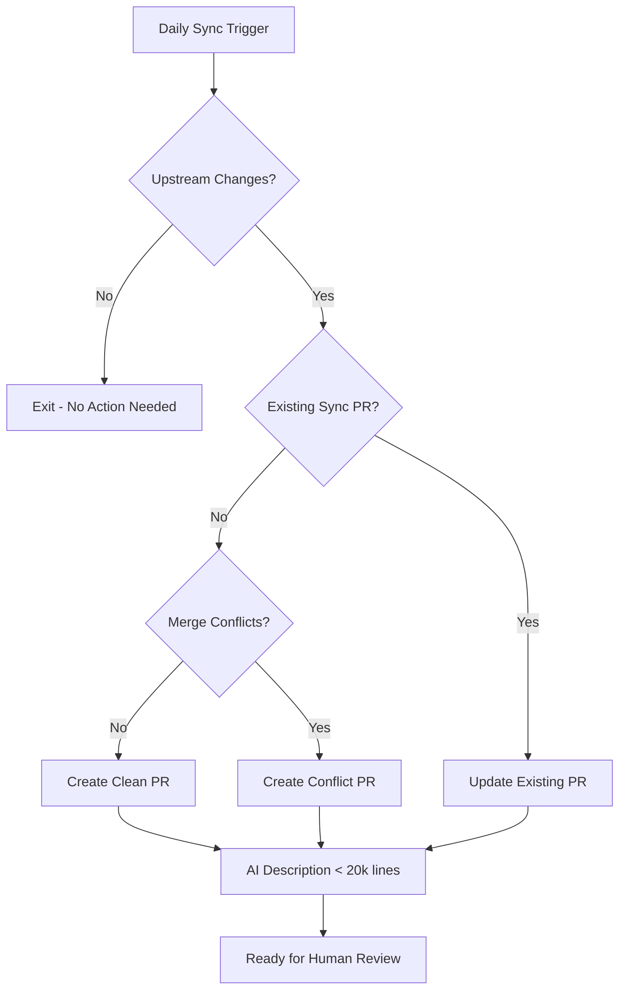

# Upstream Synchronization Workflow

The upstream synchronization workflow is the cornerstone of the fork management system, automatically keeping your repository synchronized with changes from the upstream OSDU repository.
This workflow runs daily to detect new commits, bug fixes, and features from upstream. It then intelligently integrates them into your fork using a safe three-branch strategy.

The workflow includes sophisticated duplicate prevention that avoids creating multiple PRs for the same upstream state. When changes are detected, it either creates a new sync PR or updates an existing one, ensuring a clean workflow without PR proliferation. The system intelligently uses AI for change analysis on reasonably-sized diffs (under 20,000 lines) while falling back to standard templates for massive changes to avoid token limits.

Both clean merges and conflicts are handled gracefully - clean changes get a straightforward PR ready for review, while conflicts are automatically packaged with detailed resolution guidance and marked for human attention.

## When It Runs

The synchronization workflow runs on multiple triggers to ensure your fork stays current:

- **Daily at midnight UTC** - Scheduled automatic sync to catch upstream changes
- **Manual trigger** - Run on-demand via the GitHub Actions tab when needed
- **API trigger** - Programmatically triggered via GitHub REST API for integrations

## What Happens

The workflow follows a systematic process to safely integrate upstream changes:

1. **Checks for upstream changes** - Compares your fork with upstream repository to detect new commits
2. **Creates sync branch** - If changes exist, creates a timestamped `sync/upstream-YYYYMMDD-HHMMSS` branch
3. **Generates PR** - Creates pull request with AI-generated description analyzing the changes
4. **Creates tracking issue** - Links to PR with `human-required` label for team visibility and coordination
5. **Waits for human review** - Team reviews and merges PR to continue the cascade process

## Smart Duplicate Prevention

The workflow uses intelligent state management to avoid creating duplicate sync PRs:

| Situation | Action Taken |
|-----------|-------------|
| **No existing PR + upstream changed** | Creates new PR and tracking issue |
| **Existing PR + upstream unchanged** | Adds reminder comment to existing PR |
| **Existing PR + upstream changed** | Updates existing PR with new changes |
| **No existing PR + upstream unchanged** | No action - exits cleanly |

This prevents PR proliferation and maintains a clear workflow where only one sync PR exists at a time.

## Workflow Outcomes



The workflow produces different outcomes based on what it discovers:
- **Clean merge**: Creates a straightforward PR ready for review with no conflicts
- **Merge conflicts**: Creates a PR with conflict markers and detailed step-by-step resolution instructions
- **Large changes**: Uses standard templates instead of AI for diffs over 20,000 lines
- **Existing PR updates**: Updates the existing sync PR rather than creating duplicates

## When You Need to Act

Look for GitHub issues labeled [`human-required` + `upstream-sync`](../../issues?q=is:open+label:human-required+label:upstream-sync):

- **Clean sync** - Review AI summary and merge PR if changes look safe
- **Conflict sync** - Resolve merge conflicts locally before merging

## How to Respond

### For Clean Syncs
1. **Review the PR** - Check AI-generated summary of upstream changes
2. **Verify compatibility** - Ensure no breaking changes for your fork
3. **Merge PR** - Approve and merge to `fork_upstream` branch
4. **Trigger cascade** - Go to Actions → "Cascade Integration" → enter issue number → Run

### For Conflicts
1. **Checkout branch locally**:
   ```bash
   git checkout sync/upstream-YYYYMMDD-HHMMSS
   git status  # See conflicted files
   ```

2. **Resolve conflicts** - Use your IDE's merge tools or edit manually
3. **Test and commit**:
   ```bash
   # Test your changes
   npm test  # or your project's test command

   # Commit resolution
   git add .
   git commit -m "resolve: merge conflicts from upstream sync"
   git push
   ```

4. **Complete PR** - Request review, get approval, merge
5. **Trigger cascade** - Same as clean sync process

## Configuration

| Setting | Default | Description |
|---------|---------|-------------|
| **Schedule** | `0 0 * * *` | Daily at midnight UTC |
| **AI Provider** | Azure Foundry | Primary AI for PR descriptions |
| **AI Diff Limit** | 20,000 lines | Uses standard templates above this limit |
| **Duplicate Prevention** | Enabled | Prevents multiple PRs for same upstream state |
| **Monitor Trigger** | 6 hours | Auto-cascade if human trigger missed |
| **State Persistence** | Git config | Tracks last sync state between runs |

### AI Configuration
To enable AI-generated PR descriptions, configure these secrets:
- `AZURE_API_KEY` + `AZURE_API_BASE` (primary)
- `OPENAI_API_KEY` (fallback)
- `ANTHROPIC_API_KEY` (future use)

## Troubleshooting

| Issue | Cause | Solution |
|-------|-------|----------|
| "No upstream changes detected" | Fork is current with upstream | Normal - no action needed |
| "Failed to fetch upstream" | Network issues or incorrect URL | Verify `UPSTREAM_REPO_URL` secret |
| "AI description generation failed" | API key issues or service down | PR created with fallback template |
| "Large diff - using fallback template" | Changes exceed 20k lines | Normal for major upstream updates |
| "Duplicate PR detected" | Existing sync PR found | Updates existing PR instead |
| "Cascade not triggered" | Forgot to run manually | Monitor auto-triggers after 6 hours |
| "Sync branch conflicts" | Upstream conflicts with fork changes | Follow conflict resolution steps in PR |

## Related

- [Three-Branch Strategy](../decisions/adr_001_three_branch_strategy.md) - Core branching approach
- [Cascade Workflow](cascade.md) - Next step after sync PR is merged
- [Conflict Management](../decisions/adr_005_conflict_management.md) - Detailed resolution guidance