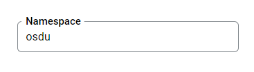

## Service Configuration for Google Cloud

## Environment variables

Define the following environment variables.

Must have:

| name | value | description | sensitive? | source |
| ---  | ---   | ---         | ---        | ---    |
| `SPRING_PROFILES_ACTIVE` | ex `gcp` | Spring profile that activate default configuration for Google Cloud environment | false | - |
| `SHARED_TENANT_NAME` | ex `osdu` | Shared account id | no | - |
| `GCP_AIRFLOW_URL` | ex `https://********-tp.appspot.com` | Airflow endpoint | yes | - |
| `SHARED_TENANT_NAME` | ex `osdu` | Shared account id | no | - |

Defined in default application property file but possible to override:

| name                               | value                                         | description                                                                                                                                            | sensitive? | source                                                       |
|------------------------------------|-----------------------------------------------|--------------------------------------------------------------------------------------------------------------------------------------------------------|------------|--------------------------------------------------------------|
| `LOG_PREFIX`                       | `workflow`                                    | Logging prefix                                                                                                                                         | no         | -                                                            |
| `AUTHORIZE_API`                    | ex `https://entitlements.com/entitlements/v1` | Entitlements API endpoint                                                                                                                              | no         | output of infrastructure deployment                          |
| `PARTITION_API`                    | ex `http://localhost:8081/api/partition/v1`   | Partition service endpoint                                                                                                                             | no         | output of infrastructure deployment                          |
| `GOOGLE_APPLICATION_CREDENTIALS`   | ex `/path/to/directory/service-key.json`      | Service account credentials, you only need this if running locally                                                                                     | yes        | <https://console.cloud.google.com/iam-admin/serviceaccounts> |
| `STATUS_CHANGED_MESSAGING_ENABLED` | `true` OR `false`                             | Allows configuring message publishing about schemas changes to Pub/Sub                                                                                 | no         | -                                                            |
| `STATUS_CHANGED_TOPIC_NAME`        | ex `status-changed`                           | Allows to subscribe a specific Pub/Sub topic                                                                                                           | no         | -                                                            |
| `OSDU_AIRFLOW_VERSION2`            | `true` OR `false`                             | Allows to configure Airflow API used by Workflow service, choose `true` to use `stable` API, `false` to use `experimental` API, by default used `true` | no         | -                                                            |
| `COMPOSER_CLIENT`                  | `IAAP` OR `V2` OR `NONE`                      | Allows to configure authentication method used by Workflow to authenticate its requests to Airflow, by default `IAAP` is used                          | no         | -                                                            |
| `MANAGEMENT_ENDPOINTS_WEB_BASE`    | ex `/`                                        | Web base for Actuator                                                                                                                                  | no         | -                                                            |
| `MANAGEMENT_SERVER_PORT`           | ex `8081`                                     | Port for Actuator                                                                                                                                      | no         | -                                                            |


These variables define service behavior, and are used to switch between `Reference` or `Google Cloud` environments, their overriding
and usage in the mixed mode were not tested. Usage of spring profiles is preferred.

| name | value | description | sensitive? | source |
| ---  | ---   | ---         | ---        | ---    |
| `PARTITION_AUTH_ENABLED` | ex `true` or `false` | Disable or enable auth token provisioning for requests to Partition service | no | - |
| `OQMDRIVER` | `rabbitmq` or `pubsub` | OQM driver mode that defines which message broker will be used | no | - |
| `OSMDRIVER` | `postgres` OR `datastore` | Osm driver mode that defines which storage will be used | no | - |
| `SYSTEM_WORKFLOW_NAMESPACE` | ex `system-workflow-namespace` | Namespace for System Workflows | no | output of infrastructure deployment |

### Running E2E Tests

You will need to have the following environment variables defined.

| name                                | value                                                         | description                                                                                                                                       | sensitive? | source                                                       |
|-------------------------------------|---------------------------------------------------------------|---------------------------------------------------------------------------------------------------------------------------------------------------|------------|--------------------------------------------------------------|
| `DOMAIN`                            | ex `contoso.com`                                              | OSDU R2 to run tests under                                                                                                                        | no         | -                                                            |
| `INTEGRATION_TESTER`                | `********`                                                    | Service account for API calls, as a filename or JSON content, plain or Base64 encoded.  Note: this user must have entitlements configured already | yes        | <https://console.cloud.google.com/iam-admin/serviceaccounts> |
| `NO_DATA_ACCESS_TESTER`             | `********`                                                    | Service account without data access, as a filename or JSON content, plain or Base64 encoded.                                                      | yes        | <https://console.cloud.google.com/iam-admin/serviceaccounts> |
| `LEGAL_TAG`                         | `********`                                                    | Demo legal tag used to pass test                                                                                                                  | yes        | Legal service                                                |
| `WORKFLOW_HOST`                     | ex `https://os-workflow-dot-opendes.appspot.com/api/workflow` | Endpoint of workflow service                                                                                                                      | no         | -                                                            |
| `DEFAULT_DATA_PARTITION_ID_TENANT1` | ex `opendes`                                                  | OSDU tenant used for testing                                                                                                                      | no         | -                                                            |
| `OTHER_RELEVANT_DATA_COUNTRIES`     | `US`                                                          | -                                                                                                                                                 | no         | -                                                            |
| `FINISHED_WORKFLOW_ID`              | `********`                                                    | Workflow ID with finished status                                                                                                                  | yes        | -                                                            |
| `TEST_DAG_NAME`                     | `********`                                                    | Name of test DAG                                                                                                                                  | yes        | -                                                            |
| `OSDU_AIRFLOW_VERSION2`             | `true` or `false`                                             | Disable\Enable tests that work only with specific Airflow version                                                                                 | no         | -                                                            |
| `ENTITLEMENT_V2_URL`                | ex `http://localhost:8080/api/entitlements/v2/`               | Entitlements V2 Host                                                                                                                              | no         | --                                                           |

**Entitlements configuration for integration accounts**

| INTEGRATION_TESTER | NO_DATA_ACCESS_TESTER |
| ---  | ---   |
| service.workflow.system-admin<br/>users<br/>service.entitlements.user<br/>service.workflow.admin<br/>service.workflow.creator<br/>service.workflow.viewer<br/>service.legal.admin<br/>service.legal.editor<br/>data.test1<br/>data.integration.test | users |

```bash
# build + install integration test core
$ (cd testing/workflow-test-core/ && mvn clean install)

# build + run Google Cloud integration tests.
#
# Note: this assumes that the environment variables for integration tests as outlined
#       above are already exported in your environment.
$ (cd testing/workflow-test-gc/ && mvn clean test)
```

## Datastore configuration

There must be a namespace for each tenant, which is the same as the tenant name.

Example:



Kinds `workflow_osm` and `workflow_run_osm` will be created by the service if it does not exist.

## Pubsub configuration

At Pubsub should be created a topic with the name:

**name:** `status-changed`

It can be overridden by:

- through the Spring Boot property `gcp.status-changed.topicName`
- environment variable `STATUS_CHANGED_TOPIC_NAME`

## Google cloud service account configuration

TBD

| Required roles |
| ---    |
| - |
