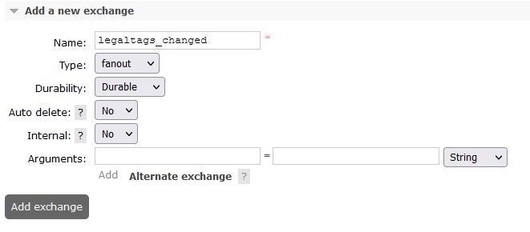

## Service Configuration for Anthos

## Environment variables:

Define the following environment variables.

Must have:

| name | value | description | sensitive? | source |
| ---  | ---   | ---         | ---        | ---    |
| `SPRING_PROFILES_ACTIVE` | ex `anthos` | Spring profile that activate default configuration for Anthos environment | false | - |
| `OSDU_AIRFLOW_USERNAME` | `******` | Airflow username, need to be defined if `AIRFLOW_IAAP_MODE`=`false`| yes | - |
| `OSDU_AIRFLOW_PASSWORD` | `******` | Airflow password, need to be defined if `AIRFLOW_IAAP_MODE`=`false` | yes | - |
| `GCP_AIRFLOW_URL` | ex `https://********-tp.appspot.com` | Airflow endpoint | yes | - |

Defined in default application property file but possible to override:

| name | value | description | sensitive? | source |
| ---  | ---   | ---         | ---        | ---    |
| `LOG_PREFIX` | `workflow` | Logging prefix | no | - |
| `AUTHORIZE_API` | ex `https://entitlements.com/entitlements/v1` | Entitlements API endpoint | no | output of infrastructure deployment |
| `PARTITION_API` | ex `http://localhost:8081/api/partition/v1` | Partition service endpoint | no | - |
| `STATUS_CHANGED_MESSAGING_ENABLED` | `true` OR `false` | Allows to configure message publishing about schemas changes to Pub/Sub | no | - |
| `STATUS_CHANGED_TOPIC_NAME` | ex `status-changed` | Allows to subscribe a specific Pub/Sub topic | no | - |

These variables define service behavior, and are used to switch between `anthos` or `gcp` environments, their overriding
and usage in mixed mode was not tested. Usage of spring profiles is preferred.

| name | value | description | sensitive? | source |
| ---  | ---   | ---         | ---        | ---    |
| `PARTITION_AUTH_ENABLED` | ex `true` or `false` | Disable or enable auth token provisioning for requests to Partition service | no | - |
| `OQMDRIVER` | `rabbitmq` or `pubsub` | Oqm driver mode that defines which message broker will be used | no | - |
| `OSMDRIVER` | `postgres` OR `datastore` | Osm driver mode that defines which storage will be used | no | - |
| `OSDU_AIRFLOW_VERSION2` | `true` OR `false` | Allows to configure Airflow API used by Workflow service, choose `true` to use `stable` API, by default used `true`  | no | - |
| `AIRFLOW_IAAP_MODE` | `true` OR `false` | Allows to configure authentication method used by Workflow to authenticate it requests to Airflow, by default `true` and IAAP used | no | - |

## Postgres configuration:

### Properties set in Partition service:

**prefix:** `osm.postgres`

It can be overridden by:

- through the Spring Boot property `osm.postgres.partition-properties-prefix`
- environment variable `OSM_POSTGRES_PARTITION_PROPERTIES_PREFIX`

**Propertyset:**

| Property | Description |
| --- | --- |
| osm.postgres.datasource.url | server URL |
| osm.postgres.datasource.username | username |
| osm.postgres.datasource.password | password |

<details><summary>Example of a definition for a single tenant</summary>

```

curl -L -X PATCH 'http://partition.com/api/partition/v1/partitions/opendes' -H 'data-partition-id: opendes' -H 'Authorization: Bearer ...' -H 'Content-Type: application/json' --data-raw '{
  "properties": {
    "osm.postgres.datasource.url": {
      "sensitive": false,
      "value": "jdbc:postgresql://127.0.0.1:5432/postgres"
    },
    "osm.postgres.datasource.username": {
      "sensitive": false,
      "value": "postgres"
    },
    "osm.postgres.datasource.password": {
      "sensitive": true,
      "value": "postgres"
    }
  }
}'

```

</details>

### Persistence layer
### Database structure for OSMDRIVER=postgres
```
DROP TABLE IF EXISTS <partitionId>.workflow_osm;
CREATE TABLE IF NOT EXISTS opendes.workflow
(
	id text COLLATE pg_catalog."default" NOT NULL,
	pk bigint NOT NULL GENERATED ALWAYS AS IDENTITY PRIMARY KEY,
	data jsonb NOT NULL,
	CONSTRAINT workflow_id UNIQUE (id)
)
TABLESPACE pg_default;
ALTER TABLE opendes.workflow
    OWNER to postgres;


DROP TABLE IF EXISTS opendes.workflow_run_osm;
CREATE TABLE IF NOT EXISTS opendes.workflow_run
(
	id text COLLATE pg_catalog."default" NOT NULL,
	pk bigint NOT NULL GENERATED ALWAYS AS IDENTITY PRIMARY KEY,
	data jsonb NOT NULL,
	CONSTRAINT workflow_run_id UNIQUE (id)
)
TABLESPACE pg_default;
ALTER TABLE opendes.workflow_run
    OWNER to postgres;
```

## RabbitMQ configuration:

### Properties set in Partition service:

**prefix:** `oqm.rabbitmq`

It can be overridden by:

- through the Spring Boot property `oqm.rabbitmq.partition-properties-prefix`
- environment variable `OQM_RABBITMQ_PARTITION_PROPERTIES_PREFIX`

**Property Set** (for two types of connection: messaging and admin operations):

| Property | Description |
| --- | --- |
| oqm.rabbitmq.amqp.host | messaging hostname or IP |
| oqm.rabbitmq.amqp.port | - port |
| oqm.rabbitmq.amqp.path | - path |
| oqm.rabbitmq.amqp.username | - username |
| oqm.rabbitmq.amqp.password | - password |
| oqm.rabbitmq.admin.schema | admin host schema |
| oqm.rabbitmq.admin.host | - host name |
| oqm.rabbitmq.admin.port | - port |
| oqm.rabbitmq.admin.path | - path |
| oqm.rabbitmq.admin.username | - username |
| oqm.rabbitmq.admin.password | - password |

<details><summary>Example of a single tenant definition</summary>

```

curl -L -X PATCH 'https://dev.osdu.club/api/partition/v1/partitions/opendes' -H 'data-partition-id: opendes' -H 'Authorization: Bearer ...' -H 'Content-Type: application/json' --data-raw '{
  "properties": {
    "oqm.rabbitmq.amqp.host": {
      "sensitive": false,
      "value": "localhost"
    },
    "oqm.rabbitmq.amqp.port": {
      "sensitive": false,
      "value": "5672"
    },
    "oqm.rabbitmq.amqp.path": {
      "sensitive": false,
      "value": ""
    },
    "oqm.rabbitmq.amqp.username": {
      "sensitive": false,
      "value": "guest"
    },
    "oqm.rabbitmq.amqp.password": {
      "sensitive": true,
      "value": "guest"
    },

     "oqm.rabbitmq.admin.schema": {
      "sensitive": false,
      "value": "http"
    },
     "oqm.rabbitmq.admin.host": {
      "sensitive": false,
      "value": "localhost"
    },
    "oqm.rabbitmq.admin.port": {
      "sensitive": false,
      "value": "9002"
    },
    "oqm.rabbitmq.admin.path": {
      "sensitive": false,
      "value": "/api"
    },
    "oqm.rabbitmq.admin.username": {
      "sensitive": false,
      "value": "guest"
    },
    "oqm.rabbitmq.admin.password": {
      "sensitive": true,
      "value": "guest"
    }
  }
}'

```

</details>

### Exchanges & queues configuration:

At RabbitMq should be created exchange with name:

**name:** `status-changed`

It can be overridden by:

- through the Spring Boot property `gcp.status-changed.topicName`
- environment variable `STATUS_CHANGED_TOPIC_NAME`


